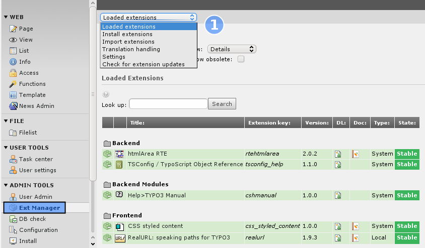
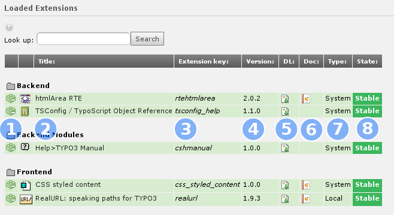
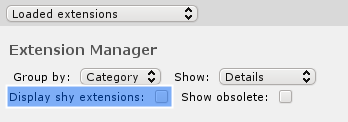
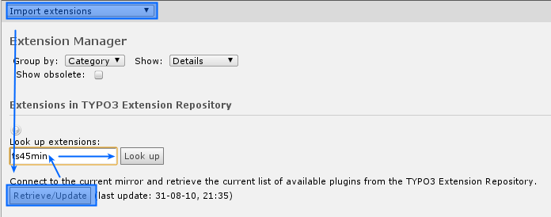

.. ==================================================
.. FOR YOUR INFORMATION
.. --------------------------------------------------
.. -*- coding: utf-8 -*- with BOM.

.. include:: ../Includes.txt

.. _a-short-glimpse-into-the-extension-manager:

A short glimpse into the extension manager
------------------------------------------

TYPO3 has many features build in, but even more different features are
implemented as extensions. With such extension you can enhance the
functions of TYPO3 or build totally new features. Even a lot core
features are implemented as extensions (plugins), so it is your choice
if you want to use that features or not. The extension manager helps
you to manage all your extensions. We want to have now a short glimpse
at the extension manager. Login as admin and switch to the extension
manager module.

At the top of the module, you can select different sub-modules (#1).
You can get the list of all loaded extensions. This are extensions
which are activated. In sub-module "Install extension" you can install
and uninstall extensions which are already downloaded or shipped with
as system extension. The most time you may want to download extensions
from TER (TYPO3 Extension repository). This is done in the "import
extension" sub-module. "Translation handling" manages the language
selection for the backend and downloads the language packages for
TYPO3 core and all extensions which are managed by the translation
team. In "Settings" you can select an specific TER mirror and define
the login for Uploading extensions. If everything works fine, you
would not need to change anything. "Check for extension updates" helps
you to get an quick overview for which extension an new version
exists.

Now have a look at the list of loaded Extensions.

You can uninstall or install (in module "Install extensions") by
clicking at the icon (#1). The title (#2) of the extension is shown.
But more important is the extension key (#3). That key is used to
create the extension folder in typo3conf/ext/, to define TypoScript
paths and a lot more of depends on the extension key. The version (#4)
and the state (#8) is set by the extension developer based on his
judgement. You can download the extension itself (#5) or the manual
(#6) if one is shipped with that extension. The extension type (#7)
"System" indicates that an extension is shipped with the TYPO3 core,
extensions of type "Local" are available in typo3conf/ext/
*extensionkey* .

Some extensions are marked as "shy", so the list should not get to
long with unimportant extensions. Just check "Display shy extensions"
and have a look at the list.

Now let us install an new extension. For that switch to the sub-module
"Install extensions".

Click on the "Retrieve/Update" Button to retrieve the latest list of
available extensions from the TER. Now let's look up for the extension
ts45min.

.. figure:: ../Images/manual_html_m65f5db8f.png
   :alt:

You can download and install the extension which ships with the
OpenOffice (.sxw) manual. In this case, you would not get an new
module or function, just the document itself which you can download in
the loaded list view.

.. warning::

   **Extension security**

   Please keep in mind, that there is no security audit available for the
   extensions, so take a close look at extensions you are installing. If
   you find a security issue, get in touch with the security team
   (security@typo3.org).

.. toctree::
   :maxdepth: 5
   :titlesonly:
   :glob:

   ChangingBackendLanguage/Index