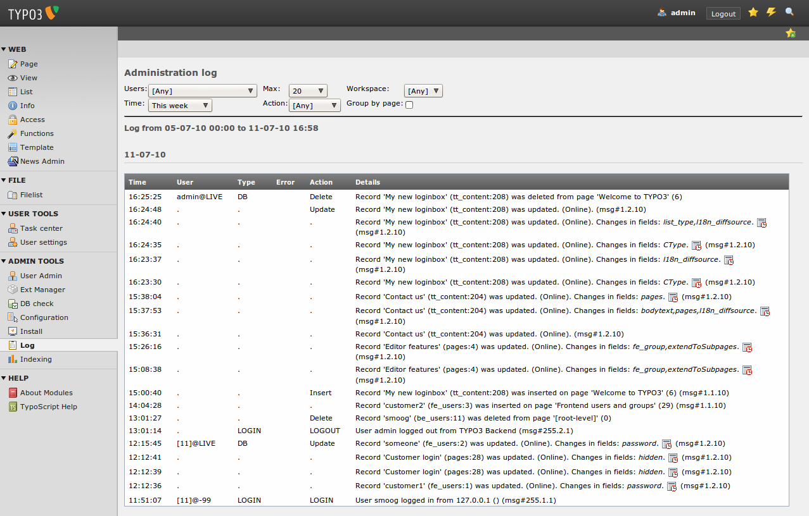
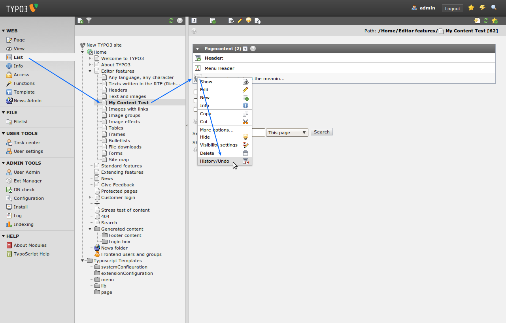
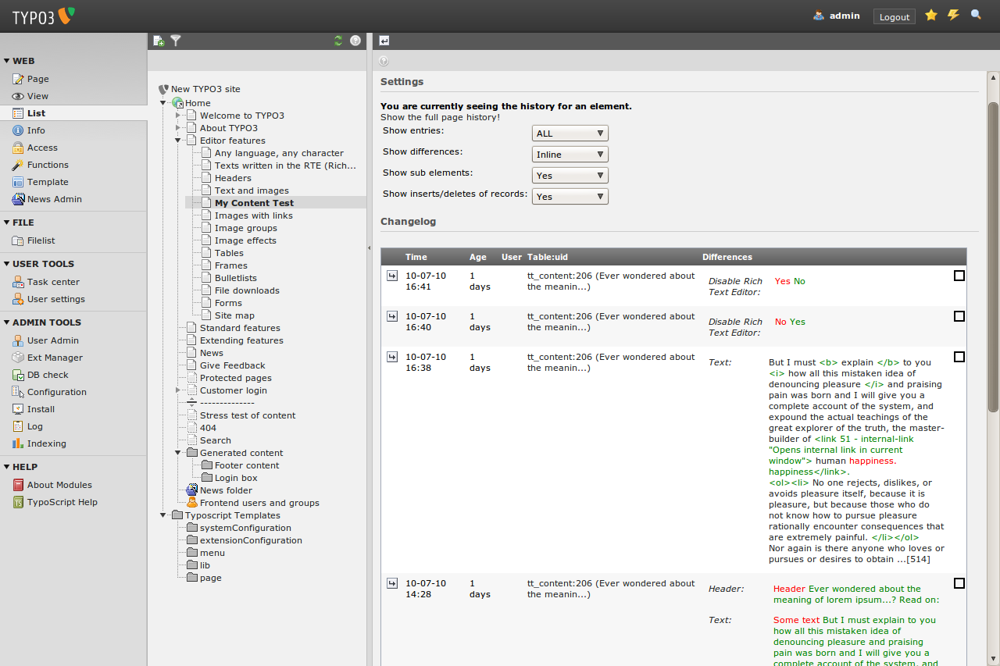

.. ==================================================
.. FOR YOUR INFORMATION
.. --------------------------------------------------
.. -*- coding: utf-8 -*- with BOM.

.. include:: ../../Includes.txt

.. _tracking-backend-users:

Tracking backend users
^^^^^^^^^^^^^^^^^^^^^^

Sometimes you want to know which editor did what, some sort of
tracking the backend users actions. You can do that by using the
integrated log functionality of TYPO3. Just select "Admin Tools" >
"Log" from the menu and you will see an overview of the last actions
your users did:

Do you notice the little icons with the clock in the log? This is the
record history. Each record has a history in TYPO3, so if you change a
record by accident you can use this history to undo your changes.

The easiest way to access the record history is through the list
module.

You will see colored differences between your changes (If you don't
see colored differences, see "Troubleshooting"):

