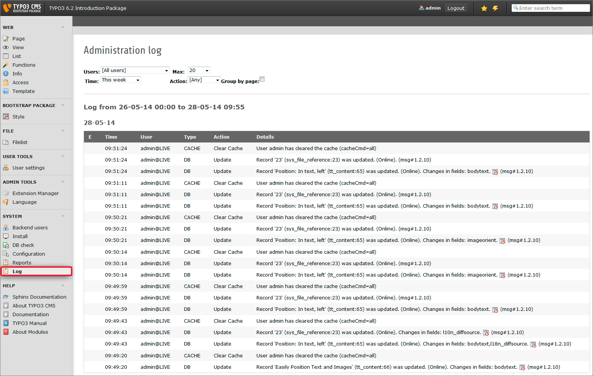
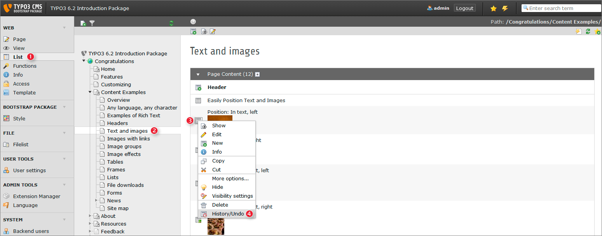
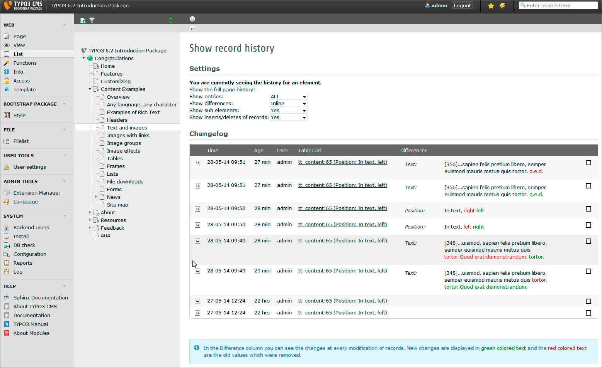

.. ==================================================
.. FOR YOUR INFORMATION
.. --------------------------------------------------
.. -*- coding: utf-8 -*- with BOM.

.. include:: ../../Includes.txt

.. _tracking-backend-users:

Tracking backend users
^^^^^^^^^^^^^^^^^^^^^^

Sometimes you may want or need to know which editor made ​​which changes.
Tracking the backend users actions can easily be done by using the integrated
log functionality of TYPO3 CMS.

Just select **SYSTEM > Log** from the modules menu on the left and you will get
an overview of your backend users last actions:

Do you recognize the little icons with the clock in the log? Clicking this symbol
will forward you directly the record's history. Each record in TYPO3 CMS has its
own history. Therefor, if you change a record accidently you can use its history
to undo your changes.

The easiest way to open a record's history is the route via the list module (1).
Afterwards select the page (2) containing the related content element. Open its
context menu (3) and select "History/Undo" (4).

Having done so you will see the differences between your changes emphasized by green and
red colors.

.. tip::

    **Get colored differences**

    If you do not see colored differences see
    :ref:`Colored differences in history module <colored-differences-in-history-module>`
    in chapter *Troubleshooting*.
