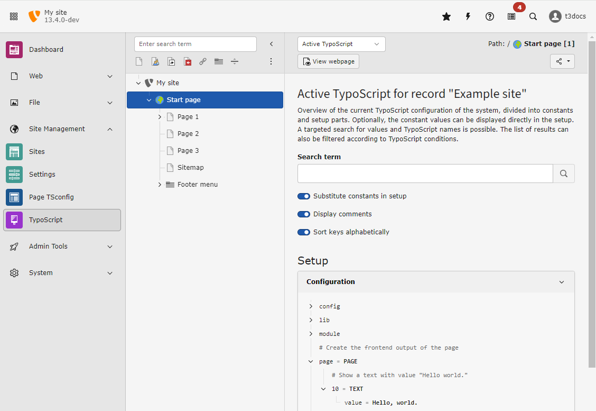

:navigation-title: TypoScript
..  include:: /Includes.rst.txt

..  _typoscript:

=========================================
A minimal page created by pure TypoScript
=========================================

TypoScript is the basic configuration language used to configure the frontend
output of a page in TYPO3.

Learn more about TypoScript in
:ref:`Getting started: A quick introduction into TypoScript <t3tsref:guide>` in
the :ref:`TypoScript Reference <t3tsref:start>`.

You can find detailed information about the
:ref:`TypoScript Syntax<t3tsref:typoscript-syntax>` and a listing of all objects
and with their properties and functions in the
:ref:`TypoScript Reference <t3tsref:start>`.

..  _typoscript-hello-world:

"Hello world" example in TypoScript
===================================

..  versionchanged:: 13.1
    The site set can be used as
    :ref:`TypoScript provider <t3coreapi:site-sets-typoscript>`. It is not
    necessary to use a TypoScript record as is explained in tutorials for
    TYPO3 versions 12.4 and below.

Put the following TypoScript in a file called :file:`setup.typoscript` within
your :ref:`Site set <t3coreapi:site-sets>`. The site set is the folder
containing your :ref:`site configuration <site-configuration>`.

..  literalinclude:: _minimal.typoscript
    :caption: config/sites/main/setup.typoscript
    :linenos:

#.  Is a comment. See the Syntax of comments in TypoScript:
    :ref:`Comments <t3tsref:typoscript-syntax-syntax-comment-blocks>`.
#.  Assigns a top level object of type :ref:`PAGE <t3tsref:object-type-page>`
    to a variable called `page`.
#.  The `page` gets more options in this block. See the
    :ref:`Blocks in the TypoScript syntax <t3tsref:typoscript-syntax-syntax-curly-brackets>`.
#.  Another comment.
#.  Assigns a content object (also called "cObject") of type
    :ref:`TEXT <t3tsref:cobj-text>` to
    :confval:`index number 10 <t3tsref:page-array>` of `page`. It has the path
    `page.10` if you want to change it later.
#.  Assigns the value `Hello, world.` to the `value` property of the TEXT
    cObject stored in path `page.10`.

..  todo: Link to page how to clear cache once https://github.com/TYPO3-Documentation/TYPO3CMS-Tutorial-GettingStarted/issues/425 is resolved

Clear all caches via the following console command or the button in the backend:

..  code-block:: bash

    ddev typo3 cache:flush

You can now preview the result.

..  todo: Add link on how to preview a page.
..  todo: Link to how to clear all caches

..  _typoscript-hello-world-result:

Resulting web page
==================

Here is the resulting web page HTML source for both the TypoScript-only and
the Fluid-based implementations. Notice how TYPO3 has added default markup
around the single line of content:

..  literalinclude:: _minimal-output.html
    :caption: Example frontend output

..  _typoscript-active-debug:

Debug the TypoScript in the backend module "Active TypoScript"
==============================================================

Open the backend module
:guilabel:`Site Management > TypoScript > Active TypoScript`.

    Switch the submodules of module :guilabel:`Site Management > TypoScript`
    using the Dropdown in the module header.

You can find the variable `page` that you just defined. The other variables have
been created by TypoScript loaded globally by the TYPO3 Core and system
extensions. They are some of the
:ref:`Reserved top-level objects <t3tsref:top-level-objects-other-reserved-tlo-s>`.

..  _typoscript-play-around:

Play around with TypoScript
===========================

You can now try out a couple of TypoScript commands to familiarize yourself
with TypoScript.

Here are some examples:

..  _typoscript-example-stdwrap:

Wrap "Hello, world." in p-tags
------------------------------

..  literalinclude:: _stdwrap.typoscript
    :caption: config/sites/main/setup.typoscript
    :linenos:
    :emphasize-lines: 4-7

4.  As we now have several options for :ref:`TEXT <t3tsref:cobj-text>` object
    with path `page.10`, we switch to the
    :ref:`block syntax <t3tsref:typoscript-syntax-syntax-curly-brackets>` here.
5.  Assign the text to the :confval:`value <t3tsref:text-value>` property of
    the TEXT object.
6.  We use the :confval:`stdWrap <t3tsref:text-stdwrap>` property of the TEXT
    object to configure the :ref:`stdWrap <t3tsref:stdwrap>` function.

    In this function we use the option :confval:`wrap <t3tsref:stdwrap-wrap>`.
    It surrounds the current content of the TEXT object as set in line 5 with
    the value defined here. The pipe `|` character is replaced by the text that corresponds to the value property.

..  note::
    You may sometimes see that :confval:`stdWrap <t3tsref:text-stdwrap>`
    functionality is directly applied to a TEXT object like this:

    ..  literalinclude:: _stdwrap_direct.typoscript
        :caption: config/sites/main/setup.typoscript
        :linenos:
        :emphasize-lines: 6

    For backward compatibility reasons it is possible to apply stdWrap
    properties directly to TEXT object. This is only true for TEXT objects, not
    any other TypoScript cObject types. So we recommend to always use
    stdWrap to stay consistent.

..  _typoscript-example-page-title:

Display the title of the current page on top
--------------------------------------------

..  literalinclude:: _page-title.typoscript
    :caption: config/sites/main/setup.typoscript
    :linenos:
    :emphasize-lines: 3-7

3.  We assign a second content object (also called "cObject") of type
    :ref:`TEXT <t3tsref:cobj-text>` to
    :confval:`index number 5 <t3tsref:page-array>` of `page`. As the index is
    smaller than the index 10 of the TEXT object containing the text
    "Hello World", it is displayed before the other object.
4.  Uses the :ref:`block syntax <t3tsref:typoscript-syntax-syntax-curly-brackets>`
    to apply properties to the TEXT object.
5.  Uses the stdWrap property :confval:`field <t3tsref:stdwrap-field>` to fetch
    the field `title` from the :ref:`database record <t3coreapi:database-records>`
    of the current page.
6.  Uses the stdWrap property :confval:`wrap <t3tsref:stdwrap-wrap>` to wrap the
    current string fetched in line 5 in :html:`<h1>` tags.

..  note::
    The order in which the content objects are defined in the TypoScript file
    does not matter. They are output from the smallest index to the largest.
    Therefore the following would give you the same output:

    ..  literalinclude:: _page-title_reverse.typoscript
        :caption: config/sites/main/setup.typoscript
