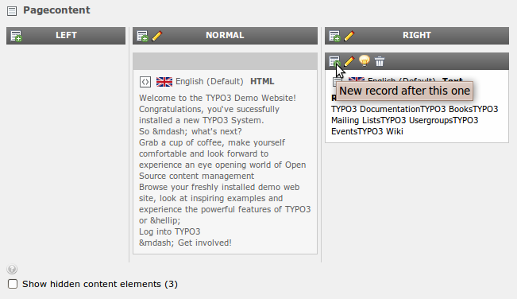
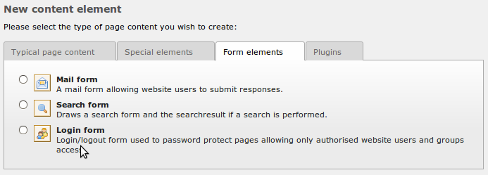
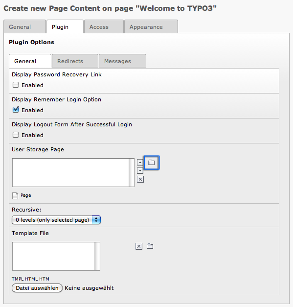
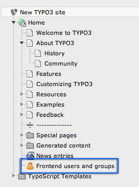
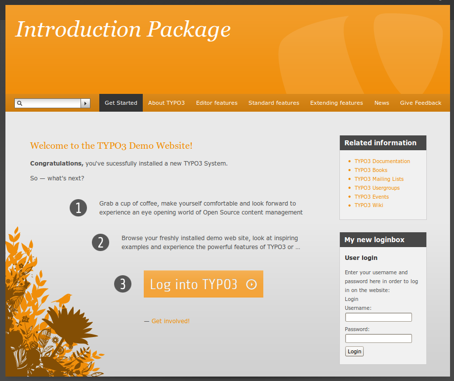

.. ==================================================
.. FOR YOUR INFORMATION
.. --------------------------------------------------
.. -*- coding: utf-8 -*- with BOM.

.. include:: ../../Includes.txt

.. _create-a-login-form:

Create a login form
^^^^^^^^^^^^^^^^^^^

The Introduction Package already comes with a fully configured login
form. But what if you want to create another one, for example on the
homepage? No problem. In general the login form is just a content
element like text or text & images. Go (in the backend) to the page
"Welcome to TYPO3", make sure that the page module is selected and
click on the little content element icon with the green plus in the
header of the "Related information" content element. This will create
a new content element after this one.

Activate the tab "Form elements" and select "Login Form":

You will get the form for configuration of the login. Give the login a
header and then go to the "Plugin" tab. The most important thing here
is to set the "User Storage Page". This is the folder where the login
looks for users. Click on the little folder icon next to the "User
Storage Page" field:

In the appearing popup select your "Frontend users and groups" page:

This is all you have to do. Now take a look at your website and you
will see your shiny new login box on your home page:

