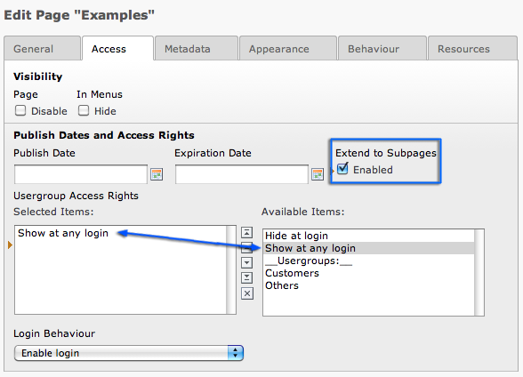

.. ==================================================
.. FOR YOUR INFORMATION
.. --------------------------------------------------
.. -*- coding: utf-8 -*- with BOM.

.. include:: ../../Includes.txt
.. include:: Images.txt

Create restricted branch
^^^^^^^^^^^^^^^^^^^^^^^^

Earlier you have seen how to restrict access to a page (you remember
the access tab on the page properties, don't you?). Sometimes however
it is useful to have not only restricted pages but whole branches that
should only be seen by certain users. For example we want to restrict
the whole "Examples" branch to logged in users only. After what you
know right now you'd have to edit each and every page by hand and set
it to access restricted. For every new page of that branch you would
have to do the same. Sounds annoying? Yeah, it is and therefore there
is an easier way to do it.

Go and edit the page properties of the "Examples" page - tab "Access"
again:

If you check "Extend to subpages: Enable" then all subpages will have
the same access settings as the parent page. This means you can not
only require a login but you could also set a "Start" or "Stop" date
for a whole branch!

The Access options
""""""""""""""""""

Basically access restriction works as simple as this - just select a
website user group and that is it. From that point you just handle
which users are members of which groups.

Users can belong to one or more groups, so if you have groups for
every section of your website and you want to have some kind of
frontend super user, you could just assign him all groups.

Finally the option "Hide at login" means that a page will  *not* be
visible when a user logs in! This is useful if you have pages with
information only relevant for users not yet logged in. Of course the
option "Show at any login" is the opposite - that will enable the page
for display for any user who is logged in. No need to be a member of
any particular group - if you are logged in you are shown the page.

Special content elements
""""""""""""""""""""""""

There are some commonly used yet special content elements which will
be explained in this section, like a contact form or the search box.
You already know the special element sitemap from the section about
Content Elements in general.