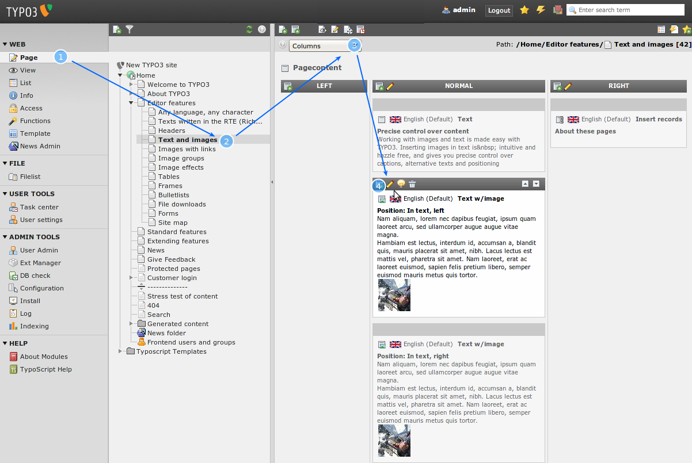
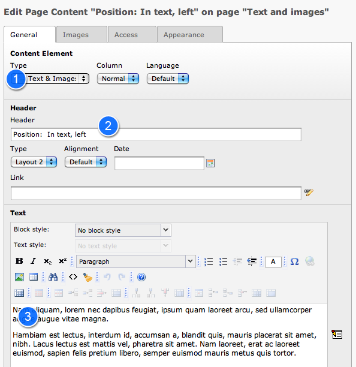

.. ==================================================
.. FOR YOUR INFORMATION
.. --------------------------------------------------
.. -*- coding: utf-8 -*- with BOM.

.. include:: ../../Includes.txt

.. _edit-page-content:

Edit page & content
^^^^^^^^^^^^^^^^^^^

It is really easy to edit page content in TYPO3. Just select the Page
module (1), click the page title of the page you want to edit (2) and
in the "Columns" view (3) you click the edit icon (4) of the page
content element you wish to change:

This brings up this edit form:

First of all the field "Type:" (1) tells you the type of page content
element! In this case "Text & Images". It could also be "Text" (like
you saw earlier) or "Images" or "Table" etc. See for yourself! Each
content element type has its own set of fields and by inserting
different elements you can achieve great diversity on your website.

The header field (2) contains the headline of the content element.

You can insert text by typing into the "Text" field (2).

Different element types have different options. Play around a bit and
see what you can do on the different tabs. Be aware that every change
of the element type saves the element.

.. figure:: ../../Images/manual_html_m43fb96d.png
   :alt:

**QuickEdit - save a mouse click...**

If you want fast access to your page content elements you can change
the Page module view to "QuickEdit" instead of "Columns" - then the
first content element on a page is shown right away: