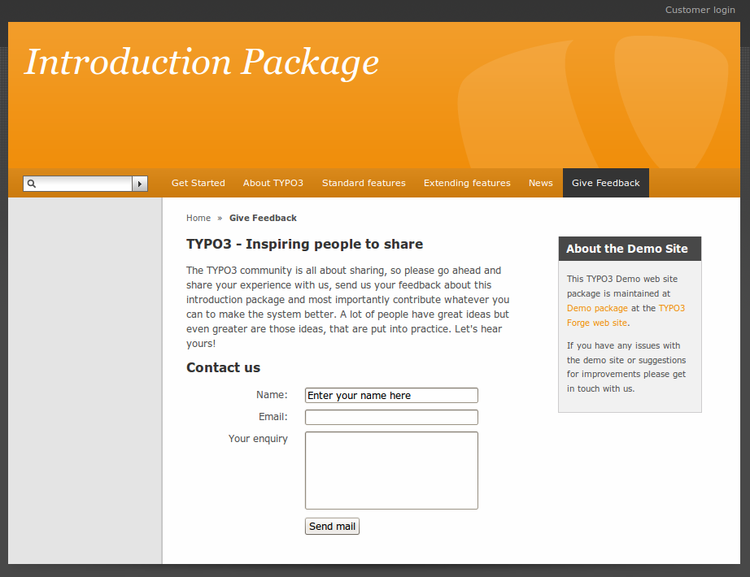
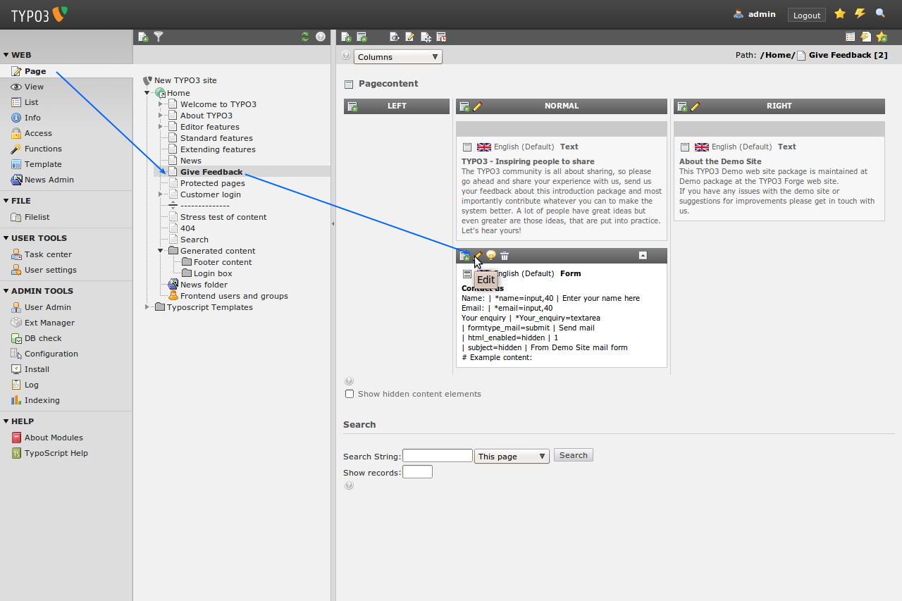
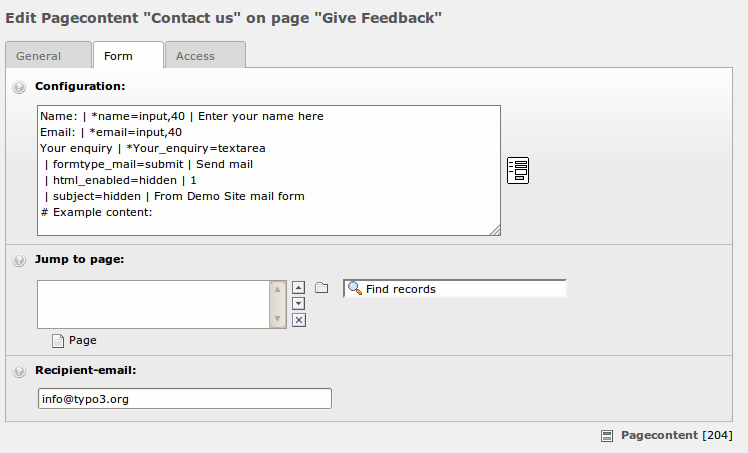
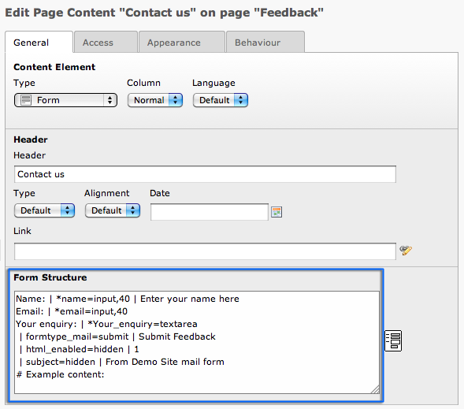
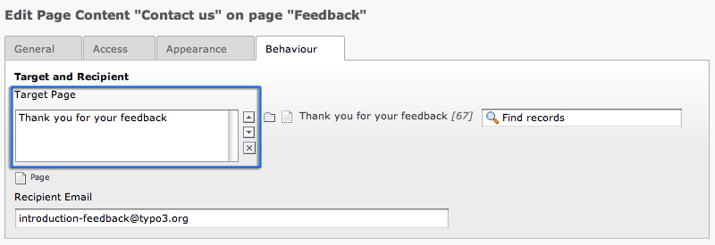
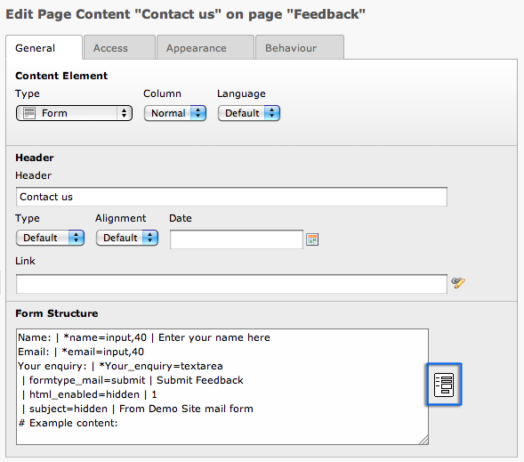
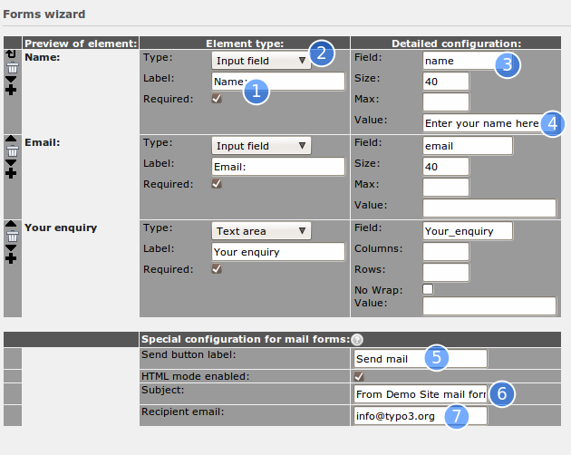
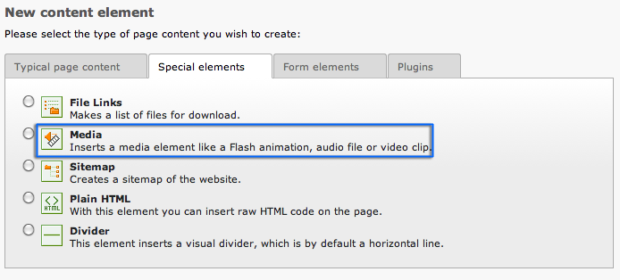
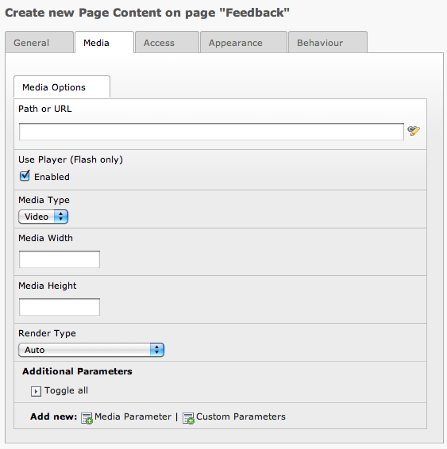
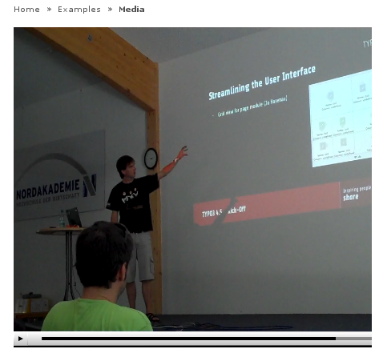

.. ==================================================
.. FOR YOUR INFORMATION
.. --------------------------------------------------
.. -*- coding: utf-8 -*- with BOM.

.. include:: ../../Includes.txt
.. include:: Images.txt

Email form
^^^^^^^^^^

We already have an email form on the website. If you go the the page
"Feedback" you will see a basic contact form:

Navigate to the "Feedback" page in the backend and edit the form:

In the field "Form Structure" the form is defined:

At the "Target Page" field on tab "Behavior" you can define where the
user gets redirected after he sends the form:

If you leave this blank he won't be redirected. Normally you'd enter
some kind of "Thank you" page.

Let's take a closer look at the form structure. You already know the
pipe (\|) as separator from the tables content element. It is used
here in this mail form to define the form fields. Every line
represents one field of the form. Click on the wizard icon on the
right side of the field:

As you can see the codes are transformed into this nice form.

Here each field in the form is created by visual controls. For a field
you need to enter a label of course (1) and a field type (2). These
are the visible parts. You also have to give the field an internal
name (3) which is the one that will be shown in the email the
recipient gets. In the case of "Input field" types you can also enter
a default value (4).

For all email forms there are three common values to be set: The name
of the send button (5), the subject line of the email being sent (6)
and finally the email address of the person that should receive the
email (7). This person is normally you! Or whoever on your team who is
supposed to respond to feedback.

Media
"""""

The Media element is not yet used in the introduction package. But you
may be interested to show an Video on your website. Upload your video
into the fileadmin. Now create an new content element of type "media".

Select the "Media" tab and select your video, set if needed some
additional parameters and add the alternative content on tab
"Behavior" for those, who are not able to see your video.

Save your content element and watch your video on your website.

