.. ==================================================
.. FOR YOUR INFORMATION
.. --------------------------------------------------
.. -*- coding: utf-8 -*- with BOM.

.. include:: ../../Includes.txt
.. include:: Images.txt

Make links
^^^^^^^^^^

Hyperlinks are what glues the internet together some say. In TYPO3 you
already have links automatically made for you since the sheer creation
of pages in the hierarchical structure of the page tree has generated
the menu automatically.

But you still might want to link from a piece of text to another page,
a file, another website or an email address, right? This is very easy
if you use the Rich Text Editor. Simply mark the text and press the
"Insert Link" icon:

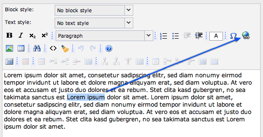

A popup opens in which you can choose which type of link you want to
create. In this case choose the tab "Page" and click on "About TYPO3"
in the page tree to create a link to the "About TYPO3" page.

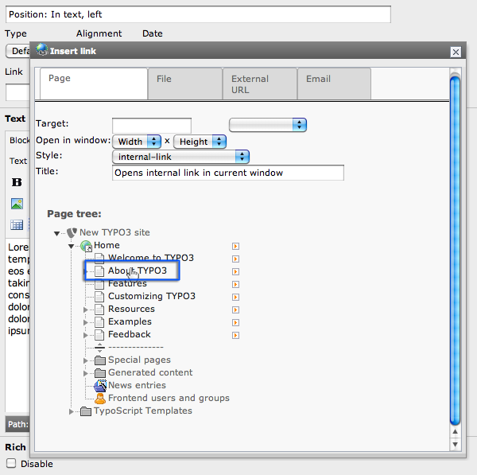

The popup should close itself and you can now see that the text you
marked is linked:

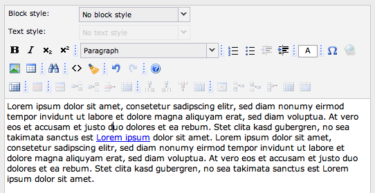

To edit the link just right-click on it and choose the link option
from the context menu (or position your cursor somewhere in the link
text and click on the link icon again).

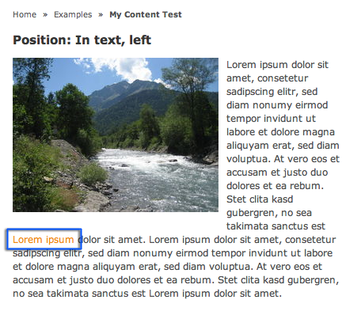

In the frontend this will produce a link as you would expect. Click it
and you are taken to the "About TYPO3" page:

If you have problems with the editor you can switch to the source code
view and have a look at what it generated:

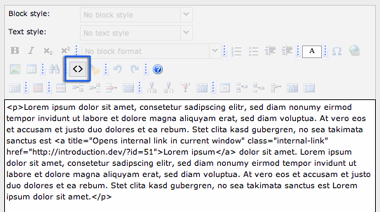

It is just simple HTML. But remember: The RTE parses the code in there
and removes everything it doesn't know or isn't configured to allow.
So you can't just write your own HTML in here.

Other kinds of links?
"""""""""""""""""""""

You can create links to local files and external webpages - even links
directly to a specific content element on a page and links to email
addresses.

We already saw how to link to an internal page. The following
screenshots illustrate how to set different types of links.

Creating a link to a certain content element
~~~~~~~~~~~~~~~~~~~~~~~~~~~~~~~~~~~~~~~~~~~~

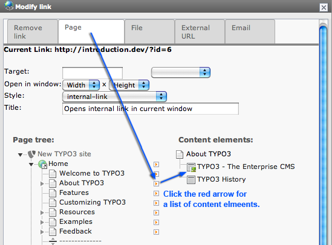

Creating a link to a file
~~~~~~~~~~~~~~~~~~~~~~~~~

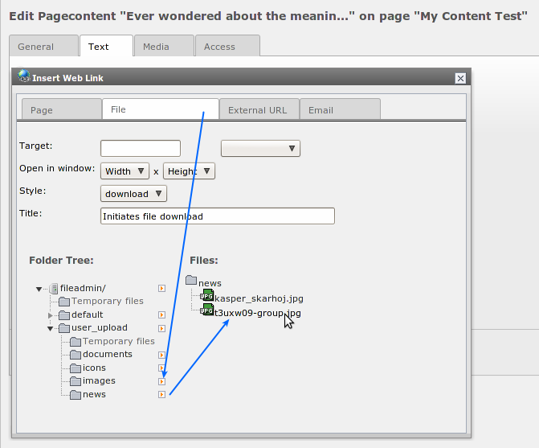

Creating a link to an external URL
~~~~~~~~~~~~~~~~~~~~~~~~~~~~~~~~~~

.. figure:: ../../Images/manual_html_m7ac6ba2e.png
   :alt:

Creating a link to an email address
~~~~~~~~~~~~~~~~~~~~~~~~~~~~~~~~~~~

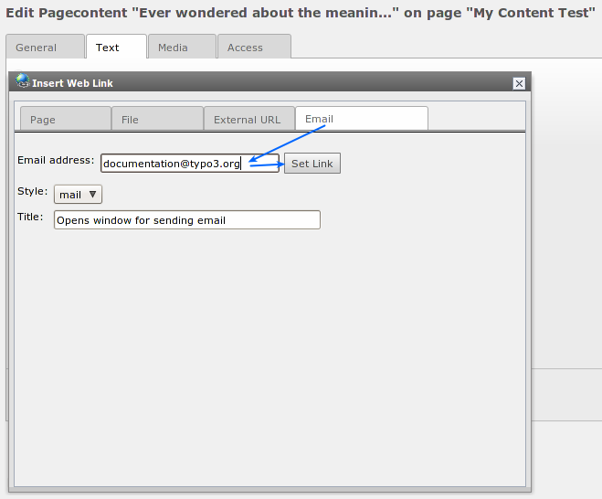

**Content element types**
~~~~~~~~~~~~~~~~~~~~~~~~~

As you already know there are a number of page content element types
available and combining them is the key to creating diverse web pages
so not every single page on your site looks the same!

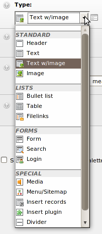

The different types are grouped by categories. The most used items are
"Text" and "Text & Images".

Wizards
"""""""

Notice that some elements come with a little wizard. For instance edit
one of the content elements on the page "Tables" (you can find it in
the "Examples" branch):

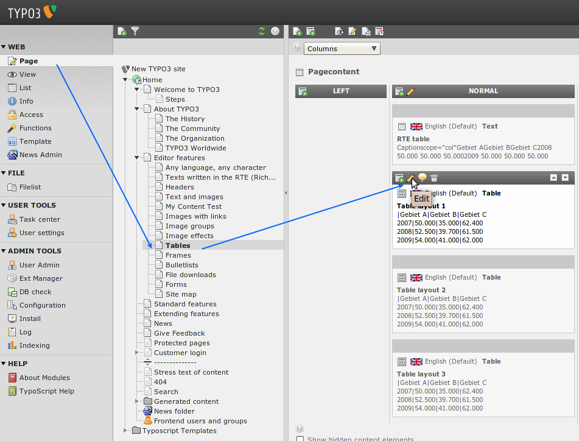

You can edit the content of the table in plain text mode (1) or you
can open the wizard (2).

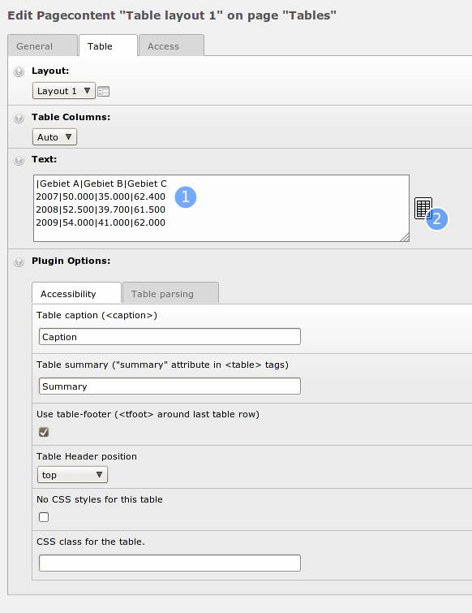

The table is constructed by interpreting each line in the "Text" field
as a  *table row* . Then the vertical line, \| , is used to separate
*columns* from each other. This is the "low level" way it works and it
*could* be maintained by hand.

But the "Table wizard" would be the right tool to use for most people.
This will bring up designated form fields and buttons for adding,
deleting and moving table content around:

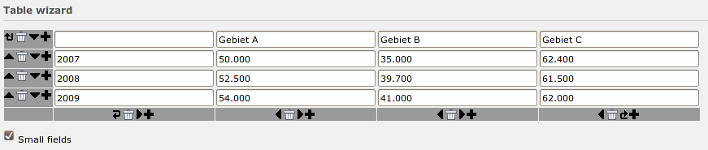

Secondary options - "Palettes"
""""""""""""""""""""""""""""""

From the dawn of time TYPO3 has held to the concept of  *primary* and
*secondary* form fields. The editing forms in TYPO3 contain a lot of
fields and can be extended with even more. But many fields shown at
the same time become very hard to overview for the average user. In
particular if you are a beginner and have lots of new things to keep
inside of your head already.

The concept of primary and secondary fields means that normally you
see  *only* the most important and typically used form fields
(primary). And more detailed options are hidden in the secondary
fields which are shown on request.

Most content elements and pages do not have secondary fields, but many
extensions still use this concept.

Go to the page "Tables" in your page tree and edit the second content
element. You only see some essential fields. Now press the button
right to the "Type" dropdown:

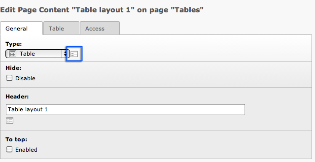

You will now see the so-called secondary options palette:

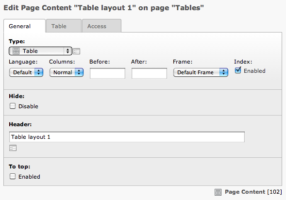

So the complexity is hidden behind this button which makes the normal
interface cleaner and easier to understand but the advanced options
are always "just a click away".

The downside is when you  *need* one of these secondary options and
can't remember "behind which icon" it is (or if you use the field a
lot) - then it might in itself be confusing to  *find* them! Therefore
you can activate the option "Show secondary options" in the bottom of
all editing forms:

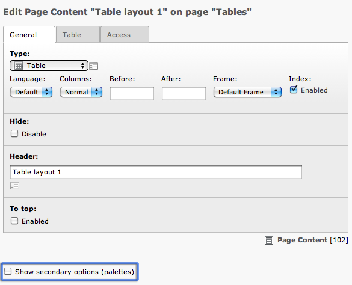

After activating the secondary options for all element will be shown
by default.

Frames
""""""

One field in the secondary options that is used in the introduction
package is the "Frame". Navigate to the "Frames" page in the frontend:

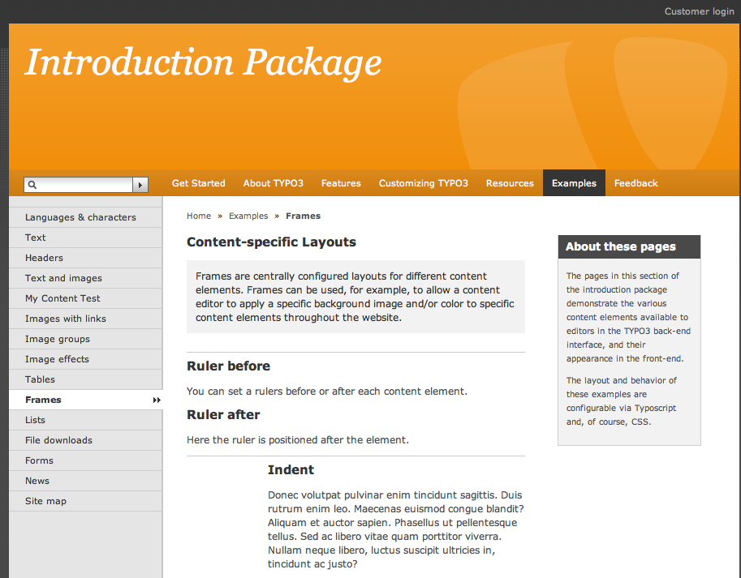

There are by default some frames to insert rulers or indent the text.

Now go to the same page in the backend and edit the "Ruler before"
content element:

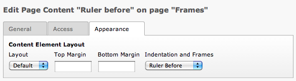

You can see that the frame "Ruler before" is selected in "Indentation
and Frames" on "Appearance" Tab - this creates the horizontal line in
front of the element. Basically what the frame element does is to wrap
the content element with a certain html element or css class which can
then in turn be used in your own stylesheet to create different
looking elements.