.. ==================================================
.. FOR YOUR INFORMATION
.. --------------------------------------------------
.. -*- coding: utf-8 -*- with BOM.

.. include:: ../../Includes.txt

.. _new-page:

New page
^^^^^^^^

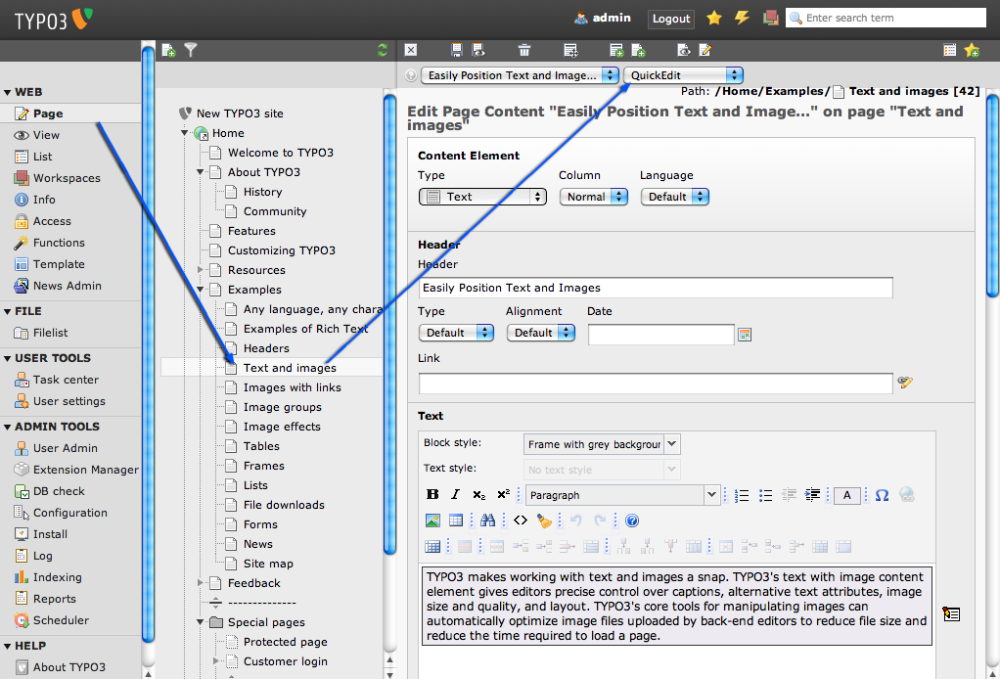

We already saw one way to create a new page when we created the
"External URL" page earlier. However, in TYPO3 there are multiple ways
to get things done. Here is another way to create a page:

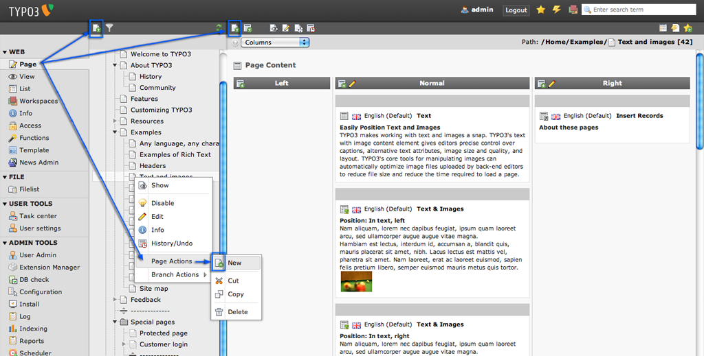

If you click on the button in the docheader you will get the position
selector for your new page in the next step:

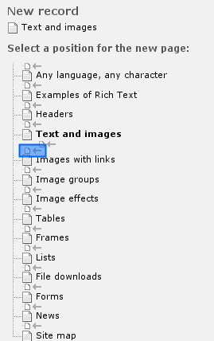

Now create a new page "My Content Test" **after** (NOT **inside** )
the "Text And images" page and have a look at your website afterwards.
You will find the page in the menu next to the "Text and images" page.

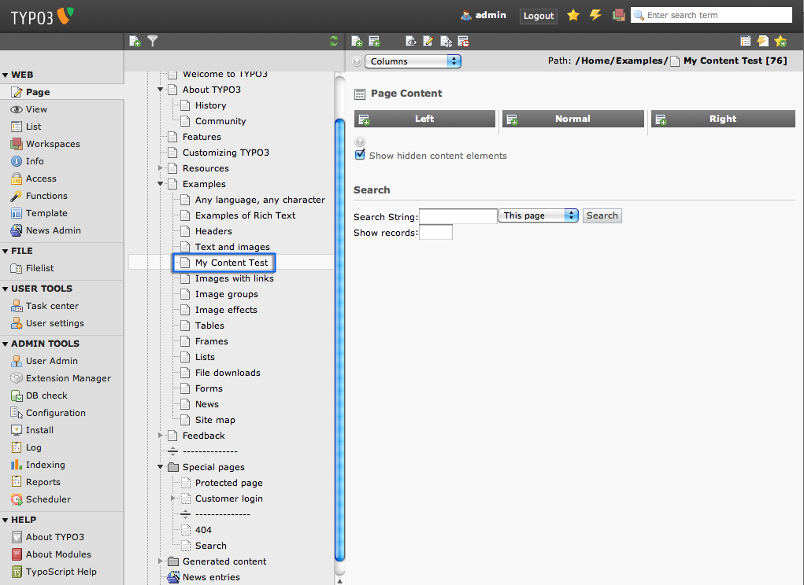

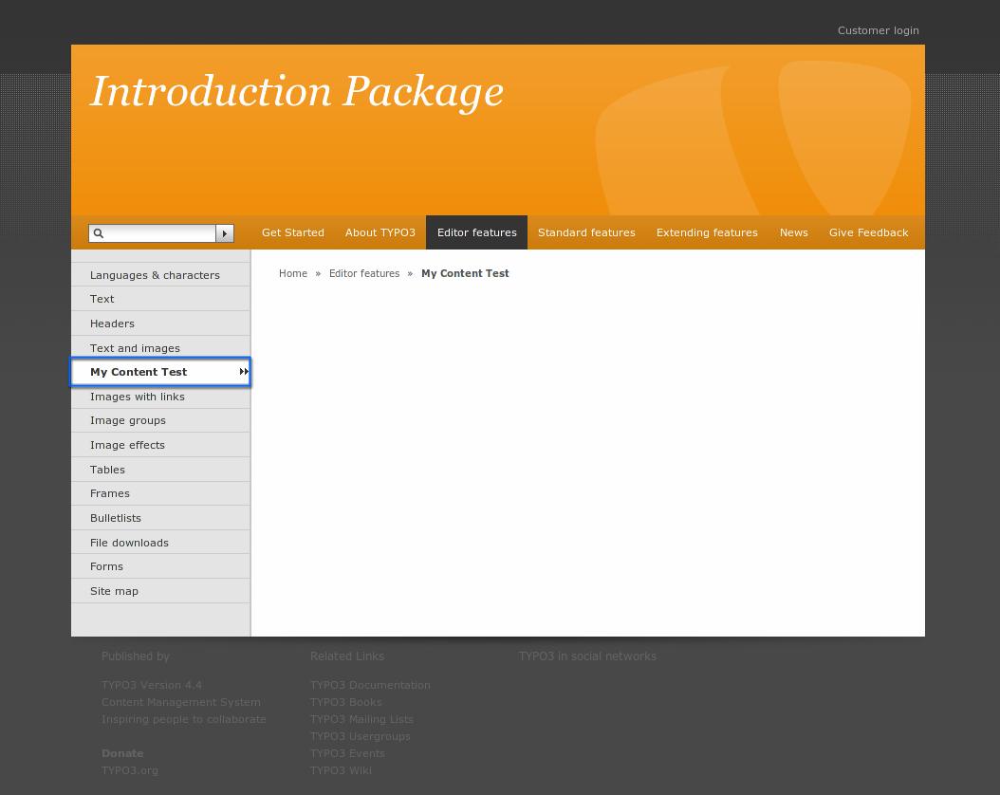

The page is still blank - we need to create some page content elements
on the page!

.. _creating-page-content-elements:

Creating page content elements
""""""""""""""""""""""""""""""

In the Page module, click the page title of "My Content Test" in the
page tree and then the icon with the content element and the little
green plus in the docheader "Create new content element":

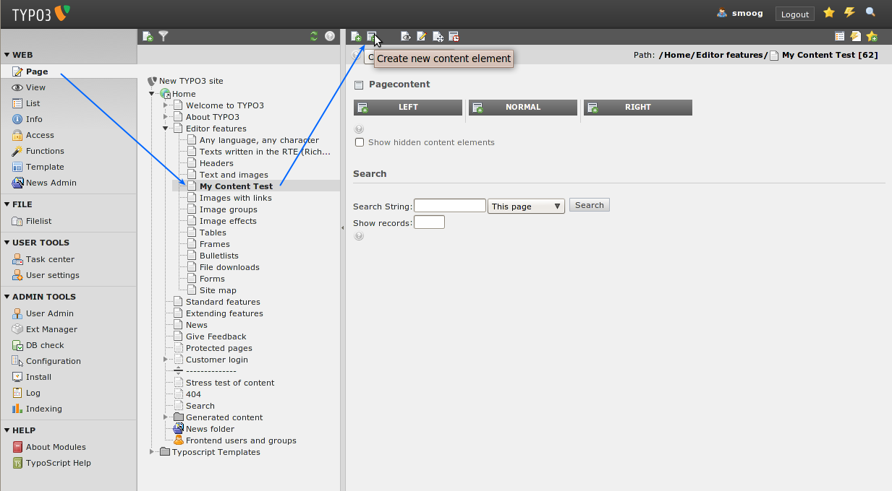

Immediately you will see a nice form like this (below). This allows
you to select a page content element type (1) - as said earlier,
different content element types create different kinds of content on
the web page - and the position (2) of the element. Let's create "Text
& Images":

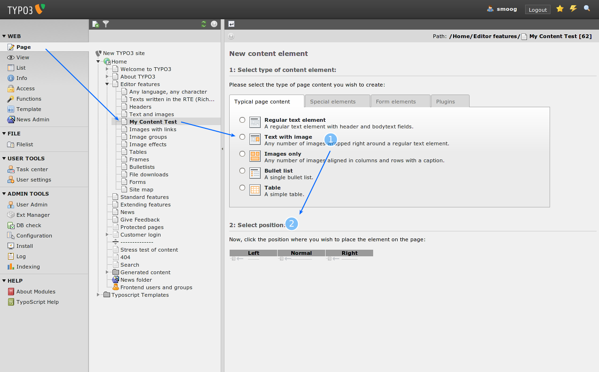

In the form which appears enter a headline (1) and some dummy content
(2) under the tab "General".

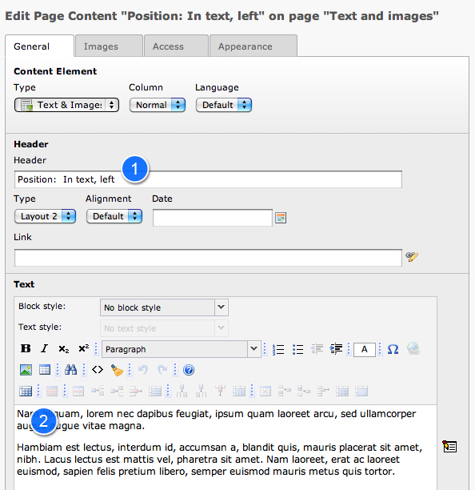

After that select the tab "Media". Choose a dummy image from your hard
drive (1). Additionally you can enter a link for your image (2).

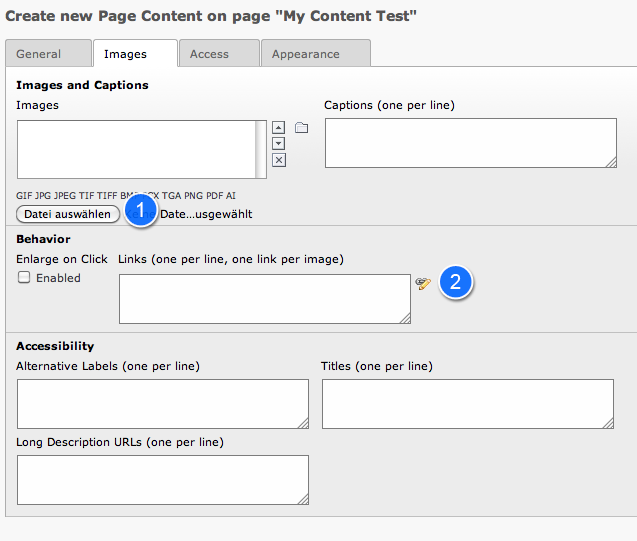

Then select the tab "Appearance". If you chose a big image you can
change it's size with (1) [If this does not work for you, have a look
at the "troubleshooting" chapter]. Below you can set a position
relative to the text for your image (2).

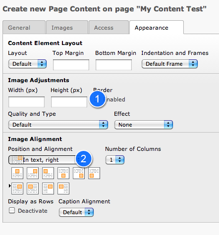

Press the "Save document" button. Now the image is uploaded to the web
server and attached to the new page content element.

If everything went fine it now looks like this on the web page:

.. figure:: ../../Images/manual_html_3a20137b.png
   :alt: Take a look at the new page in the frontend.

.. _inserting-another-content-element:

Inserting another content element
"""""""""""""""""""""""""""""""""

Back in the Page module the new content element is clearly shown.
Let's create another content element. The little content element icons
with the plus in the header bar of the content columns let you create
content in that column. Use the icon at (3) the right column to add
content there.

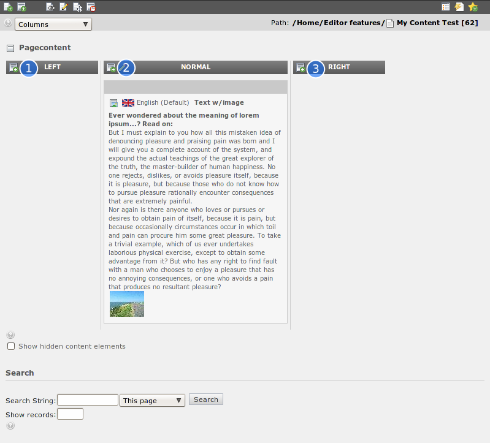

This time we choose to create a special element called "Sitemap".

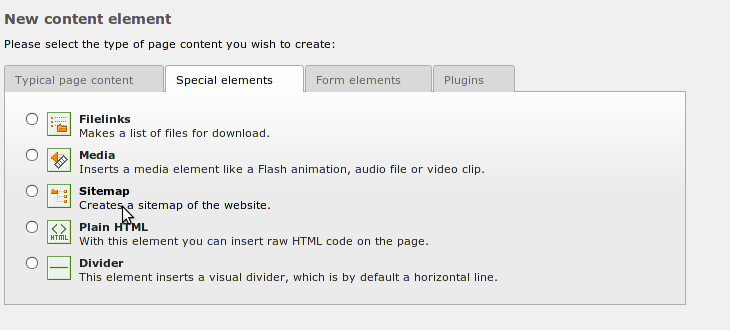

The site map element allows you to insert all sorts of page link lists
(like a real site map, a menu of sub-pages...). We want to insert a
link list to some pages we select manually, so we chose "Menu of these
pages":

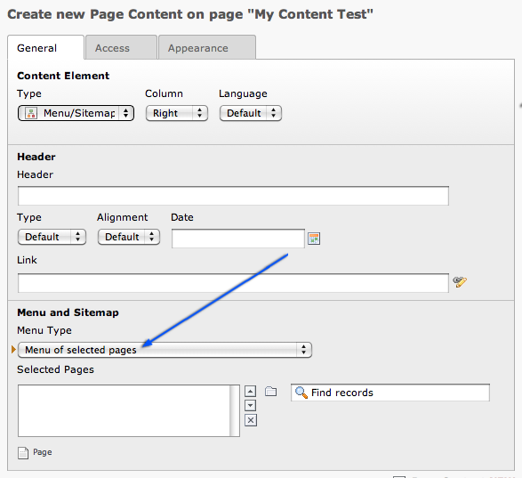

Select the pages you want to link to. There a two possible ways to do
this. Either press the little folder icon (1) and choose the pages
from the pop-up that appears then or use the auto-suggest search (2)
by typing the title of the page into the text field:

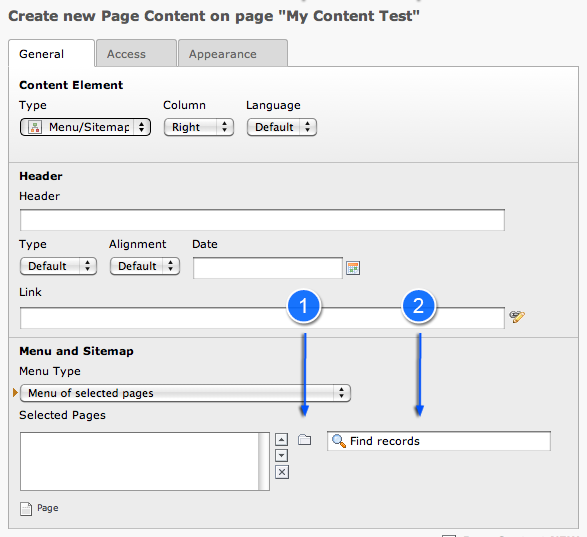

Here we added some sub-pages of "About TYPO3":

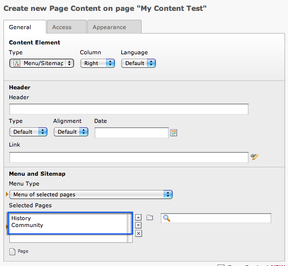

Now the page has two content elements, a "Text & Images" type in the
normal column and a "Sitemap" type in the right column:

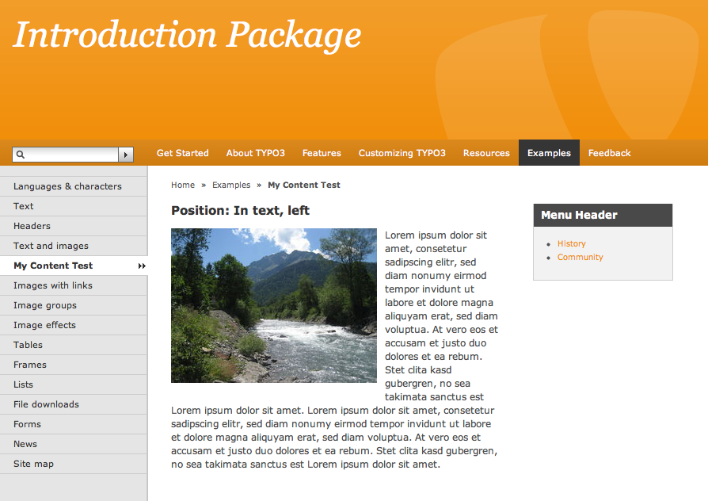

In the Page module this looks like this:

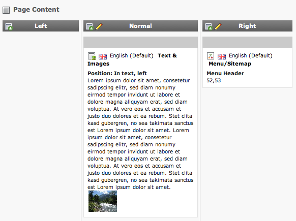

.. _move-copy-pages:

Move / Copy pages
^^^^^^^^^^^^^^^^^

Moving pages is really easy. Just drag the page in the page tree to
its new position. A small line will be show to indicate the new
position.

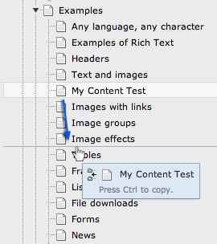

Move a page on a title to insert it into that page.

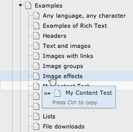

You can copy pages in the same way by toggling your CTRL key just like
you can do on you desktop.

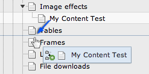

To switch back to move mode, just toggle CTRL again.

.. _cut-n-paste-copy-n-paste:

Cut'n'Paste & Copy'n'Paste
""""""""""""""""""""""""""

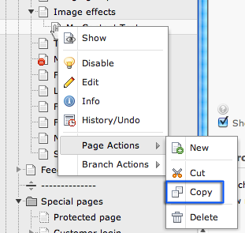

You can also use Cut'n'Paste or Copy'n'Paste for moving or copying.
Select "Page Actions: Copy" from the context menu of the page you want
to copy:

And choose "Page Actions: Paste after" (or "Page Actions: Paste into"
depending on what you want) from the context menu of the destination
page:

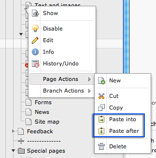

.. figure:: ../../Images/manual_html_6e95cd67.png
   :alt:

**Watch out - consistent concepts on board!**

Notice that the same principles of copy/cut'n'paste can be used with
not only pages but page content elements as well - well, in fact any
database element or file that TYPO3 manages is subject to this
functionality! This is a great example of how TYPO3 uses the same
concepts consistently and throughout the system - so once you have
learned a feature, a lot of other features make sense to you as well!
If you open your eyes to it you will have many of those "Aha!"
experiences when you see how things are designed to fit together.