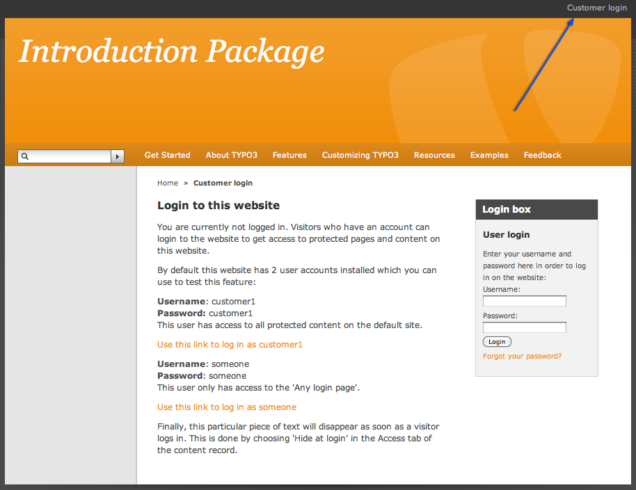
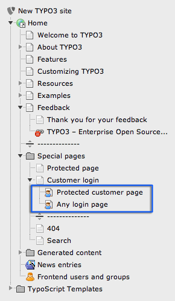
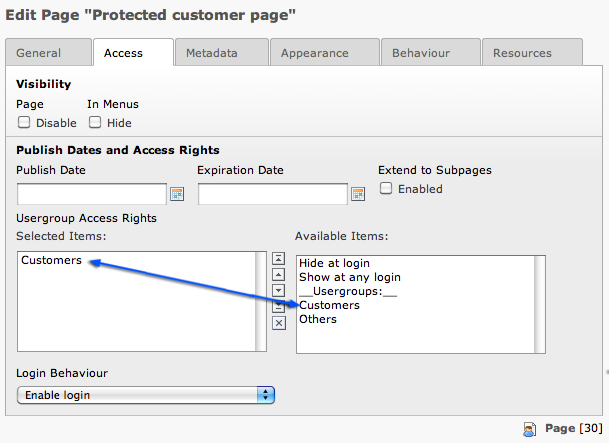

.. ==================================================
.. FOR YOUR INFORMATION
.. --------------------------------------------------
.. -*- coding: utf-8 -*- with BOM.

.. include:: ../../Includes.txt

.. _password-protected-pages:

Password protected pages
^^^^^^^^^^^^^^^^^^^^^^^^

Now you know how to create and edit pages! That was not so hard, was
it? Quite easy to become a webmaster with TYPO3. So one thing is to
make web pages for all the world to see. What if we would like only a
part of the world to see them? Can we add password protection? Yes, we
can!

Actually there are already some password protected pages in our
installation. Browse in the frontend to "Customer login" (it is the
link on the top right corner).

Read the text on that page and then use the login box on the right to
login as customer1.

.. figure:: ../../Images/manual_html_14e94e30.png
   :alt:

You see some pages appearing in the left menu after you successfully
logged in.

Now go to the backend and have a look at these pages in the page tree:

The little blue man on those pages tells you that these pages have
some kind of user restriction. Go and edit the page properties of the
page "Protected customer page" (Context menu > Edit) and go to the
"Access" tab:

You can see here that only the group "Customers" is allowed to see
this page. You could also set the page to "Show at any login" that
would mean that every registered user (regardless of his user group)
would be able to see the page.

In the next step you will learn how to create users and user groups.