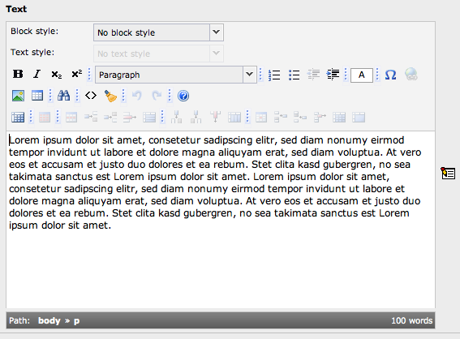

.. ==================================================
.. FOR YOUR INFORMATION
.. --------------------------------------------------
.. -*- coding: utf-8 -*- with BOM.

.. include:: ../../Includes.txt

.. _rich-text-editing-bold-italics-bullet-lists-insert-images:

Rich Text Editing: Bold, Italics, Bullet lists, Insert images
^^^^^^^^^^^^^^^^^^^^^^^^^^^^^^^^^^^^^^^^^^^^^^^^^^^^^^^^^^^^^

When you are working with the text on your pages you can use the same
kind of formatting options as you are used to from your word
processor. You have access to a Rich Text Editor (RTE) for the body
text field. "Rich Text" means that you can apply formatting to the
text in addition to just writing it.

As you can see you can create lists, apply formatting like bold or
italic and even insert tables. This editor can be fully configured to
match all your needs. The configuration is not part of this tutorial.
You can find a description in the `rtehtmlarea manual
<http://docs.typo3.org/typo3cms/extensions/rtehtmlarea/>`_ .

