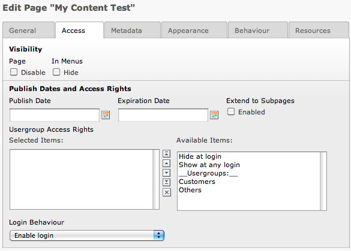
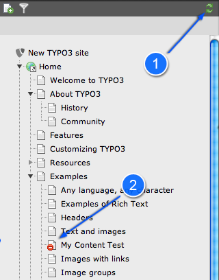
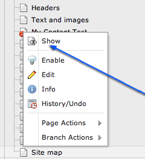
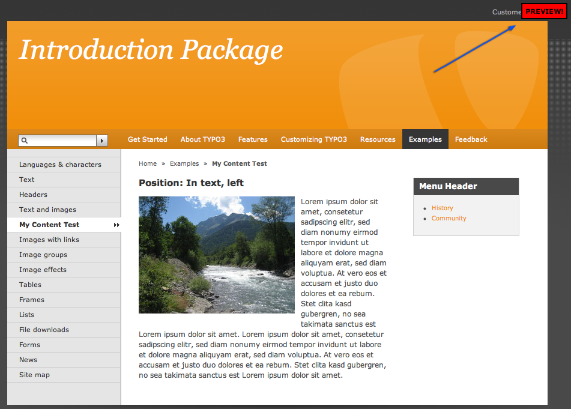
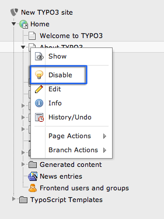
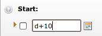
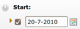
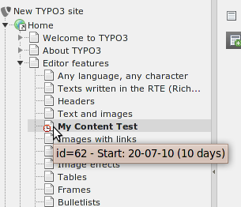

.. ==================================================
.. FOR YOUR INFORMATION
.. --------------------------------------------------
.. -*- coding: utf-8 -*- with BOM.

.. include:: ../../Includes.txt
.. include:: Images.txt

Visibility settings - hiding pages, timing appearance etc.
^^^^^^^^^^^^^^^^^^^^^^^^^^^^^^^^^^^^^^^^^^^^^^^^^^^^^^^^^^

A feature you will find for many elements - in particular pages and
page content elements - is the publishing control fields or visibility
settings. They look like this for pages:

The access settings are the same for content elements.

Disabling a page
""""""""""""""""

Check the "Page: Disable" flag:

.. figure:: ../../Images/manual_html_m1009fa2e.png
   :alt:

Save the page and have a look at the page tree. If the page tree
didn't reload press the green arrows on top of it to refresh (1). The
disabled page has an icon indicating its state (2).

A page that is disabled can not be viewed from the frontend. If you
are logged in the backend however you are still able to see a preview
of that page. Choose "Show" from the context menu of the disabled
page:

In the frontend you will see your hidden page with a "preview" note
that tells you that a normal visitor won't see it:

Disabling pages and content element is probably the most typical kind
of visibility setting. It is so common that it actually has its own
item in the context menus:

Timing pages and content elements
"""""""""""""""""""""""""""""""""

While disabling is the most common thing you can also determine when a
page should go online - on which date! For instance try to enter the
code "d+10" in the "Publish Date" field:

=

Automatically the date is set to the current date plus 10 days! If you
save the page and hold the mouse over the page tree icon you can also
see this setting reflected:

You can of course just enter a date directly or use the date picker to
select one.

And guess what - this page is currently not visible and will
automatically be visible the 20th of July year 2010, 10 days later!
That is how easy it is to control publishing of information based on
Start times. The same principles work for the "Expiration Date" field
of course. And for page content elements, news elements, guest book
elements - you name it. Same principle - many places - easy to
understand.