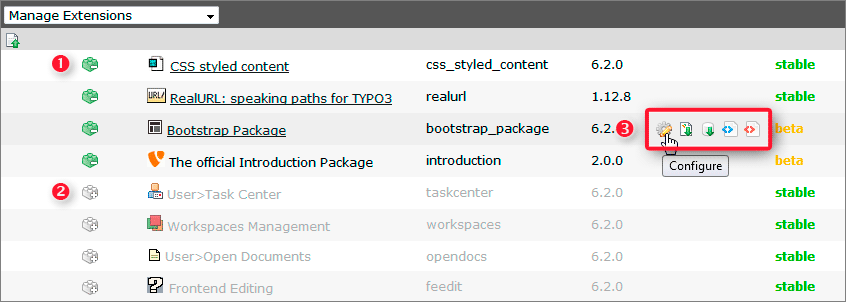
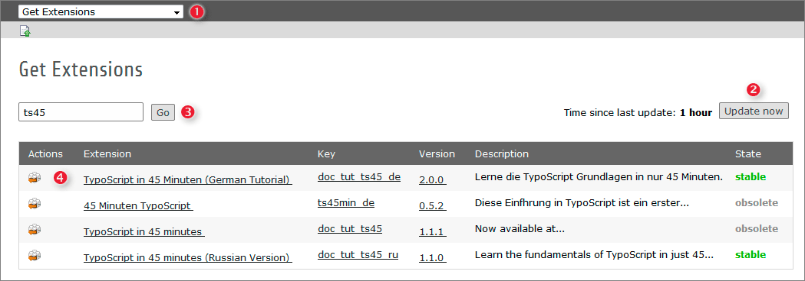
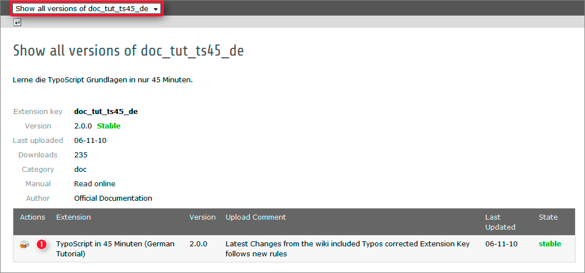

.. ==================================================
.. FOR YOUR INFORMATION
.. --------------------------------------------------
.. -*- coding: utf-8 -*- with BOM.

.. include:: ../Includes.txt

.. _a-short-glimpse-into-the-extension-manager:

A short glimpse into the Extension Manager
------------------------------------------

TYPO3 has many built-in features but even more different features are
implemented as extensions. With extensions you can enhance the functionality of
TYPO3 CMS or create totally new features. Even a lot of the core features itself
are implemented as extensions (plugins). It is up to you to use them or not.

The *Extension Manager* assists you while administrating all your extensions.
Let us have a short glimpse at the *Extension Manager* now. Login as administrator
and select the *Extension Manager* (1) module from the *ADMIN TOOLS*.

.. figure:: ../Images/T3CMS62-BE-ExtensionManager.png
   :alt: TYPO3 CMS 6.2 Extension Manager

In the drop down on top of the module (2) different functions respectively views of
the *Extension Manager* can be selected.

- Having **Manage Extensions** selected you will get a list of all loaded
  extensions. Anyway, whether they are currently activated (see (1) below )
  or not (see (2) below).

- Selecting **Get Extensions** in the drop down on top allows you to search,
  download and install extensions. Here you are right if you want to retrieve
  the latest Extension-List from TYPO3 Extension Repository (TER).

- Choosing **Get preconfigured distribution** will allow you to download such
  packages. Do you remember the  :ref:`Introduction Package <installing-the-introduction-package>`
  we downloaded during the installation of the TYPO3 base system?

Now let us have a look at the list of loaded Extensions:

The data in the list above represent from left to right:

- Extension install/uninstall symbol. You can install or uninstall an extension by
  clicking on the related icon (1) or (2).

- Extension title.

- Extension key. Used to create the extension folder in typo3conf/ext/ and to
  define TypoScript paths. Furthermore a lot of other things depend on the
  extension key.

- Extension version.

- Extension related actions (3) represented by specific icons. This icons are
  visible only when you hover over the extension line. Moving the cursor
  over an icon itself will show a short description of the action.

- Extension state (experimental, alpha, beta, stable, obsolete). Set by the
  extension developer himself based on his own judgement.

Now let us install a new extension. Therefor select *Get Extensions*
(see (1) below) from the drop down on top:

Field (3) is still empty at the moment and the list below (4) shows all
available extensions. It is a good idea to update this list by clicking on the
*Update now* button (2) before you proceed. This ensures only the latest version
of any extension will be displayed in the list and thereby offered for download
and installation.

Having done so, type the extension's name or a part of it in field (3) and click
on the *Go* button. All extensions containing the string you just typed will
show up in the list.

At this point there are two options:

- for directly downloading and installing the extension of your choice just
  click on its "Import and Install" symbol (4).

- if you would like to get more information about the extension first simply
  click on one of the underlined text sections.

Now let us have a look up at the more detailed information about extension
doc_tut_ts45_de:

As you see the name of the extension is now automatically preselected in the
drop down on top. If the extension fits your needs you can easily download and
install it by clicking on the "Import and Install" symbol (1).

.. warning::

   **Extension security**

   Please keep in mind there is no security audit available for the
   extensions! Have a close look at the extensions you are installing.
   If you find any security issue get in touch with the security team:
   security@typo3.org .
