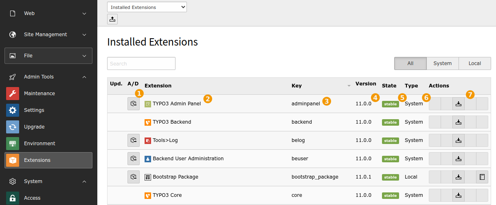

.. include:: ../Includes.txt

.. _extension-manager:
.. _a-short-glimpse-into-the-extension-manager:

A short glimpse into the Extension Manager
------------------------------------------

TYPO3 CMS has many built-in features but even more features are
available via extensions. Actually the whole of TYPO3 CMS itself
is made of extensions. With public extensions you can enhance existing
features or add totally new ones.

The *Extension Manager* is where you can manage available extensions
or get new ones from the TYPO3 Extension Repository (TER). It is quite
a rich tool and this chapter provides only a brief overview.

.. note::

   It is possible to set up your TYPO3 CMS installation to use
   Composer instead, but this is not covered by this tutorial.

Moving to **ADMIN TOOLS > Extensions**, we get the following view:

It shows the "Installed extensions". The first action icon (1) can be used
to install an uninstalled extension or vice-versa (uninstalled extensions
appear grayed out).

Next comes information about the extension: title, key, version and state.
Finally are one or more actions icons, depending on what the extension offers.
All extensions have a download action, many will have a configuration action,
which can be used to access the extension's options. Again just hover over
the actions to get a help text.

.. _install-extension:

Installing a new extension
^^^^^^^^^^^^^^^^^^^^^^^^^^

Let's look briefly at the extension installation process. Use the menu
in the docheader to switch to the "Get extensions" view:

.. figure:: ../Images/BackendExtensionManagerInstall.png
   :alt: Getting extensions from the Extension Manager

The list which appears in this view is the full list of extensions
from the TER (limited to those compatible with the TYPO3 CMS that
you are using). You can update this list using the button at the
top right (1). A search field is available (2).

Clicking the "Import and install" action (3) will trigger the installation.
Extensions may depend on other extensions, in which case all will
be installed transparently.

If you look for a specific version of an extension, you can click
on its title (4) and access the list of all available versions.

.. figure:: ../Images/BackendExtensionManagerExtensionVersions.png
   :alt: Viewing all possible versions of a given extension

Only compatible versions are displayed. Known insecure versions
will also never show up.

.. warning::

   **Extension security**

   Please keep in mind there is no security audit available for public
   extensions! Have a close look at the extensions you are installing.
   If you find any security issue get in touch with the security team:
   security@typo3.org .
