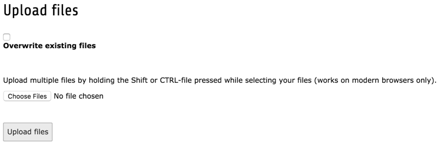

.. include:: ../Includes.txt

.. _the-file-module:
.. _the-file-module-or-image-archives:

===============
The File Module
===============

The **FILE > Filelist** module is where you can manage
all the media associated with your TYPO3 web site.

.. _managing-files:
.. _managing-files-in-typo:

Managing Files in TYPO3 CMS
===========================

Files including documents and images are managed in the 
Filelist module. Similar to the **WEB > List** module,
it displays a navigation tree, which corresponds to the file
structure on the server, and a list of all files for the
selected directory.

.. figure:: ../Images/BackendFileModule.png
   :alt: The File module
   :class: with-shadow

For admin users, the folder displayed by default is called
"fileadmin/ (auto-generated)" and corresponds to the
:file:`fileadmin/` folder located under the document root
folder on your web server.

Using these files inside content elements to display them
or link to them in your web site is covered in the
:ref:`Editors Tutorial <t3editors:images>`.

.. note::

   There are extensions which make it possible to connect to remote
   storage pools (like a WebDAV server or an Amazon S3 account) and work
   with the files as if they were on the TYPO3 CMS server.

Clipboard
---------

There's a clipboard just like in the *List* module.

.. figure:: ../Images/BackendFileClipboard.png
   :alt: The File module's clipboard
   :class: with-shadow

Using the action icons, files can be renamed or replaced
(just hover over the icons and you will get a help text).

.. _uploading-files:

Uploading New Files
-------------------

You can upload files to a given folder by using the context menu
or to the current directory by using the action icon in the docheader.

.. figure:: ../Images/BackendFileUploadIcons.png
   :alt: Upload possibilities in the File module

You will get to simple upload view:

