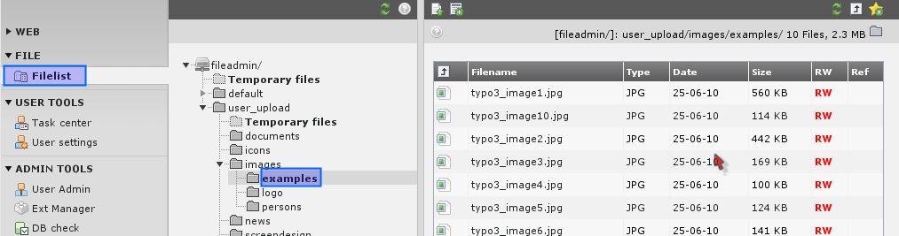
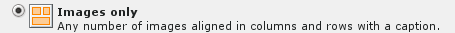
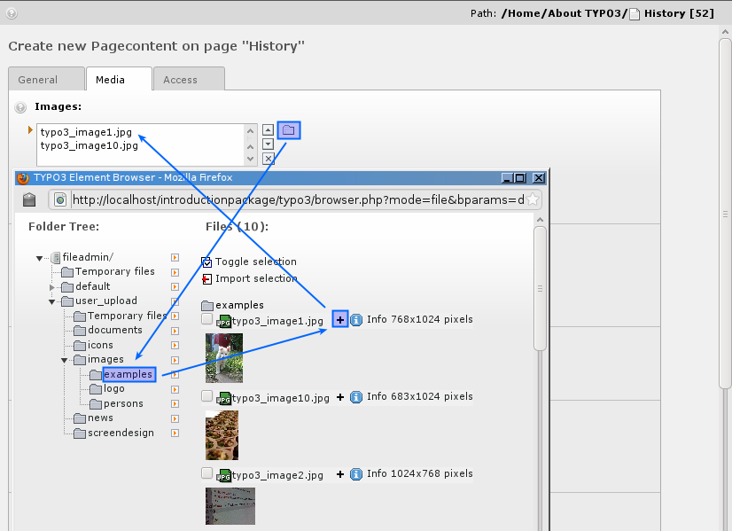
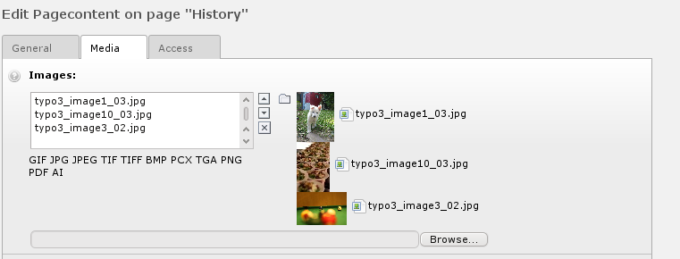
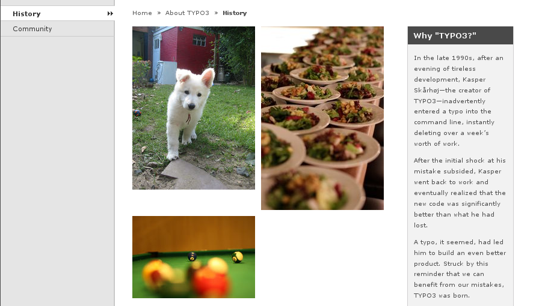
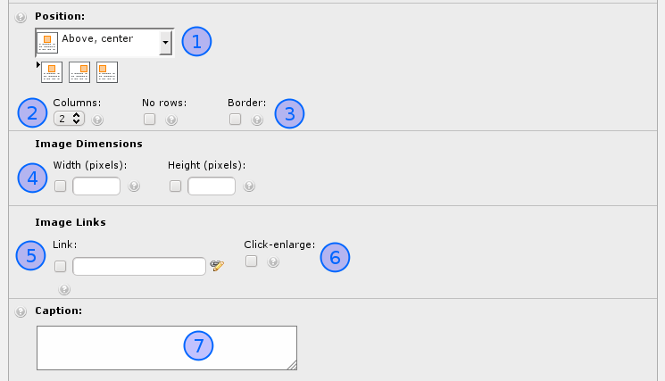
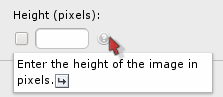

.. ==================================================
.. FOR YOUR INFORMATION
.. --------------------------------------------------
.. -*- coding: utf-8 -*- with BOM.

.. include:: ../../Includes.txt

.. _managing-files-in-typo:

Managing files in TYPO3
^^^^^^^^^^^^^^^^^^^^^^^

Let's look at another interesting module - the File module:

This works by the same principle as the List module for database
elements - it has a folder tree and a list view of files in the
folders.

The folder displayed by default (for "admin" users) is the
"fileadmin/" folder located under the root folder of your web
serverdirectory. Here a little image archive already exists. These
files are not used on the website directly. If we want to do so we can
either a) link to the files from content elements or b) pick the files
in the process of selecting files for content elements.

.. _using-files-from-the-archive-in-your-content-elements:

Using files from the archive in your content elements
"""""""""""""""""""""""""""""""""""""""""""""""""""""

The latter approach is the most typical. Try to insert an image
element on the front page of the "History" site:

And instead of uploading one image at a time by the "Browse" button
you can select  *multiple files* already on the server!

After saving the files are attached to the record. Notice that
contrary to what you might think the files are now copied to the
uploads/pics/ folder where TYPO3 stores images attached to page
content elements.

And on the front page you have got a nice block of images:

Notice that there are really a lot of options related to images in
TYPO3. In the Images tab in the "Links" box (#5) can set a link for
the images unless the "Click-enlarge" option (#6) is selected which
will enable a link for all images which opens a window with an
enlarged version inside! Very nice feature for galleries! The
"Caption" field is for the text under images.

[create a new screenshot and note the numbers in text]

You can find further options in the Appearance tab. The "Border"
option (#3) is nice since a black border is surrounding the images and
that looks good most of the time. The "Width" field (#4) determines
the image block width in pixels - very useful as well. The most
important option is the "Image Alignment" selector (#1). With this you
tell TYPO3 how to position the block of images (there are three
images, remember!) in relation to text. This is mostly important when
using the "Text & Images" element type of course. Secondly the "Number
of Columns" selector (#2) is important since this is responsible for
organizing the images into columns, in this case "2".

And finally remember:

You can hover all labels - help at your fingertips! Use it!