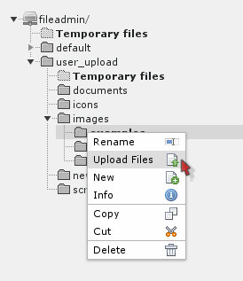
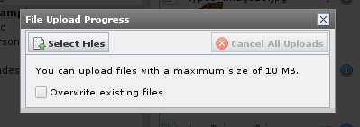
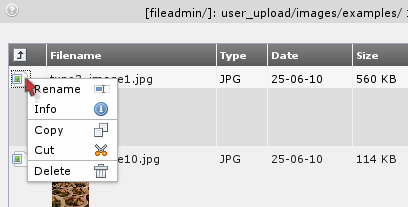
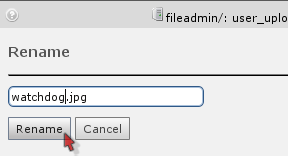

.. ==================================================
.. FOR YOUR INFORMATION
.. --------------------------------------------------
.. -*- coding: utf-8 -*- with BOM.

.. include:: ../../Includes.txt

.. _uploading-images-to-the-archive:

Uploading images to the archive
^^^^^^^^^^^^^^^^^^^^^^^^^^^^^^^

One way to get images to the archive would be through FTP. But of
course you can upload directly in the File module. Just click the
folder icons:

This will bring up a Flash-Popup form where you can upload multiple
files at once:

If your browser does not support flash, you can disable this feature
in your user settings and you will get an Simple Upload-Form.

Likewise files can be renamed, copied, deleted etc - all by the
functions available in the context menus you are familiar with
already:

