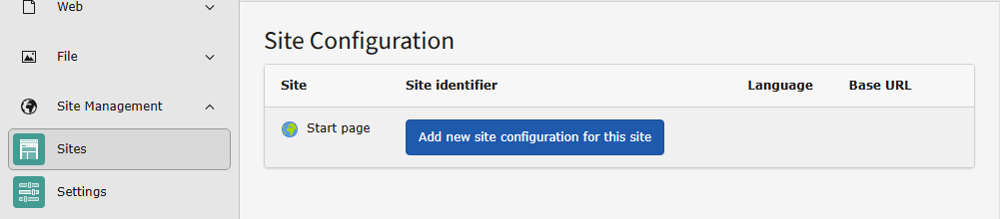
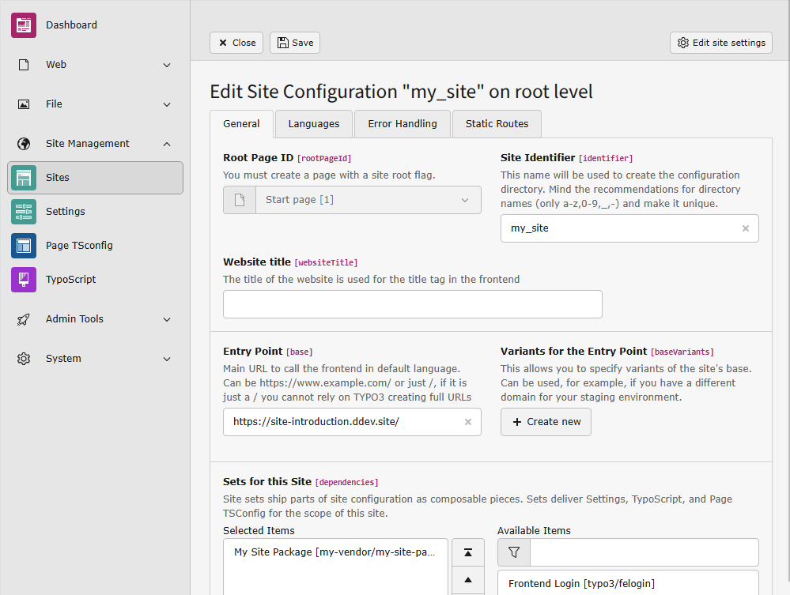
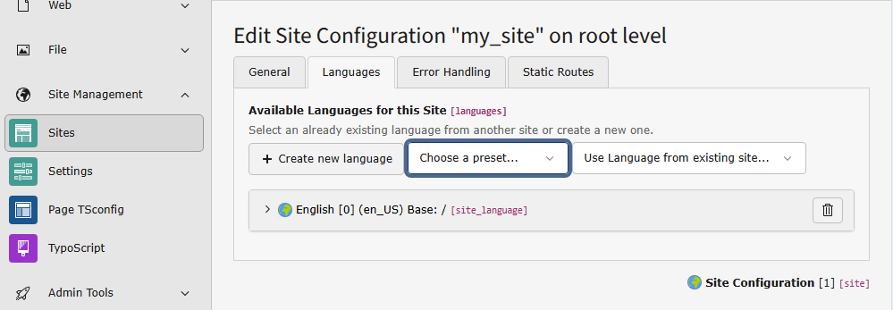

..  include:: /Includes.rst.txt

..  _site-management:

===============
Site Management
===============

..  contents:: Table of contents

..  _siteconfiguration:
..  _siterecords:
..  _site-configuration:

Create a new site configuration
===============================

..  attention::
    You can skip this step if you have already :ref:`created the root page <t3start:create-root-page>`
    in the root of the page tree. This will automatically generate a site
    configuration named after your page. Click the name of the page in the
    list of site configurations to :ref:`edit the site configuration <t3start:edit-site-configuration>`.

Before creating a site configuration, you should have :ref:`created the root page <t3start:create-root-page>` of
your site in the page tree.

The site configuration is stored in a file called
:file:`config/sites/my_site/config.yaml`. For your convenience, you can
edit this file using the backend module: :guilabel:`Sites > Setup`.

Available root pages should be listed in this module. Click
the button :guilabel:`Add new site configuration` next to the relevant
page to create a site configuration for it.

    Create a new site configuration

..  _edit-site-configuration:

Edit the site configuration
===========================

You can now enter some basic information about the site.

The site identifier can be arbitrary, so we use "example_site" here. The
entry point should be a URL pointing to the web root. In this example, it is
a local URL generated by `DDEV <https://ddev.com/>`__.

..  versionadded:: 13.1
    Site sets have been added with TYPO3

From the list of available sets, choose the set for your site package if you
have one. You can learn how to create a site package in the
:ref:`TYPO3 Sitepackage Tutorial <t3sitepackage:start>`.

    Enter the basic data and choose the site set

Since our set already depends on the set of `fluid_styled_content`, it is
not necessary to choose that set here.

    Create a language for your site by selecting it from the list of presets

In the next two tabs, you can define error handling, such as a custom 404 page,
and static routes, for example, to a :file:`robots.txt` file.

You can read more about :ref:`Site Handling <t3coreapi:sitehandling>` in
the reference "TYPO3 Explained".

After saving, a new file should be created in your project:

..  literalinclude:: _config.yaml
    :language: yaml
    :caption: config/sites/example_site/config.yaml

..  _site-management-trouble:

Site management: Trouble shooting
=================================

..  accordion::
    :name: siteManagementTrouble

    ..  accordion-item:: Set of Site Package not available
        :name: site-trouble-set-unavailable
        :header-level: 2
        :show:

        If the set of your site package is not available make sure, that the
        site package extension is `Installed <https://docs.typo3.org/permalink/t3start:installing-extensions>`_.

        If the site package is installed but the site package set is still not
        available the set or one of its dependencies might be corrupted.

        ..  versionadded:: 13.4.5

        ..  figure:: /FirstProject/SiteManagement/InvalidSiteSet.png
            :alt: Screenshot of the "Site Configuration" module with an invalid site set displayed

            Invalid site sets are listed in the "Site Configuration" module with reasons why they are invalid.

        The site sets are cached. If you change the site set configuration and
        see no difference, `clear the caches <https://docs.typo3.org/permalink/t3start:how-to-clear-cache>`_.

    ..  accordion-item:: This site depends on invalid site sets
        :name: site-trouble-set-invalid
        :header-level: 2

        If a set or one of its dependencies becomes corrupted after it has
        already been added to a site configuration, an error box appears in
        the table of configurations.

        ..  figure:: /FirstProject/SiteManagement/InvalidDependency.png
            :alt: Screenshot of the site configuration module with a site set that displays the error message "This site depends on invalid site sets".

        This can happen for example when you uninstall an extension on which
        your site package depends. In this case install the extension again or
        remove the dependency from your site package.

        The site sets are cached. If you change the site set configuration and
        see no difference, `clear the caches <https://docs.typo3.org/permalink/t3start:how-to-clear-cache>`_.

    ..  accordion-item:: On saving TYPO3 keeps creating empty language configurations
        :name: site-trouble-duplicate-language
        :header-level: 2

        On saving the site settings TYPO3 keeps creating empty language
        configurations.

        This can happen if you deleted the language configuration with uid 0.
        If you only need to use one language this one language has to have the
        uid 0.

        Edit the auto created language to fit your language needs.

        ..  figure:: /FirstProject/SiteManagement/EmptyLanguage.png
            :alt: An empty language configuration in the site settings prevents saving

            Invalid site sets are listed in the "Site Configuration" module with reasons why they are invalid.

        Sometimes it is easier to just edit the site configuration file:

        ..  code-block:: diff

             base: 'https://site-introduction.ddev.site/'
             languages:
               -
                 title: English
                 enabled: true
                 locale: en-US
                 hreflang: ''
                 base: /
                 websiteTitle: ''
                 navigationTitle: ''
                 flag: global
            -    languageId: 1
            +    languageId: 0
             rootPageId: 1
             websiteTitle: ''

        Change the language id of the only language from 1 to 0.

    ..  accordion-item:: Malformed inline YAML string at line 17
        :name: site-trouble-yaml
        :header-level: 2

        If you manually edited the site configuration and it contains a syntax
        error, the whole backend module might stop working:

        ..  figure:: /FirstProject/SiteManagement/MalformedYAML.png
            :alt: Whoops, looks like something went wrong: Malformed inline YAML string at line 17.

            Malformed YAML can only be corrected by editing the config file.

        Fix or delete the affected site configuration by editing the file, for
        example :file:`config/sites/my-site/config.yaml`.

    ..  accordion-item:: No pages found
        :name: site-trouble-no-pages
        :header-level: 2

        If you see the following you cannot add any site configuration until
        you fix the problem in the page tree:

        ..  figure:: /FirstProject/SiteManagement/NoPagesFound.png
            :alt: No pages found! Please add at least one page through the Layout module.

            Malformed YAML can only be corrected by editing the config file.

        If you have not created any pages yet,
        `create a root page <https://docs.typo3.org/permalink/t3start:create-root-page>`_
        first.

        If you have created pages but still see the message, set the flag
        "Use as Root Page" in the page properties, tab "Behavior" for the page
        that should be the startpage of your site. A root page is displayed with
        a globe icon in the page tree.

        ..  figure:: /FirstProject/SiteManagement/MarkPageAsRootpage.png
            :alt: Option "Use as Root Page" in the page properties.

            At least one root page is required before you can create a site configuration.
