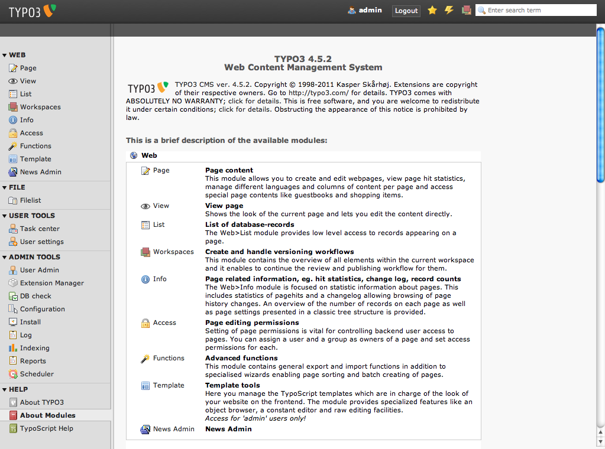

.. ==================================================
.. FOR YOUR INFORMATION
.. --------------------------------------------------
.. -*- coding: utf-8 -*- with BOM.

.. include:: ../../Includes.txt

.. _backend-and-frontend:

Backend and Frontend
^^^^^^^^^^^^^^^^^^^^

`TYPO3 CMS` is devided in two areas - the backend and the frontend.
The `frontend` is the website that is produced by `TYPO3 CMS`. It is
visible by everyone out there on the web.
The administrative area of the website is called `backend`. A username
and a password is always required for the backend.
You will later learn how to give access to the backend to others
- like editors or co-administrators.

To go to the frontend, enter http://www.your-site.example.org/ in
your address bar. For now we continue with the backend.

Go to the backend of your new website: open a browser and type
http://www.your-site.example.org/typo3/\.

You will get a login page looking like this:

.. figure:: ../../Images/BackendLoginPage.png
   :alt: Login page for the backend

Use the username "admin" and the password you set while installing
`TYPO3 CMS`.

After pressing the login button you will get redirected to the TYPO3
backend overview.

On the left you have TYPO3's main modules - the main menu of the
backend. Click on "Page" to go to the page module now.
