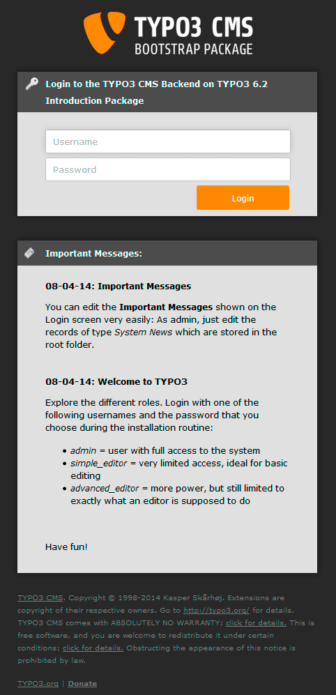
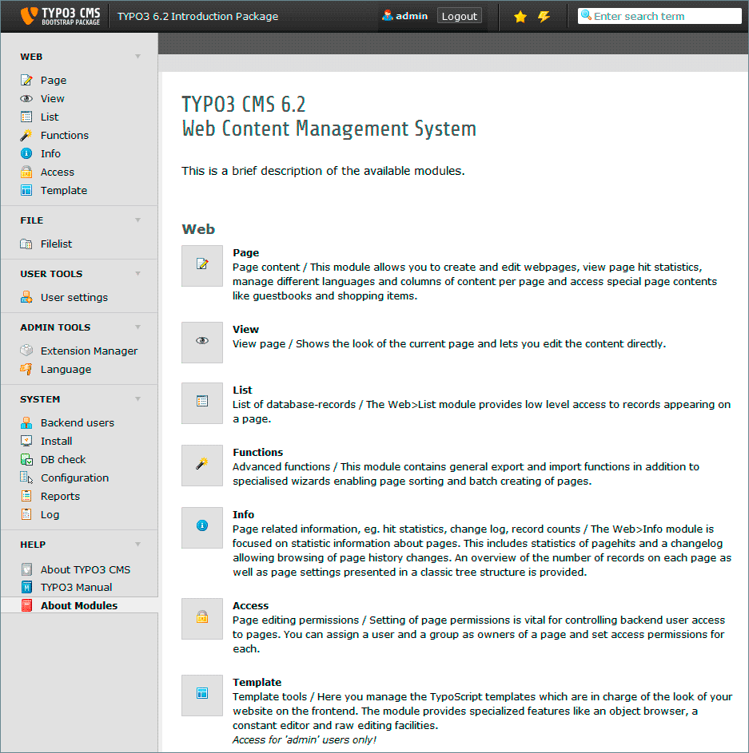

.. ==================================================
.. FOR YOUR INFORMATION
.. --------------------------------------------------
.. -*- coding: utf-8 -*- with BOM.

.. include:: ../../Includes.txt

.. _backend-and-frontend:

Backend and Frontend
^^^^^^^^^^^^^^^^^^^^

*TYPO3 CMS* is divided into two areas - the *backend* and the *frontend*.
The *frontend* is the website that is produced by *TYPO3 CMS*. It is
visible by everyone out there on the web.
The administrative area of the website is called the *backend*. Username
and password are always required for login to the backend.
Later you will learn how to  :ref:`give access to the backend to other users
<creating-a-new-user-for-the-introduction-site>`
like editors or co-administrators.

To display the *frontend*, enter http://www.your-site.example.org/ in
the address bar of your browser.

For now we will continue with the *backend*. To visit it type
http://www.your-site.example.org/typo3/ in the address bar of your browser. A login page looking like this will be displayed:

Use the username **admin** and the password you set while installing
*TYPO3 CMS*.

After pressing the **login** button you will get redirected to the TYPO3
backend overview:

On the left you see the main modules of TYPO3 CMS, also called the main menu of the
backend. **About Modules** is select in the main module **HELP**.

To perform the next step click on **WEB** > **Page** now. This will redirect you to the Page module.
