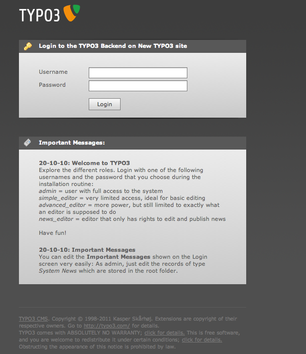
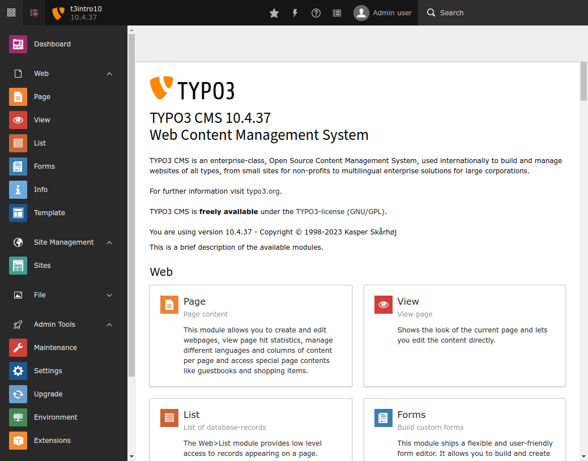
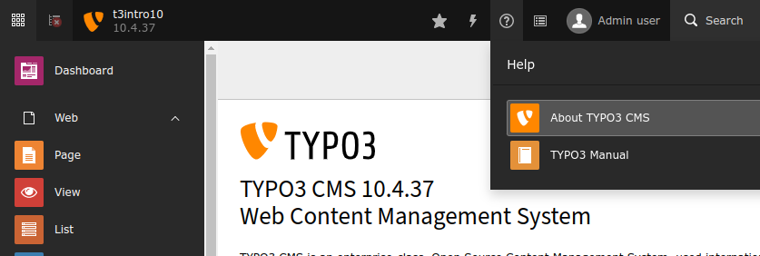

.. include:: ../../Includes.txt

.. _backend-and-frontend:

Backend and Frontend
^^^^^^^^^^^^^^^^^^^^

TYPO3 CMS is divided into two areas - the *backend* and the *frontend*.
The *frontend* is the website that is produced by TYPO3 CMS. It is
visible by everyone out there on the web.
The administrative area of the web site is called the *backend*. A user name
and a password are always required to log into the backend.

To display the *frontend*, enter the URL of your web site
in the address bar of your browser (e.g.
`http://www.your-site.example.org/`).

The *backend* is accessed by adding `/typo3/` to your web site's
URL (e.g `http://www.your-site.example.org/typo3/`)
A login page looking like this will be displayed:

Use the user name (default is **admin**) and the password that you defined during
the installation process.

After pressing the **login** button you will get redirected to the TYPO3 CMS
backend overview:

At the top is the *top bar*. On the left side is the *module menu*, main menu of the TYPO3 CMS backend.
It is divided into main modules ("Web", "File", etc.) and their sub-modules.

The current view is a list of all installed modules and their usage.
It is called the **About Modules** view and can be reached using the help menu
in the top bar:

To perform the next step click on **WEB** > **Page** now.
This will redirect you to the **Page** module.
