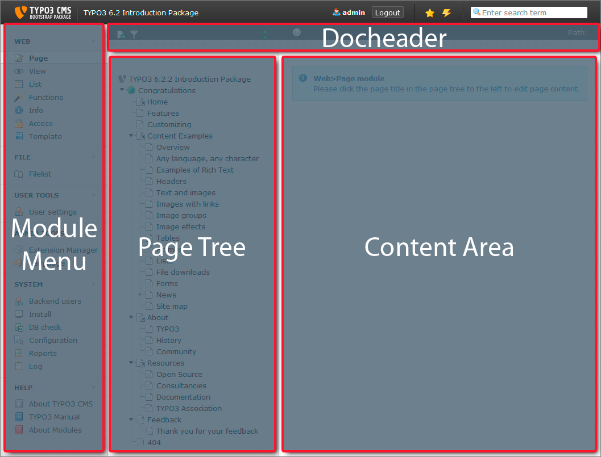

.. ==================================================
.. FOR YOUR INFORMATION
.. --------------------------------------------------
.. -*- coding: utf-8 -*- with BOM.

.. include:: ../../Includes.txt

.. _docheader:
.. _general-backend-structure:

General Backend Structure
^^^^^^^^^^^^^^^^^^^^^^^^^

On the left you still have the *modules menu*, in the middle you now
have the *page tree* and on the right the *content area*.

The *docheader* contains your action icons - like close, save or preview
- and some general information.
We will have a closer look at the individual parts on the next pages.
