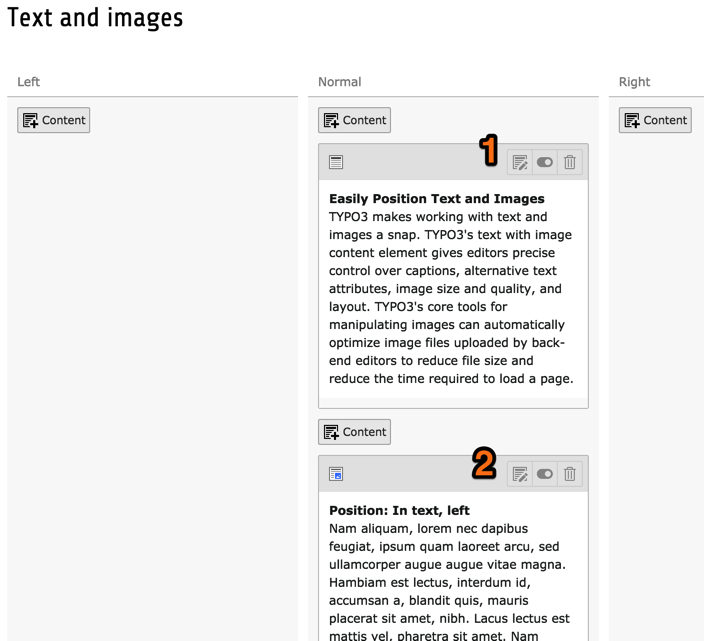

.. include:: /Includes.rst.txt

.. _page-content:

============
Page Content
============

Let us now see how content is structured in a TYPO3 CMS web site.
First of all we shall navigate to a particular page:

- in the backend, click on the arrow right of the "Content Examples" page

- next click on the "Text and images" page

- use the context menu to show the "Text and images" in the frontend.

Let's now compare both views.

Frontend:

.. figure:: ../../Images/FrontendTextAndImages.png
   :alt: Page content seen from the frontend

For now we want to be in "Columns" mode. If that is not the case when you move to the Page module, please use the menu in the docheader to switch mode.

.. figure:: ../../Images/PageModuleFunctions.png
   :alt: Changing mode in the Page module

Backend:

As you see the order of the content elements on the web page is the
same as the order of the elements in the backend. The content elements
are stored in columns, content that is in the right
column in the backend is in the right column on your page, etc. Each
content element on your page can be of a different type (like text or
text & images) giving you a lot of flexibility.

The Page module shows a preview of each content element, together
with some action icons. Here is a quick overview:

.. figure:: ../../Images/BackendContentElementPreview.png
   :alt: Content element preview and action icons

#. insert a new content element above the current one
#. an icon representing the type of content element
   (hovering over it will show its id)
#. edit the content element
#. hide/show the content element
#. delete content element
#. a preview of the element's content (will vary depending on the type)
#. insert a new content element below the current one

Modifying existing content or adding new content is covered in the
:ref:`Editors Tutorial <t3editors:content-elements>`.
