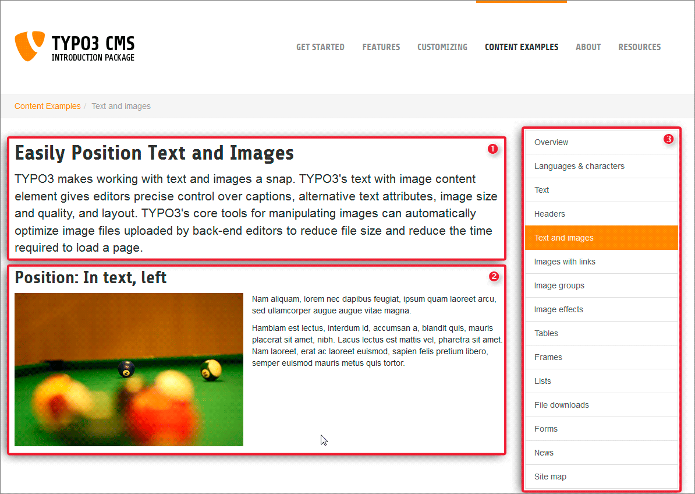
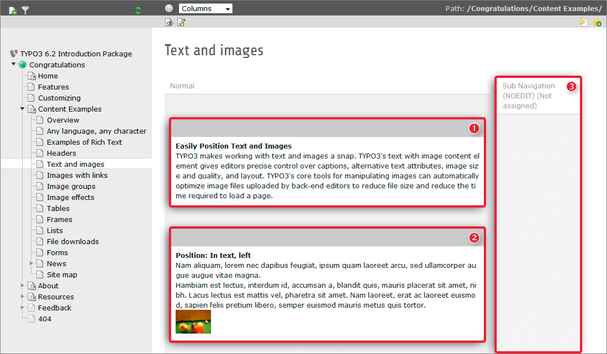
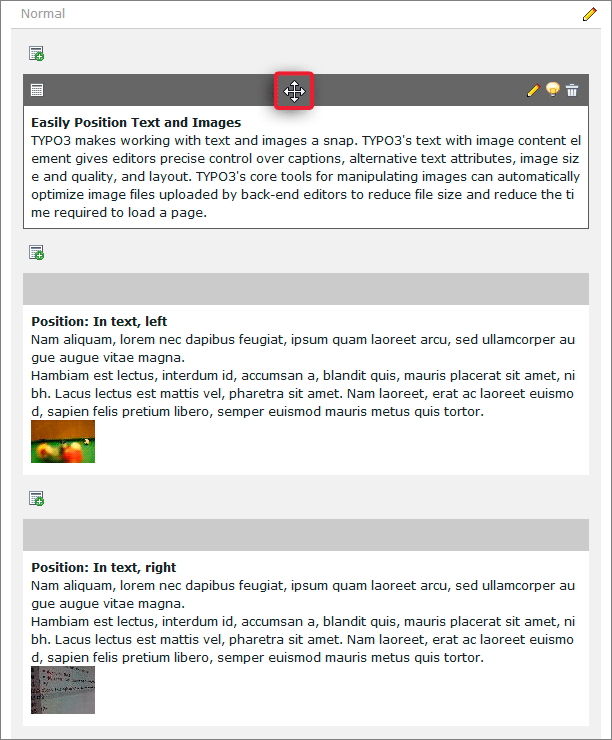
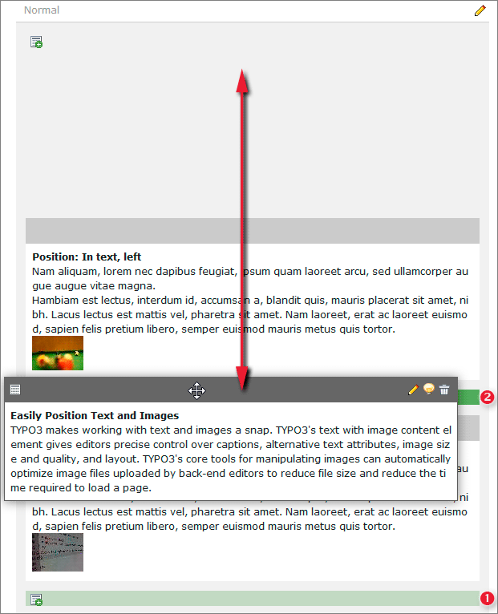
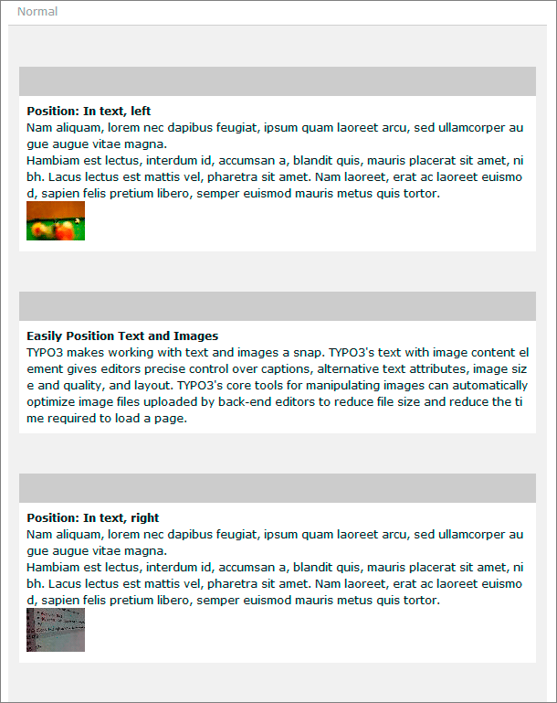
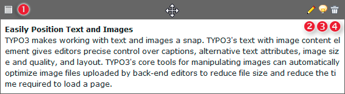

.. ==================================================
.. FOR YOUR INFORMATION
.. --------------------------------------------------
.. -*- coding: utf-8 -*- with BOM.

.. include:: ../../Includes.txt

.. _page-content:

Page content
^^^^^^^^^^^^

Having seen how our website is structured by the page tree and
what is the purpose of different page types we will go ahead with the
content now.

First, let us have a look how the content on a page is organized:

- Open the page "CONTENT EXAMPLES" > "Text and images" in your browser

- In a second browser window open the TYPO3 backend

- Choose the page module and select "Content Examples" > "Text and
  images" in your page tree

- Compare both views

Frontend:

Backend:

As you see the order of the content elements on the webpage is the
same as the order of the elements in the backend. The content elements
are additionally sorted by columns, content that is in the right
column in the backend is in the right column on your page. Each
content element on your page can be of a different type (like text or
text & images), so you are very flexible in creating pages.

Now let us move a content element inside a page. Typically the top bar of each
content element is colored light grey and there are no icons visible on it. When
you hover over the top bar of a content element three things will happen:

- the color of the top bar changes from light grey to dark grey

- a few icons become visible on the top bar

- your mouse cursor changes its shape to a crosshair cursor

After the mouse cursor's shape changed to a crosshair press the left mouse button
and move the content element up and down (do not relaese the mouse button). Doing
so, you will recognise light green horizontal bars (1) showing up between the other
content elements. This bars mark all possible positions where you can drop the content
element your are currently dragging.

Now move the content element to its final position. You will note the light green
bar changes its color to dark green (2). By Releasing the left mouse button you will
drop the content element on its new position and you are done.

After moving the content element to its new position have a look at your
website's frontend. It reflects the changing of the content elements arrangement
in the backend.

The icons in a content element's header bar indicate different actions you
can perform with this element:

1. show context menu
2. edit content element
3. hide/show content element
4. delete content element
