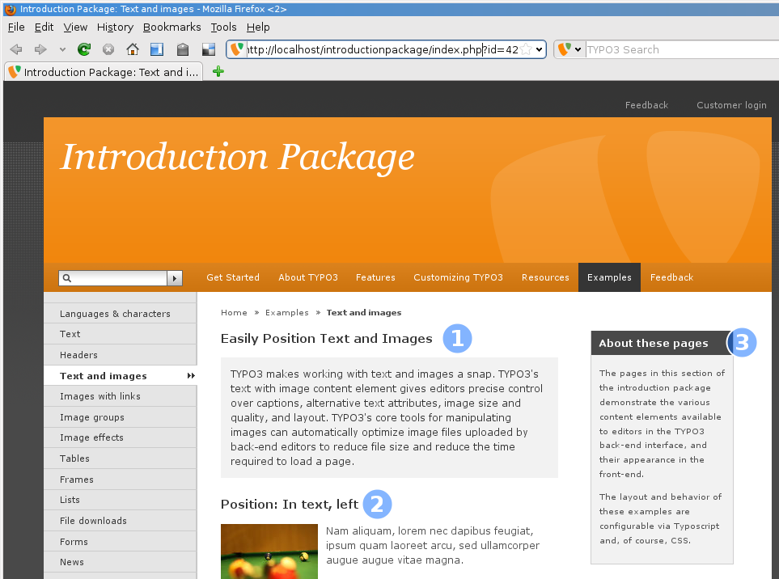
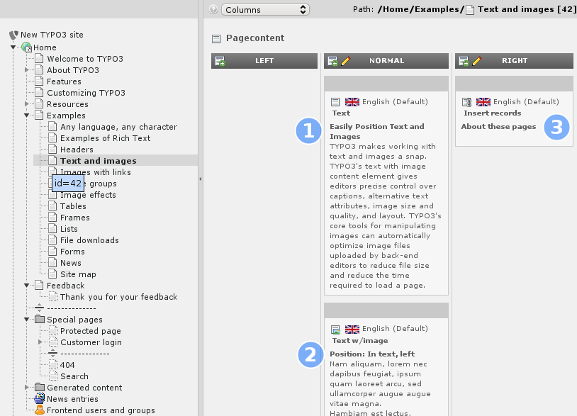
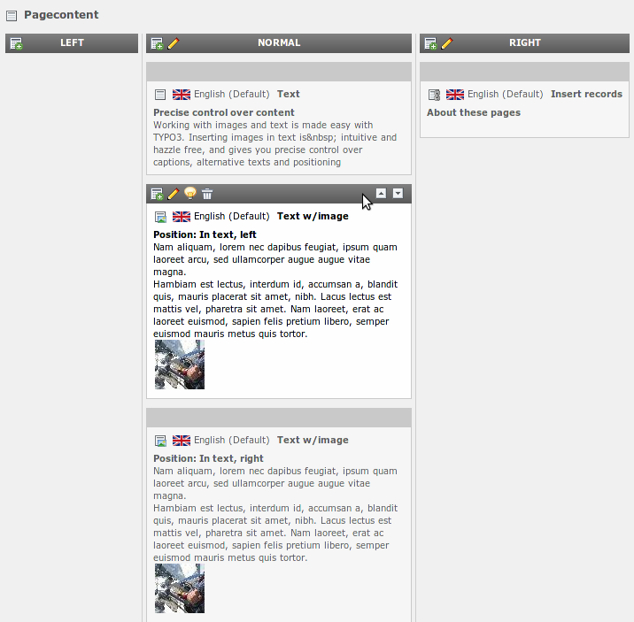
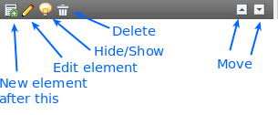

.. ==================================================
.. FOR YOUR INFORMATION
.. --------------------------------------------------
.. -*- coding: utf-8 -*- with BOM.

.. include:: ../../Includes.txt

.. _page-content:

Page content
^^^^^^^^^^^^

Now that we have seen how the page is structured via the page tree and
what the different page types do. It is time to have a look at the
content.

First let's see how the content on a page is organized.

- Open the page "Editor Features" > "Text and Images" in your browser

- In a second browser window open the TYPO3 backend

- Choose the page module and select "Editor Features" > "Text and
  images" in your page tree

- Compare both views

Frontend:

Backend:

As you can see the order of the content elements on the webpage is the
same as the order of the elements in the backend. The content elements
are additionally sorted by columns, content that is in the right
column in the backend is in the right column on your page. Each
content element on your page can be of a different type (like text or
text with image), so you can create very flexible pages.

Let's look what happens if we move a content element.

- Hover with your mouse over the gray bar of a content element on that
  page:

As you can see, some editing icons for that element appear. Use the
arrows at the right to move the content element up or down. After you
moved the element have a look at your website frontend. You should see
the page reflecting your changes to the order.

The other icons in the elements header point to different actions you
can do with this element:

