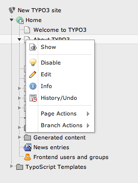
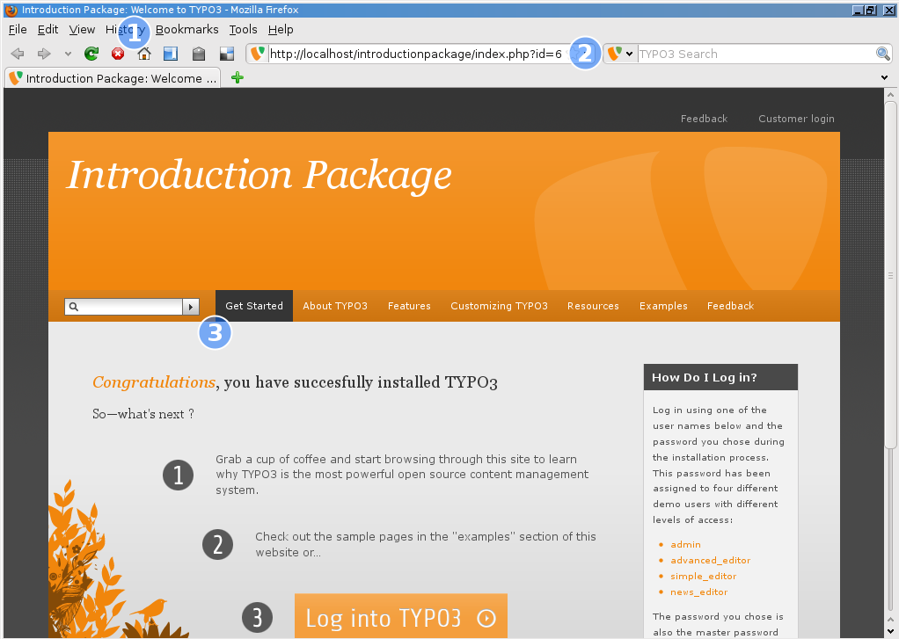
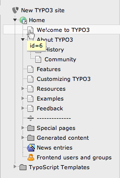

.. ==================================================
.. FOR YOUR INFORMATION
.. --------------------------------------------------
.. -*- coding: utf-8 -*- with BOM.

.. include:: ../../Includes.txt

.. _page-tree:

Page tree
^^^^^^^^^

The page tree represents the hierarchical structure of your page. In
most cases this is exactly corresponding to what you will see in the
navigation on your website. The page tree can be expanded by clicking
the little arrows on the left of the items.

*Look at your page tree now:*

.. figure:: ../../Images/CurrentPageTree.png
   :alt: Current page tree

Simultaneously look at the navigation in frontend if you click on
**About TYPO3**.

.. figure:: ../../Images/FrontendAboutTypo3.png
   :alt: Frontend of the Introduction Package

You can see how the main menu of your website corresponds to the first
level pages in the page tree, and the submenu corresponds to those
beneath "About TYPO3" in the page tree.

For all modules below the *Web* category there is a page tree shown,
this means all those modules are acting on a per-page base.

A click on the page title will open that page in the content frame on
the right. Hovering over the icon of a page will display its internal
id. This id is also used to display the page in the frontend.

A click on the page icon will open the context menu. Alternatively you
can right click the whole page title.

.. _the-context-menu:

The context menu
""""""""""""""""

The context menu of a page can be used to access most of the
page-related functions the fast way. Here is what these options do:

- Show: Opens the page you clicked in the browser (frontend)

- Disable: Disables the page (so it isn't accessible from the frontend
  anymore)

- Edit: Lets you edit the page properties

- Info: Displays some information of the page

- History/Undo: Shows the change history of the page (who did which
  changes when)

- Page Actions: Action related to the selected page

  - New: Lets you create a new page or new content

  - Cut: Cuts the page

  - Copy: Copies the page

  - Delete: Deletes the page

- Branch Actions: Actions related to the whole branch

  - Mount as treeroot: Temporarily makes the selected page being the
    treeroot

  - Expand Branch: Same as clicking on a "closed" the arrow

  - Collapse Branch: Same as clicking on an "open" arrow

  - Export to .t3d: Opens the export tool and preselects the selected page

  - Import from .t3d: Opens the import tool and preselects the selected
    page

Depending on the context, fewer or more functions might be available.

*Now use the context menu to show the "Welcome to TYPO3" page in the
frontend.*

You see on (1 blue) that the last part of the title in your browser
bar corresponds to the title of the page in the page tree. (2) shows
you that this is the page with ID 6. Go back to your page tree and
hover over this pages icon and you will see the ID 6 again:

(3) might puzzle you - in the page tree and the title bar the pages
name is *Welcome to TYPO3*, but here in the menu it is suddenly *Get
Started*. How come? To find out select **Edit** in the context menu of
that page and take a look at the right content area:

.. figure:: ../../Images/EditPageProperties.png
   :alt: Editing the page properties

There you can see that the page title (1) is *Welcome to TYPO3* but
you will be also able to find *Get Started* at (2). This is called
*Alternative Navigation Title* and means the title that is displayed
in any navigational element (menus, breadcrumbs, sitemaps...). If it
is empty, the page title is used.
