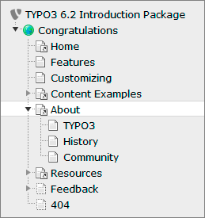
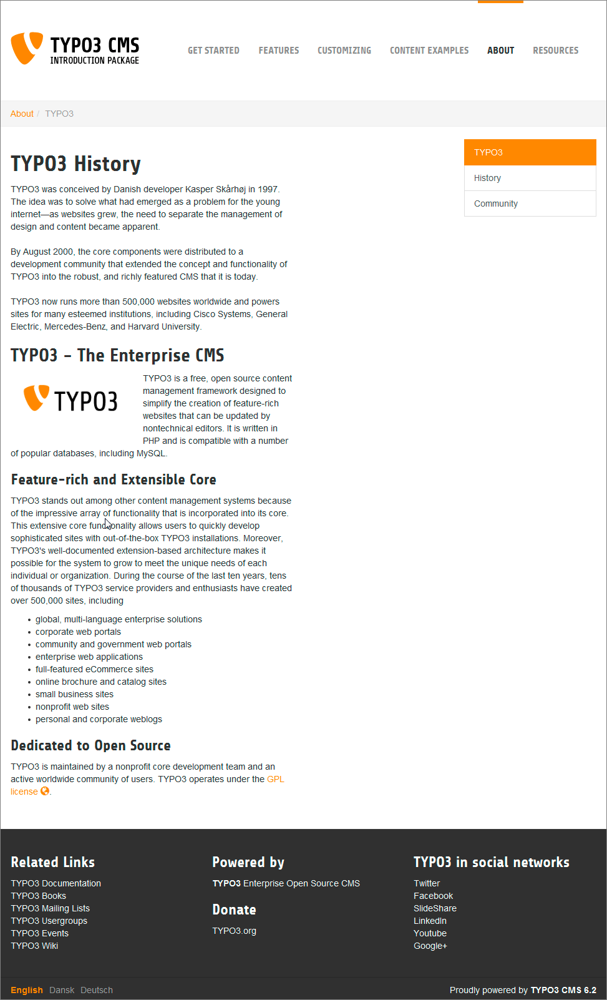
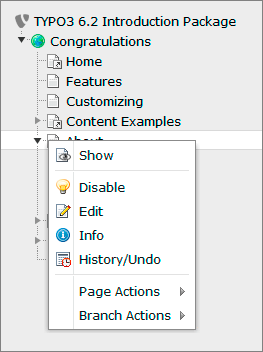
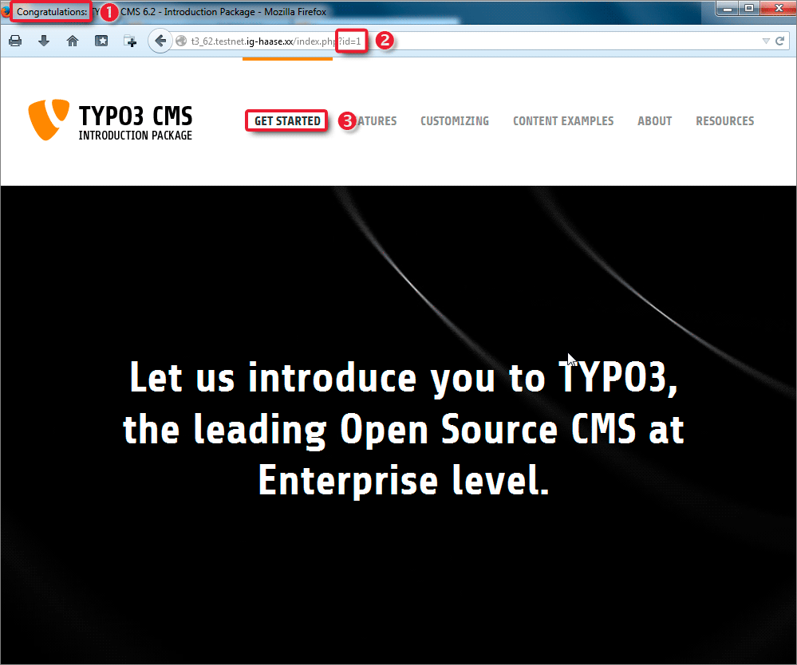
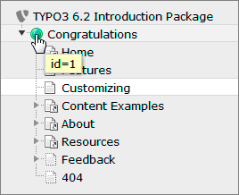
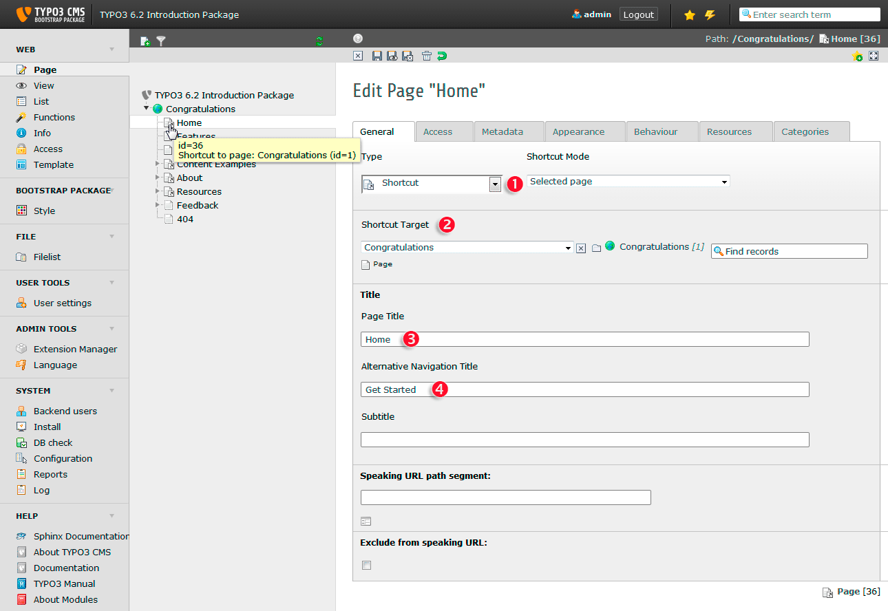

.. ==================================================
.. FOR YOUR INFORMATION
.. --------------------------------------------------
.. -*- coding: utf-8 -*- with BOM.

.. include:: ../../Includes.txt

.. _page-tree:

Page tree
^^^^^^^^^

The page tree represents the hierarchical structure of your page. In
most cases this is exactly corresponding to what you will see in the
navigation on your website. The page tree can be expanded by clicking
the little arrows on the left of the items.

Look at your page tree in the backend now:

Simultaneously have a look at the navigation in the frontend. Click on
**About** in the main menu on top and then select **TYPO3** form the submenu:

As you see the main menu on top of your website corresponds to the first
level menu pages in the page tree. Furthermore the submenu of the **About** page
in the frontent corresponds to the entries beneath **About** in the page tree.

For all modules below the **WEB** category the page tree will be displayed.
This means all these modules are acting on a per-page base.

A click on the page title opens that page in the content area on
the right. Hovering over the icon of a page will display its internal
id. This id is also used to display the page in the frontend.

A click on the page icon will open the context menu. Alternatively you
can right click the whole page title.

.. _the-context-menu:

The context menu
""""""""""""""""

The context menu of a page can be used to access most of the
page-related functions the fast way. Here is what these options do:

- Show: Opens the page you clicked in the browser (frontend)

- Disable: Disables the page (so it isn't accessible from the frontend
  anymore)

- Edit: Lets you edit the page properties

- Info: Displays some information of the page

- History/Undo: Shows the change history of the page (who did which
  changes when)

- Page Actions: Action related to the selected page

  - New: Lets you create a new page or new content

  - Cut: Cuts the page

  - Copy: Copies the page

  - Delete: Deletes the page

- Branch Actions: Actions related to the whole branch

  - Mount as treeroot: Temporarily makes the selected page being the
    treeroot

  - Expand Branch: Same as clicking on a "closed" the arrow

  - Collapse Branch: Same as clicking on an "open" arrow

  - Export to .t3d: Opens the export tool and preselects the selected page

  - Import from .t3d: Opens the import tool and preselects the selected
    page

Depending on the context, fewer or more functions might be available.

Next use the context menu of the "Congratulations" page to the show this page
in the frontend:

As you see at (1) the first part of the page title in your browser
bar corresponds to the title of the page in the page tree. (2) shows
this is the page with id 1. Go back to your page tree in the backend and
hover over the related page's icon and you will recognize id 1 again:

(3) might puzzle you - in the page tree and the title bar the page's
name is "Congratulations", but here in the frontent menu it is suddenly "Get
Started". To find out what happened hover over the icon of the "Home" page
in the page tree. As you see this page is a :ref:`Shortcut <shortcuts>`
to page "Congratulations" with id 1.

Now select **Edit** in the context menu of "Home" page and take a look at the
right content area:

Here you find the page's type *Shortcut* again (1). The shortcut's target
is the "Congratulations" page (2). The title of the page itself is "Home" (3). But,
there is an *Alternative Navigation Title* assigned to it:  "Get Started" (4).
This title is displayed in any navigational element (menus, breadcrumbs, sitemaps...).
If not set the page title will be used.

The "Congratulations" page is additionally the root of your website and
therefore has its own domain - that is where the world icon is coming
from.

