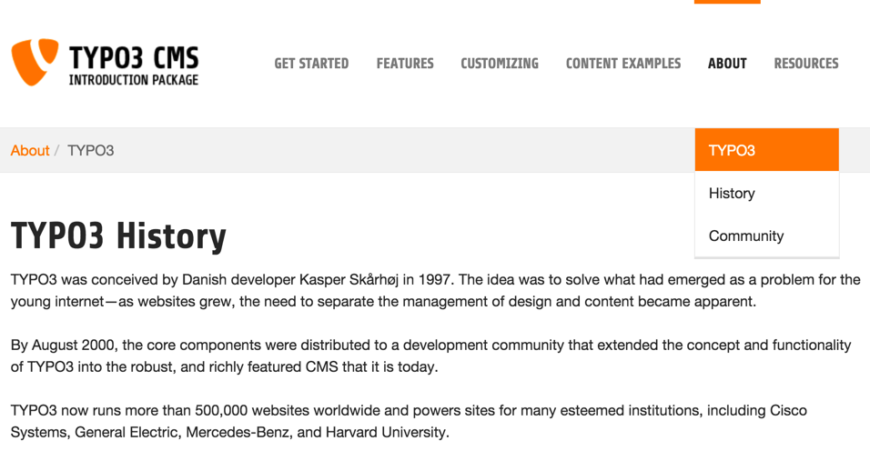

.. include:: ../../Includes.txt

.. _page-tree:

Page tree
^^^^^^^^^

The page tree represents the hierarchical structure of your site and its pages. In
most cases this corresponds exactly to the navigation structure
of your web site. The page tree can be expanded by clicking
the arrow to the left of each page.

For example, click on the arrow next to the page called "About".
Your page tree should look like this:

.. figure:: ../../Images/BackendPageTree.png
   :alt: The page tree with the "About" page expanded

At the same time, take a look at the navigation bar in the frontend. Click on
**About** item in the main menu on top and then select **TYPO3** from the sub-menu:

As you can see, the main menu on top of your web site corresponds to the first
level menu pages in the page tree. The sub-menu of the **About** page
in the frontend corresponds to the entries beneath **About** in the page tree.

The page with the globe icon represents the root of your web site.
Multiple websites can exist within a single installation of TYPO3.
The top node with the TYPO3 logo is a special container which is used
to store shared resources such as File Mounts and backend user records.

Some modules make use of the page tree, but not all. The presence of the page tree
implies that the module depends upon the selection of a specific pages in the page tree.

Clicking on a pages title opens that page in the content area to
the right. Hovering over the icon of a page will display its internal id.

Clicking on the page icon will open the context menu. Alternatively you
can right click the whole page title.

.. figure:: ../../Images/BackendContextMenu.png
   :alt: Page tree with opened context menu

.. _the-context-menu:

The context menu
""""""""""""""""

The context menu of a page is used to access the most common
page related functions. Here is what these options do:

- Show: Opens the page you clicked in the browser (frontend)

- Disable: Disables the page (so it isn't accessible from the frontend
  anymore)

- Edit: Lets you edit the page properties

- Info: Displays information about the page

- History/Undo: Shows the change history of the page (who did which
  changes when)

- Page Actions: Action related to the selected page

  - New: Lets you create a new page or new content

  - Cut: Cuts the page

  - Copy: Copies the page

  - Delete: Deletes the page

- Branch Actions: Actions related to the whole branch

  - Mount as treeroot: Temporarily makes the selected page being the
    treeroot

  - Expand Branch: Same as clicking on a "closed" the arrow

  - Collapse Branch: Same as clicking on an "open" arrow

  - Export to .t3d: Opens the export tool and preselects the selected page

  - Import from .t3d: Opens the import tool and preselects the selected
    page

.. _the-view-module:

The View module
"""""""""""""""

It is also possible to view a page having to leave the backend. By selecting the View module,
backend users are able to preview individual pages and test them against various screen sizes,
by accessing the drop-down menu at the top.

.. figure:: ../../Images/BackendViewModule.png
   :alt: Viewing a page directly in the backend

.. _collapse-page-tree:

Collapsing the page tree
""""""""""""""""""""""""

The page tree can be collapsed to gain screen space, by clicking on the handle
on its right-hand side.

.. figure:: ../../Images/BackendCollapsePageTree.png
   :alt: Click there to collpase the page tree

.. _editing-pages:

Editing pages
"""""""""""""

Modifying an existing page or adding a new one is covered in the
:ref:`Editors Tutorial <t3editors:pages>`.

Next we will look at how content is placed on pages.
