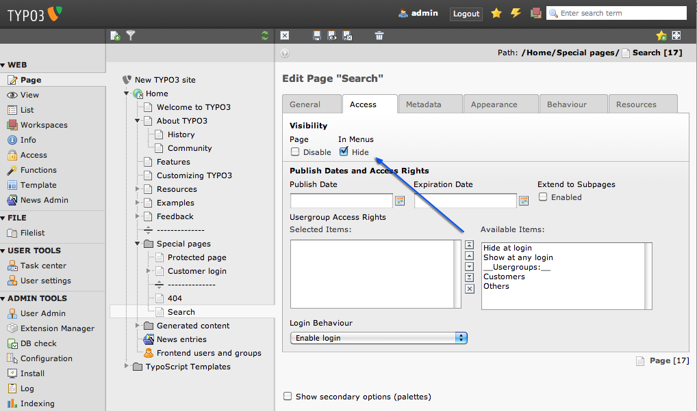
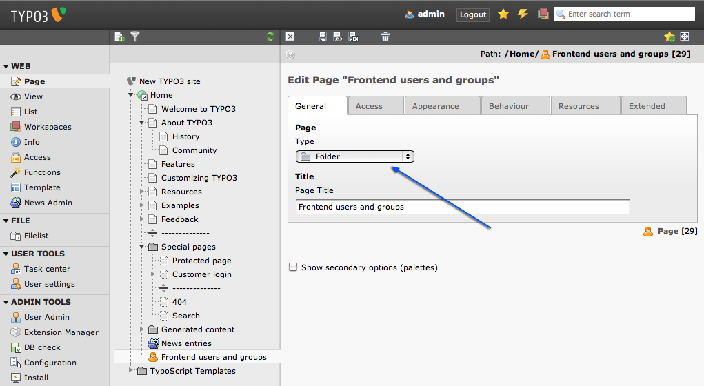
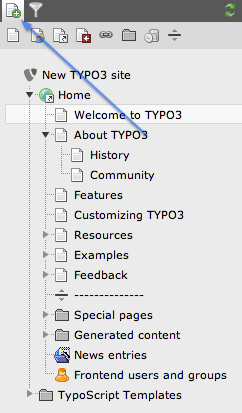
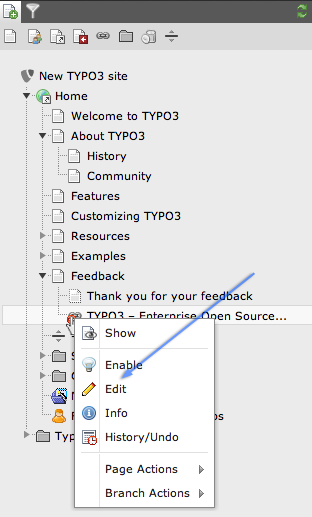
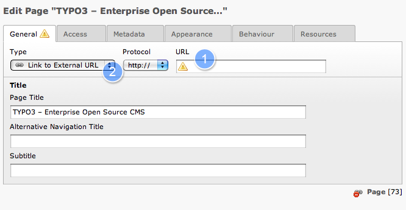
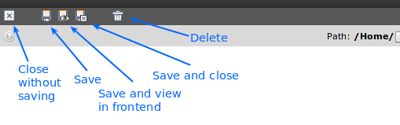

.. ==================================================
.. FOR YOUR INFORMATION
.. --------------------------------------------------
.. -*- coding: utf-8 -*- with BOM.

.. include:: ../../Includes.txt

.. _special-pages:

Special pages
^^^^^^^^^^^^^
.. note::
    Going back to the page tree, you will notice different symbols are
    used for the different page types. The ones appearing in the menu on
    your website are normal pages. Nothing special about them. Then there
    are those with a dotted border on the icon, these are pages that are
    hidden in menus.

.. _hide-in-menu:

Hide in menu
""""""""""""

Pages hidden in menus are basically like the normal pages but don't
appear in the menus. This is useful if you want to have a page, you
just want to link to, but that should not appear in the menu. Edit the
page properties of the page `Search` (use the context menu). Select
the `Access` Tab:

You can see that `Visibility` - `In Menus` - `Hide` is checked.

.. _folders:

Folders
"""""""

In the page tree you see some pages with a folder icon. By default
pages created in TYPO3 are meant to contain web page content. They
appear in the menu and can have a title. 95% of all pages are used
like that. But pages can also serve as simple containers of database
elements that are not meant to be content on a visible web page. This
is what folders are for. Use them just like you use folders on your
computer's file system to store different files in an organized
manner. In the same way folders nicely organize database elements
inside TYPO3. Database elements are for example frontend users,
frontend groups or news records.

You can create a folder by selecting it in the `Type` drop down in the
page properties:

.. _shortcuts:

Shortcuts
"""""""""

A shortcut can be used to create a page that is empty but works - for
example - as a parent page of other pages. Imagine you are selling a
product and have a navigation like this on you website:

- About us

- My Product

- Imprint

- Contact.

Now you want to have some subpages beneath
the `My Product` page to convey the information about your product:
-About us

- My Product
  
  - Overview
  
  - Technical Details
  
  - Pricing and Shipping

- Imprint

- Contact
  
You don't really have content for the `My Product`
page, you just want it to appear in the menu. Now you can use
a shortcut to point the "My Product" page to the "Overview" page. What
happens? Whenever you click the main menu point "My Product" you get
directly to the overview page. You got your menu structure like you
wanted but don't need content for the `My Product` page.

In the Introduction Package you will find a shortcut, too. The `Home`
page. The symbol for a shortcut is the little arrow in the lower
right. The "Home" page is additionally the root of your website and
has therefore it's own domain - that is where the world icon is coming
from.

You can create a shortcut like you create a folder - by selecting it's
type in the drop down when editing page the properties:

.. figure:: ../../Images/PageTypeShortcut.png
   :alt: Changing a page type from page to Shortcut

.. _link-to-external-url:

Link to external URL
""""""""""""""""""""

External links can be used to create a link to an external page that
appears in your menu. We will try this together. Imagine you want to
have a link to http://typo3.org in your menu. *First, click on the new
icon in the top left hand corner of the page tree:*

A menu will open that contains different symbols for different kind of
pages. Hover over them to see there names. *Now drag the "Link to
External URL" icon onto the "Feedback" page:*

.. figure:: ../../Images/PageTreeAddDragAndDrop.png
   :alt: Adding a link to an external URL with the page tree menu

You will see a disabled page with the title "[Default Titel]".
*Double click on the title* :

.. figure:: ../../Images/PageTreeAddSetTitle.png
   :alt: Giving a name to a link to an external URL

You can just start typing the name. Lets call this menu item 
" *TYPO3 - Enterprise Open Source CMS* ". Hit the return key to save your
change.

.. figure:: ../../Images/PageTreeAddDone.png
   :alt: The page tree with a link to an external URL

*Now open the context menu hand click edit* .

You should see the `Edit page properties` dialog that you already
know:

It looks a bit different, because if has adopted to the current
context `a link to an external URL`. Note the orange exclamation mark
on the `General` Tab and in the `URL` field? This means, there is
still something left for us to do.

This is of course the most important part - the external URL we want
to link to. Enter the URL in (1) and select the URL scheme in (2). If
you don't want to use (2), you can set it to "Auto" and just write the
whole URL into (1).

.. caution::

    **Choosing the right type**

    Pay attention to the `Type` select box! Select the correct URL scheme
    here or set it to `Auto` if you want to enter URLs which already
    contain a scheme (like http://typo3.org instead of typo3.org).

Save your changes now. You can save with one of the buttons located in
the docheader:

In general you can see what a button does by hovering over it and
waiting for the tooltip explanation.

.. tip::

    **Tooltips**

    If you want to find out what certain elements in TYPO3 do you can
    often hover the label or icon to display a help text. If you click on
    the text you will get a longer explanation.

    .. figure:: ../../Images/PagePropertiesTooltipHover.png
       :alt: Example for an active tooltip

.. _visual-menu-spacer:

Visual Menu Spacer
""""""""""""""""""

You can see another page type in our page tree:

.. figure:: ../../Images/PageTreeSpacer.png
   :alt: A menu spacer inside the page tree

This type is called visual menu spacer and does basically nothing in a
default TYPO3 installation. You can use it to divide the page tree
into parts so you have an easier overview.
