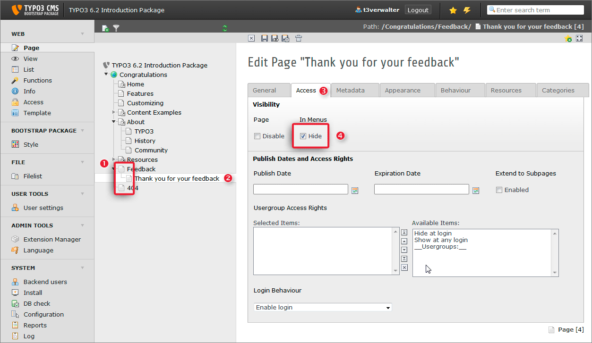
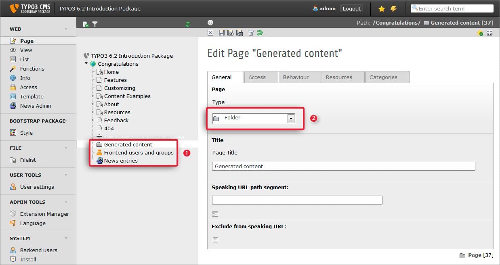
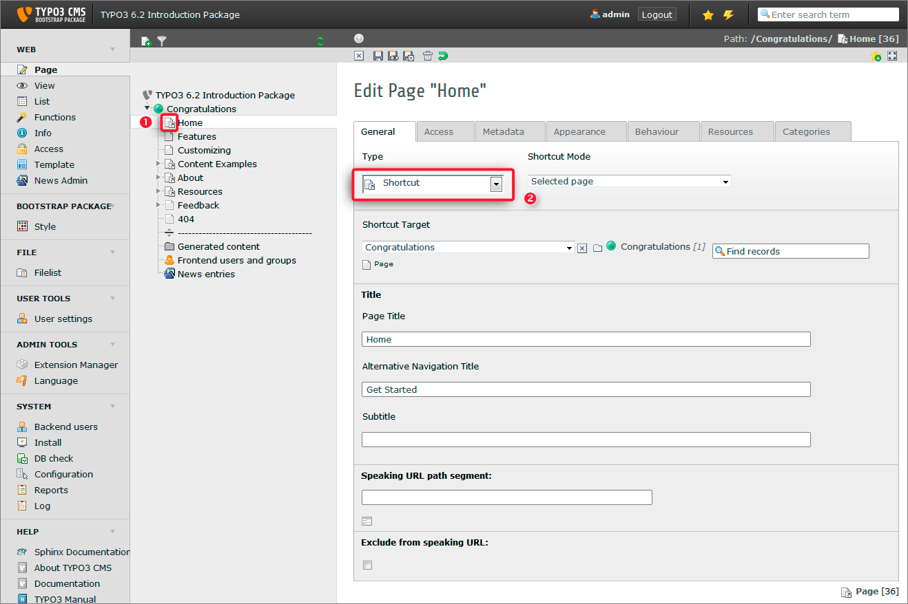
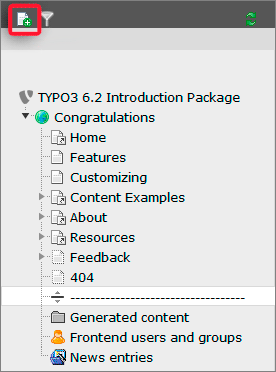
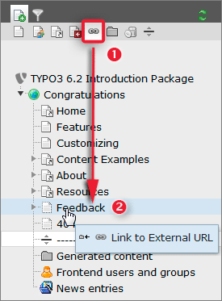
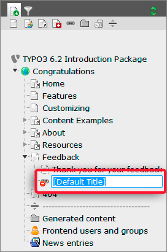
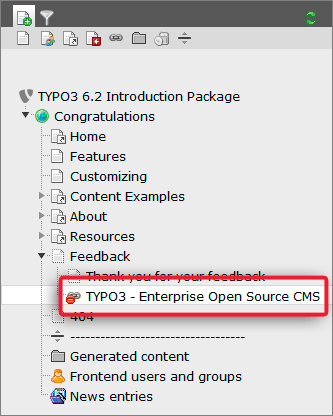
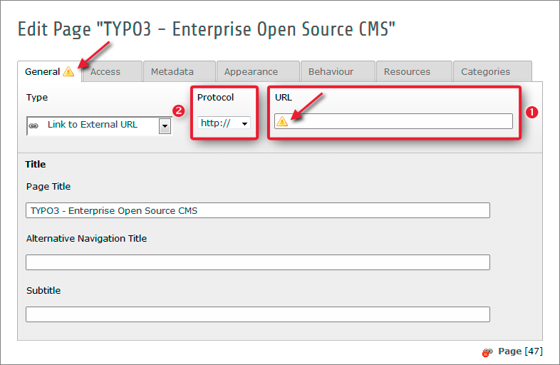
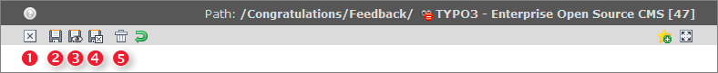
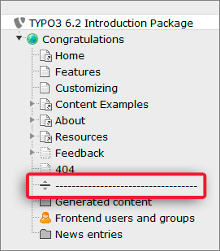

.. ==================================================
.. FOR YOUR INFORMATION
.. --------------------------------------------------
.. -*- coding: utf-8 -*- with BOM.

.. include:: ../../Includes.txt

.. _special-pages:

Special pages
^^^^^^^^^^^^^
.. note::
    Going back to the page tree, you will notice different symbols are
    used for the different page types. The ones appearing in the menu on
    your website are normal pages. Nothing special about them. Then there
    are those with a dotted border (1) on the icon, these are pages that
    are hidden in menus.

.. _hide-in-menu:

Hide in menu
""""""""""""

Pages hidden in menus are basically like the normal pages but don't
appear in the menus. This is useful if you want to have a page, you
just want to link to, but that should not appear in the menu. Edit the
page properties of the page "Thank you for your feedback" (2) (use the page's
context menu). Select the *Access* Tab (3):

As you see **Visibility > In Menus > Hide** is checked (4).

.. _folders:

Folders
"""""""

In the page tree you see some pages with a folder icon. By default
pages created in *TYPO3 CMS* are meant to contain web page content. They
appear in the menu and can have a title. 95% of all pages are used
like that. But pages can also serve as simple containers for database
elements that are not meant to be content of a visible web page. This
is what folders are used for. Use them just like folders on a
computer's file system to store different files in an organized
manner. In the same way folders nicely organize database elements
inside TYPO3 CMS. For example database elements are frontend users,
frontend groups or news records (1).

You can create a folder by selecting it in the *Type* drop down in the
page's properties (2):

.. _shortcuts:

Shortcuts
"""""""""

A shortcut can be used to create a page that is empty but works - for
example - as a parent page of other pages. Imagine you are selling a
product and have a navigation like this on your website:

- About us

- My Product

- Imprint

- Contact

Now you want to have some subpages beneath
the *My Product* page to convey the information about your product:

- About us

- My Product

  - Overview

  - Technical Details

  - Pricing and Shipping

- Imprint

- Contact

You do not really have content for the *My Product*
page, you just want it to appear in the menu. Now you can use
a shortcut to point the *My Product* page to the *Overview* page. What
happens? Whenever you click the main menu point *My Product* you get
directly to the overview page. You got your menu structure like you
wanted but don't need content for the *My Product* page.

In the Introduction Package you will find a few shortcuts, too. The *Home*
page is one of them. The symbol for a shortcut is the little arrow in the lower
right (1).

You can create a shortcut like you create a folder - by selecting its
type in the drop down (2) while editing page the properties:

.. _link-to-external-url:

Link to external URL
""""""""""""""""""""

External links can be used to create a link to an external page that
appears in your menu. We will do this together. Imagine you want to
have a link to http://typo3.org in your menu.

First, click on the new icon in the top left hand corner of the page tree:

A menu will open that contains different symbols for different kinds of
pages. Hover over them to see there names.

Now click and drag the "Link to External URL" icon (1) and drop it on the "Feedback" page (2):

A new currently disabled page (indicated by the red 'no entry' sign) entitled
"[Default Title]" will be added to the page tree.

Double click on the title:

You can just start typing the name. Lets call this menu item
"TYPO3 - Enterprise Open Source CMS". Press the return key to save your
changes.

Now open the context menu and click edit:

.. figure:: ../../Images/T3CMS62-BE-PageTreeContextMenuEdit.png
   :alt: Editing page properties with the page tree context menu

Afterwards the "Edit page" properties dialog will show up in the content area
on the right:

It looks a bit different, because the type adopted the current
context "Link to External URL". Did you note the orange exclamation marks
(see red arrows) on the "General" tab and in the "URL" field ? This means, there is
still something to do for us!

And, this is of course the most important part - the external URL we want
to link to. Enter the URL in (1) and select the protocol type in (2). If
you do not want to preselect a certain protocol type, just choose "Auto" in (2).
But, in this case you have to insert the complete URL including the protocol type as prefix in (1).

.. caution::

    **Choosing the right protocol type**

    Pay attention to the "Protocol" drop down! Select the correct protocol
    prefix here. If you want to enter an URLs which already  contains a protocol
    prefix (e.g. http://typo3.org instead of typo3.org) choose "Auto".

Save your changes now. You can do this by one of the buttons located in the
:ref:`docheader <docheader>`:

In general you can see what a button does by hovering over it and
waiting for the tooltip explanation showing up. Pressing one of the buttons shown above will
result in the following actions:

1. close without saving
2. save
3. save and view in frontend
4. save and close
5. delete

.. tip::

    **Tooltips**

    Would you like to get a short description of a certain element in TYPO3 CMS?
    Often it is possible to get this short description by hovering over the
    label or icon. Clicking into the text itself will result in a more detailed
    explanation.

    .. figure:: ../../Images/T3CMS62-BE-PagePropertiesTooltipHover.png
       :alt: Example for an active tooltip

.. _visual-menu-spacer:

Visual Menu Spacer
""""""""""""""""""

Have a look at a further page type in our page tree:

This type is called "visual menu spacer" and does basically nothing in a
default TYPO3 installation. You can use it to divide the page tree
into several parts, to separate tree entries and get an easier overview.
