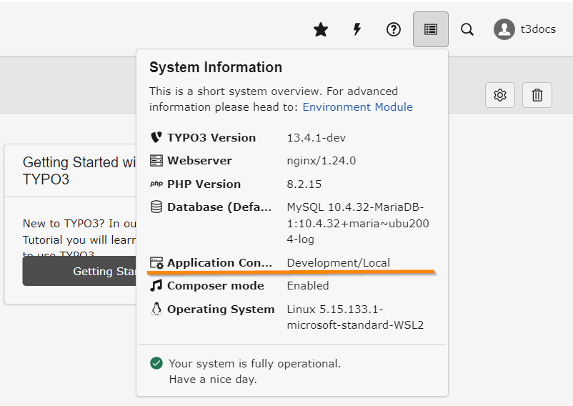

:navigation-title: Application context
.. include:: /Includes.rst.txt

.. index:: Environment; Configuration; .env ; dotenv

..  _environment-phpconfig:
..  _environment-configuration:
..  _application-context:

====================================================
TYPO3 Application context: Development or Production
====================================================

    The current application context is displayed on the top-right in the "System Information" box

A TYPO3 instance is often used in different contexts that can adapt to your
needs.

You can use the application context to differentiate between different
environments / servers.

There are 3 major application context groups:

`Development`
    To be used during development. Debugging is enabled by default.
`Production`
    Debugging and deprecation logs are deactivated by default.
`Testing`
    To be used in automated testing.

You can define arbitrary strings as a subcontext for example `Development/Local`
or `Production/Stage`.

..  todo: Link to application context in TYPO3 explained, once that chapter is written

..  contents::

..  _set-ApplicationContext:

Setting the application context
===============================

If the application context is not set it is `Production` by default so that you
don't have to do anything on the production server.

..  todo: Link to application context in TYPO3 explained, once that chapter is written

In DDEV you should set the application context to `Development/Local` to enable
debugging and different site configurations for DDEV and your live server.

Create a file called :file:`docker-compose.context.yaml` in your :path:`.ddev`
path with the following content:

..  literalinclude:: _ApplicationContext/_docker-compose.context.yaml
    :caption: [project root]/.ddev/docker-compose.context.yaml

Restart DDEV using

..  code-block:: bash

    ddev restart

.. _development-settings:

Local development
=================

When you :ref:`installed TYPO3 with DDEV <install>`, DDEV automatically created
a file called :path:`config/system/additional.php` for you. This file includes
server settings needed only during development, including:

*   A connection to the local database in DDEV
*   Configuration of Mailpit to enable debugging of emails
*   Image magic configuration so that images can be scaled and edited
*   Enabling enhanced error reporting

You should not :ref:`deploy <deployment>` this file to your production server
but create one just for the production server.
See section :ref:`production-settings`

.. _production-settings:

Production environment
======================

It is not recommended to put credentials into a file that is kept under version
control. However, many other settings should be kept under version control.

We recommend putting all configuration containing credentials into a special
file that is not kept under version control and include it in your
:path:`config/system/additional.php`.

Create a file called :file:`config/system/credentials.php`:

..  literalinclude:: _ApplicationContext/_credentials.php
    :caption: config/system/credentials.php

..  important::
    Add :file:`config/system/credentials.php` to your `.gitignore` so that it
    is never put under version control.

You can now include this file in your
:path:`config/system/additional.php`:

..  literalinclude:: _ApplicationContext/_additional.php
    :caption: config/system/additional.php

The following steps are needed for a secure production context:

*   :ref:`Generate a unique encryption key <t3coreapi:security-encryption-key-generate>`
    and put it in `$customChanges['SYS']['encryptionKey']` in your
    :file:`config/system/credentials.php`.
*   Choose a new install tool password and put its hash into
    `$customChanges['BE']['installToolPassword']`.
*   Replace the database credentials in the
    `$customChanges['DB']['Connections']['Default']` section with
    database credentials for your server.

Further settings important for security can be made directly in the
:path:`config/system/additional.php`:

..  literalinclude:: _ApplicationContext/_additional-2.php
    :caption: config/system/additional.php

Please refer to the security guide in getting started to check which settings
are currently recommended for a secure production environment:

:ref:`Global TYPO3 configuration options <t3coreapi:security-global-typo3-options>`

Suggested configurations might change in future security bulletins.

..  todo: link to chapter about security / security bulletins once it is written.

You can put any of the suggested changes into the `$customChanges` array of
your :path:`config/system/additional.php`.
