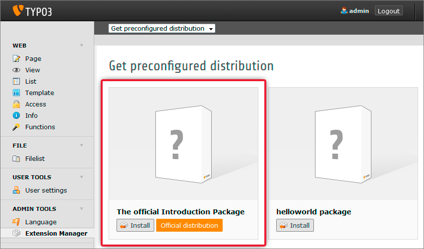

.. ==================================================
.. FOR YOUR INFORMATION
.. --------------------------------------------------
.. -*- coding: utf-8 -*- with BOM.

.. include:: ../Includes.txt

.. _installation:

Installation
------------

.. _prerequisite:

Prerequisite
^^^^^^^^^^^^

For trying out TYPO3 CMS you need to have a fully configured and ready
to use web server which meets the   `minimum system requirements
<http://typo3.org/typo3-cms/overview/requirements/>`_.

If you do not have a web server and you are running a MS Windows
on local your machine, you might want to try the `TYPO3Winstaller
<http://typo3winstaller.sourceforge.net/>`_, which will install a web
server and TYPO3 CMS on your computer.

Make sure to have your database credentials ready.

.. _getting-the-introduction-package:
.. _installing-typo3-cms-base-system:

Installing TYPO3 CMS base system
^^^^^^^^^^^^^^^^^^^^^^^^^^^^^^^^

First you will need to download and install the TYPO3 CMS Package
which is used to explain TYPO3 CMS in this tutorial. Get this package at
`http://typo3.org/download/ <http://typo3.org/download/>`_.
To install your first
website follow the steps provided in the :ref:`Quick Installation <t3install:quick-installation>`
part of the :ref:`Installation and Upgrade Guide <t3install:start>`.
If you want to use TYPO3 CMS professionally we recommend to read the whole guide.

.. _installing-the-introduction-package:

Installing the Introduction Package
^^^^^^^^^^^^^^^^^^^^^^^^^^^^^^^^^^^

Having downloaded and unpacked the TYPO3 CMS package do not forget to install the
Introduction Package itself. It is not included in the TYPO3 CMS package and has
to be downloaded and installed separately. Performing a typical installation the
:ref:`Install Tool <t3install:the-install-tool>`
will offer this option when reaching the related installation step.

The introduction package is a complete demo website. Based on a responsive
design it  contains a lot of default content for testing and learning purposes. Please
try it, if you are new to TYPO3 CMS!

.. _for-those-who-can-t-wait-try-this-very-short-installation-guide:

For those who can't wait, try this very short installation guide:
"""""""""""""""""""""""""""""""""""""""""""""""""""""""""""""""""

- Unzip / untar your downloaded TYPO3 CMS package in the root folder
  of your web server

- Make sure your web server user has write permissions to the
  folders :file:`fileadmin/,typo3conf/,typo3temp/` and :file:`uploads/`

- Opening `http://your-site.example.org/ <http://your-site.example.org/>`_ in a
  web browser you will be redirected to the TYPO3 CMS
  :ref:`Install Tool <t3install:the-install-tool>`

- If this does not happen, create a file called :file:`ENABLE\_INSTALL\_TOOL` in
  the :file:`typo3conf/` folder

- Follow the steps in the TYPO3 CMS :ref:`Install Tool <t3install:the-install-tool>`
