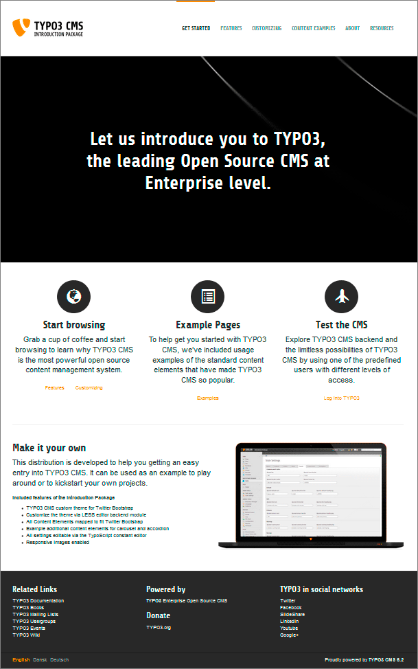

.. ==================================================
.. FOR YOUR INFORMATION
.. --------------------------------------------------
.. -*- coding: utf-8 -*- with BOM.

.. include:: ../Includes.txt

.. _introduction:

Introduction
------------

.. _about-this-document:

About this document
^^^^^^^^^^^^^^^^^^^

This document is an introduction to the basic principles of TYPO3 CMS. The
example website used in this introduction will get you started
immediately on your own first TYPO3 CMS website. After this tutorial you
will have an idea about TYPO3 CMS's capabilities, its general structure
and extension possibilities. Professional creation of templates and
development with TYPO3 CMS in general are not covered by this document.

.. _what-s-new:

What's new
^^^^^^^^^^

The current version is updated to reflect the changes in TYPO3 CMS 6.2
LTS.

.. _credits:

Credits
^^^^^^^

The "Quickstart Guide" was originally written by Kasper Skårhøj and adapted to TYPO3 CMS
4.5 LTS by Philipp Gampe, Martin Holtz, Susanne Moog and François Suter.
The current version was revised and updated to TYPO3 CMS 6.2 LTS by Guido Haase.

.. _feedback:

Feedback
^^^^^^^^

For general questions about the documentation get in touch by writing
to `documentation@typo3.org <mailto:documentation@typo3.org>`_.

If you find a bug in this manual, please be so kind as to check the
online version on https://docs.typo3.org/typo3cms/GettingStartedTutorial/.
From there you can hit the "Edit me on GitHub" button in the top right corner
and submit a pull request via GitHub. Alternatively you can just file an issue
using the bug tracker: https://github.com/TYPO3-Documentation/TYPO3CMS-Tutorial-GettingStarted/issues.

Maintaining high quality documentation requires time and effort
and the TYPO3 Documentation Team always appreciates support.
If you want to support us, please join the documentation
mailing list/forum (http://forum.typo3.org/index.php/f/44/).
