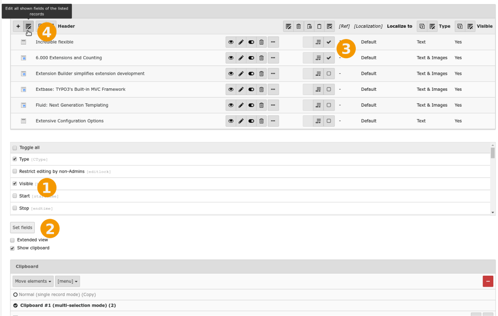

.. include:: /Includes.rst.txt

.. _mass-editing:
.. _selective-editing:

============
Mass Editing
============

The *List* module makes it possible to display additional information
about each record and gives you the ability edit several records with
one action.
To enable this feature, select the table header (1):

.. figure:: ../../Images/BackendListAdditionalFields.png
   :alt: The List view with an additional field displayed
   :class: with-shadow

This restricts the view to that single table and adds a selector (2)
where you can select which additional fields to display. Select the "Type"
field for now and click on the "Set fields" button.
This makes the "Type" field appear in a new column to the right of the record
list (4).

.. _editing-all-headers:

Edit all Headers
================

To edit the headers of all records in one go,
select the pencil icon next to the "Header" label:

.. figure:: ../../Images/BackendListEditAllHeaders.png
   :alt: The button to edit a given field for all records
   :class: with-shadow

You will then see this:

.. figure:: ../../Images/BackendListChangeAllHeaders.png
   :alt: Editing form displayed for all records
   :class: with-shadow

Upon saving this change will be applied to all records.

Edit Selected Fields
====================

All fields that are currently viewable can be edited at the same
time by selecting a different icon:

.. figure:: ../../Images/BackendListEditAllFields.png
   :alt: The button to edit all fields visible in the list
   :class: with-shadow

The result is almost the same form, but with the additional field "Type":

.. figure:: ../../Images/BackendListChangeAllFields.png
   :alt: Editing form displayed for all records and all fields
   :class: with-shadow

Edit Selected Fields of Selected Records
========================================

This can be further refined:

#. Additionally select the checkbox for the field "Visible" on the bottom
#. Click "Set fields" again
#. Select some records
#. Click "Edit all shown fields of the listed records"

Activate one of the clipboard pads if
this is not already the case and check the boxes for a couple of records:

The result is a form for editing just the chosen field for the
selected records:

.. figure:: ../../Images/BackendListSelectiveEditingForm.png
   :alt: Editing form displayed for the selected records
   :class: with-shadow
