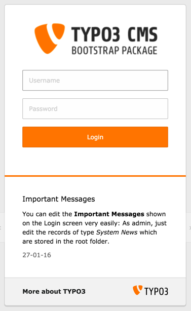
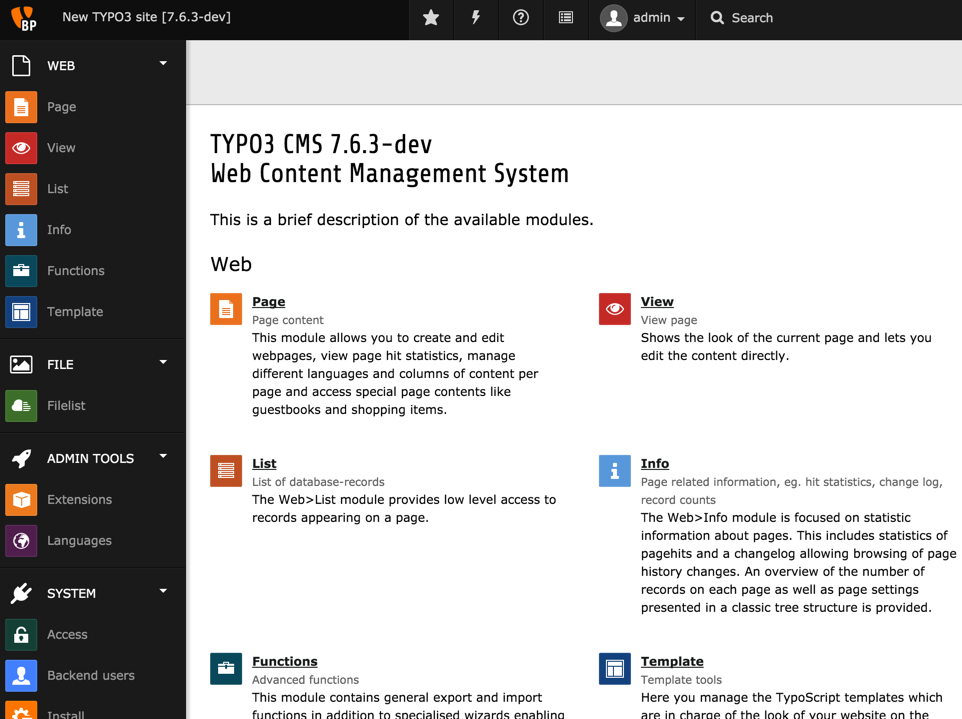
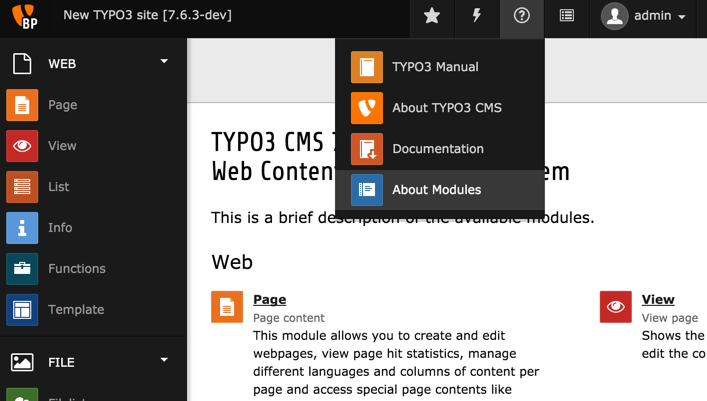

.. include:: ../../Includes.txt

.. _backend-and-frontend:

====================
Backend and Frontend
====================

TYPO3 CMS est divisé en deux zones - le *backend* et le *frontend*.
Le *frontend* est le site produit par TYPO3 CMS et visible par tout internaute sur le web.
La partie administrative du site Web est appelé le *backend*.
Un nom d'utilisateur et un mot de passe sont toujours nécessaires
pour ouvrir une session dans le backend.

Pour afficher le *frontend*, entrez l'URL de votre site web dans
la barre d'adresse de votre navigateur (par exemple :samp:`https://example.org/`).

Le *backend* est accessible en ajoutant / typo3 / à l'URL de votre site Web
(par exemple :samp:`https://example.org/typo3/`)
Une page de connexion ressemblant à ceci sera affichée :

Utilisez le nom d'utilisateur (par défaut **admin**) et le mot de passe
que vous avez défini au cours du processus d'installation.

Après avoir appuyé sur le bouton **connexion** , vous serez redirigé vers
la liste d'aperçu des modules de backend de TYPO3 CMS :

Au sommet se trouve la *barre supérieure*. Sur le côté gauche se trouve le *menu des modules*,
qui constitue le menu principal du backend de TYPO3 CMS.
Il est divisé en modules principaux ( "Web", "Fichier", etc.) et leurs sous-modules.

La vue actuelle présente la liste de tous les modules installés et leur rôle.
C'est la vue du module **À propos** qui peut être consultée
en utilisant le menu d'aide dans la barre supérieure:

Pour passer à l'étape suivante, cliquez maintenant sur **WEB** > **Page**.
Cela vous redirigera vers le module **Page**.
