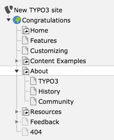
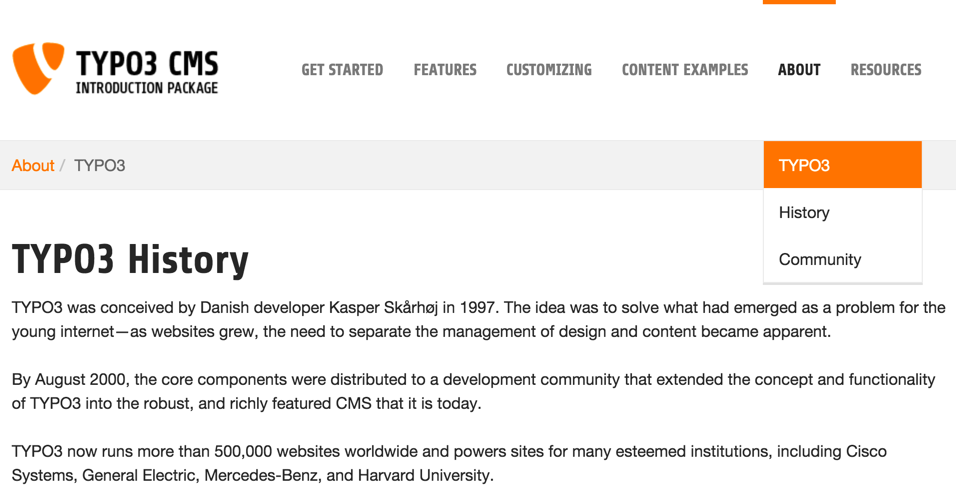
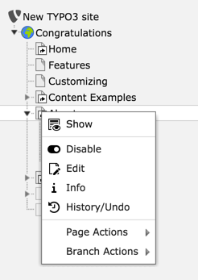
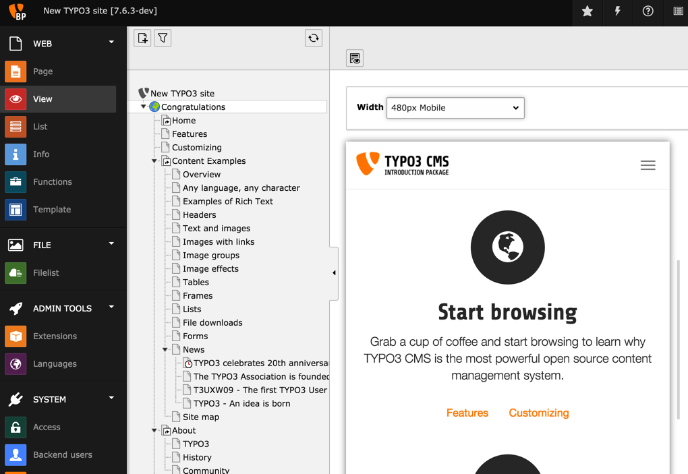
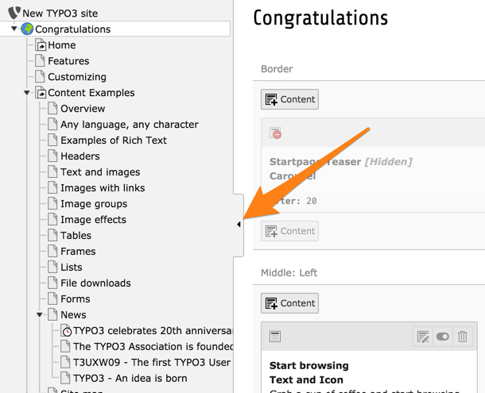

.. include:: ../../Includes.txt

.. _page-tree:

L'arborescence de page
^^^^^^^^^^^^^^^^^^^^^^

L'arborescence de page représente la structure hiérarchique de vos pages.
Dans la plupart des cas, cela correspond exactement à la structure de navigation
de votre site web.
L'arborescence peut être dépliée en cliquant sur les petites flèches
sur la gauche des éléments.

Par exemple, cliquez sur la flèche à côté de la page intitulée «À propos».
Votre arborescence devrait ressembler à ceci:

Jetez un oeil simultanément à la navigation dans le frontend.
Cliquez sur l'item **À propos** en haut dans le menu principal puis sélectionnez
TYPO3 à partir du sous-menu:

Simultaneously have a look at the navigation in the frontend. Click on
**About** item in the main menu on top and then select **TYPO3** from the sub-menu:

Comme vous le voyez, le menu principal en haut de votre site correspond
aux pages du premier niveau dans l'arborescence.
Le sous-menu de la page **À propos** en frontend correspond aux entrées
sous **À propos** dans l'arborescence.

La page avec l'icône du gobe terrestre représente la racine de votre site Web.
Il peut y avoir plusieurs sites Web par l'installation de TYPO3.
Le nœud supérieur avec le logo TYPO3 est un conteneur spécial
utilisé pour stocker des informations très générales.

Les modules peuvent afficher l'arborescence de la page ou non.
La présence de l'arborescence indique que le module réagit
à la sélection d'une page dans cette dernière.

Un clic sur le titre d'une page ouvre la page dans la zone de contenu à droite.
Le survol de l'icône d'une page affiche son identifiant interne.

Un clic sur l'icône d'une page va ouvrir le menu contextuel.
Sinon, vous pouvez faire un clic droit sur le titre de la page.

.. _the-context-menu:

Le menu contextuel
""""""""""""""""""

Le menu contextuel d'une page peut être utilisé pour accéder rapidement à la plupart
des fonctions liées à la page. Voici ce que font ces options:

- Afficher: Ouvre la page sur la quelle vous cliquez dans le navigateur (frontend)

- Désactiver: désactive la page (elle n'est donc plus accessible à partir du frontend)

- Edit: Vous permet de modifier les propriétés de la page

- Info: Affiche des informations sur la page

- Histoirique/Annuler: Affiche l'historique des modifications de la page (qui a fait ce changement et quand)

- Page Actions: Action liées à la page sélectionnée

  - Nouveau: vous permet de créer une nouvelle page ou un nouveau contenu

  - Couper: Coupe la page

  - Copier: Copie la Page

  - Supprimer: Supprime la page

- Branch Actions: Actions liées à l'ensemble de la branche

  - Monter comme racine: rend temporairement la page sélectionnée, page racine

  - Développez la branche: developpe la branche inférieure de la page sélectionnée

  - Replier la branche: replie la branche inférieure de la page sélectionnée

  - Exporter vers .t3d: Ouvre l'outil d'exportation et présélectionne la page sélectionnée

  - Importer à partir de .t3d: Ouvre l'outil d'importation et présélectionne la page sélectionnée

.. _the-view-module:

Le module Vue
"""""""""""""

Il est également possible d'afficher une page directement dans le backend,
en sélectionnant le module Vue, qui offre également la possibilité de prévisualiser
une page dans les différentes tailles d'écran, grâce au menu déroulant en haut.

.. _collapse-page-tree:

Réduire l'arborescence
""""""""""""""""""""""

L'arborescence peut être réduite, en cliquant sur la poignée sur sa droite,
pour gagner de l'espace à l'écran.

.. _editing-pages:

Édition de pages
"""""""""""""

La modification d'une page existante et l'ajout d'une nouvelle page sont abordées dans le
:ref:`Tutoriel Editeurs <t3editors:pages>`.

Ensuite, nous allons voir comment le contenu est placé sur les pages.