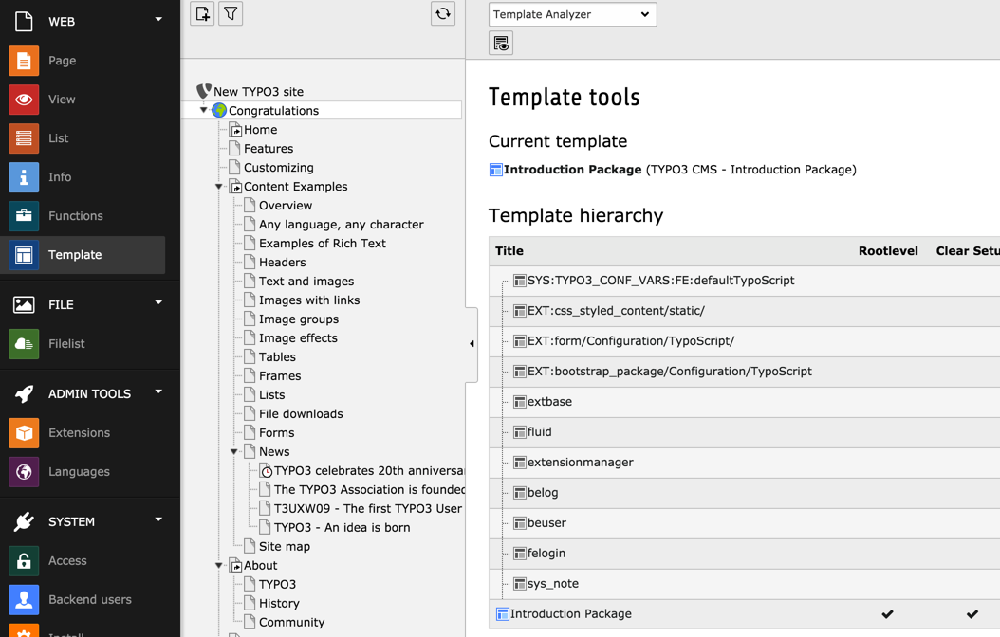

.. include:: ../../Includes.txt

.. _templates:

========
Gabarits
========

Après ce bref aperçu des pages et des éléments de contenu,
vous pourriez vous demander comment tout cette structure est transformée
en un site web, avec la mise en page, fichiers CSS et JavaScript.

Dans TYPO3 CMS ce travail est réalisé en utilisant des *gabarits*
qui doivent être considérés comme une sorte de configuration écrite
dans un langage appelé *TypoScript*.

Le module **WEB> Template** donne un aperçu de la configuration
TypoScript et permet de travailler avec ce qu'on appelle "les gabarits",
stockant la configuration de TypoScript.

Voici un bref aperçu du module *Gabarit* :
Here is a brief view of the *Template* module:

Le Templating est couvert par d'autres tutoriels:

-  le :ref:`Tutoriel TypoScript en 45 minutes <t3ts45:start>` couvre les bases du TypoScript et
   comment générer du HTML lié aux pages et les éléments de contenu.

-  le :ref:`Tutoriel Templating <t3templating:start>` vous guide à travers l'intégration de modèles
   HTML dans votre installation TYPO3 CMS utilisant TypoScript.

.. _facts-about-templates-and-possibilities:

Faits et possibilités sur les gabarits
======================================

Voici une courte liste des possibilités offertes par les modèles TYPO3 CMS :

- Vous pouvez mettre en œuvre *toute* conception que vous aimez, comme vous le souhaitez.

- Vous pouvez avoir plusieurs niveau de menu.

- Vous pouvez avoir plusieurs sites, plusieurs modèles.

- Vous pouvez avoir des pages en plusieurs langues.

- Vous pouvez avoir plusieurs zones de contenu (colonnes) sur une page.

- Vous pouvez intégrer toutes sortes de sources de données externes grâce à des
  plugins écrits en PHP.

- Vous pouvez ajouter de nombreuses applications web pour fonctionner sur différentes page TYPO3.

- Vous pouvez étendre à peu près tout avec PHP.

