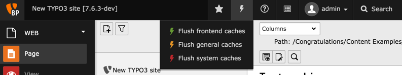
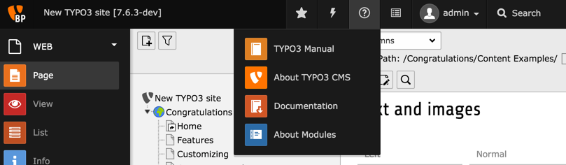
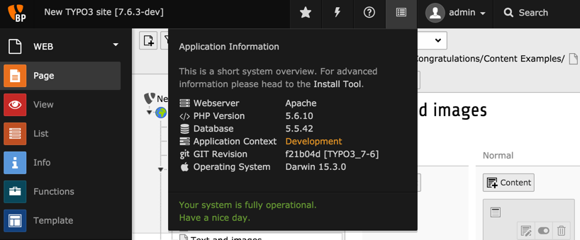
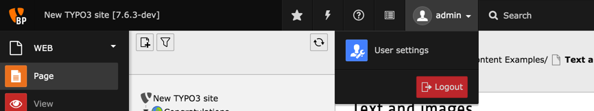

.. include:: /Includes.rst.txt

.. _top-bar:

===================
La barre supérieure
===================

La barre supérieure contient des informations et des menus supplémentaires.

A gauche se trouve le logo TYPO3 CMS (qui peut être modifié par une extension,
comme le fait le paquet d'introduction), puis vient le nom de votre site
(qui se définie dans la configuration globale, décrite plus tard).

L'icône en étoile va ouvrir une liste de marque-pages.
Chaque fois que vous voyez cette icône dans le backend TYPO3 CMS,
vous pouvez cliquer dessus et la vue actuelle sera sauvegardée dans cette liste de signets.

L'icône en forme d'éclair ouvre le menu pour vider les différents caches utilisés par TYPO3 CMS
afin d'améliorer les performances.
Les caches sont décrits en détail dans les :ref:`APIs de base <t3coreapi:caching>`.

Le point d'interrogation ouvre le menu d'aide,
qui donne accès à différents modules liés à l'aide et la documentation.

L'icône suivante ouvre un panneau montrant diverses informations
sur le système hôte actuel et sur l'installation de TYPO3 CMS.

Le nom d'utilisateur est affiché à côté.
Il ouvre un menu donnant accès au module "Paramètres utilisateur",
où vous pouvez modifier votre mot de passe et diverses préférences.
Voici également le bouton "Déconnexion".

Enfin, aligné à droite, se trouve un champs de recherche général,
qui recherche à travers tous les enregistrements (pages, éléments de contenu, utilisateurs, etc.)
existant dans l'instance de TYPO3 CMS.
