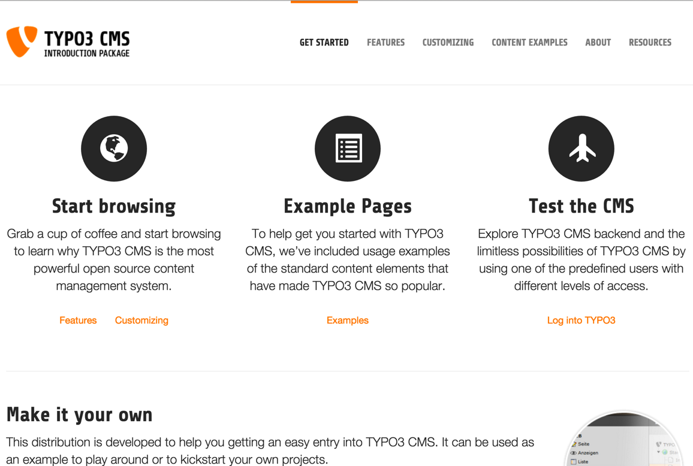

.. include:: ../Includes.txt

.. _introduction:

============
Introduction
============

.. _about-this-document:

À propos de ce document
=======================

Ce document est une introduction aux principes de base de TYPO3 CMS. Le
site web exemple utilisé dans cette introduction va vous aider à démarrer
immédiatement sur ​​votre premier site TYPO3 CMS. Après ce tutoriel, vous
devriez avoir une vue d'ensemble des capacités de TYPO3 CMS, de sa structure générale
et de ses possibilités d'extension. La création professionnelle de gabarits et le
développement avec TYPO3 CMS en général, ne sont pas couverts par le présent document .

.. _what-s-new:

Quoi de neuf
============

La version actuelle est mis à jour pour refléter les changements dans TYPO3 CMS 7 LTS.

.. _credits:

Credits
=======

Le "Guide de démarrage rapide" a été écrit par Kasper Skårhøj et adapté à
TYPO3 CMS 4.5 LTS par Philipp Gampe , Martin Holtz , Susanne Moog et François Suter.
Il a été révisé et mis à jour à la version 6.2 LTS par Guido Haase et à la version 7 LTS
par François Suter.
La mise à jour de François Suter a été traduite en français par Jonathan Iroulin.

.. _feedback:

Commentaires
============

Pour des questions générales concernant la documentation écrire à
`documentation@typo3.org <mailto:documentation@typo3.org>`_.

Si vous trouvez une erreur dans ce manuel, merci de vérifier la
version en ligne https://docs.typo3.org/typo3cms/GettingStartedTutorial/.
Si l'erreur est également présente sur la version en ligne,
vous pouvez cliquer sur le bouton "Edit me on GitHub" dans le coin en haut à droite
et soumettre une demande de récupération via GitHub .
Sinon, vous pouvez simplement signaler le problème en utilisant le bug tracker sur
: https://github.com/TYPO3-Documentation/TYPO3CMS-Tutorial-GettingStarted/issues.

Maintenir une documentation de haute qualité nécessite du temps et des efforts
que l' équipe de documentation de TYPO3 apprécie toujours .
Si vous voulez nous aider, merci de joindre la liste de diffusion / forum
de la documentation (https://forum.typo3.org/index.php/f/44/).
