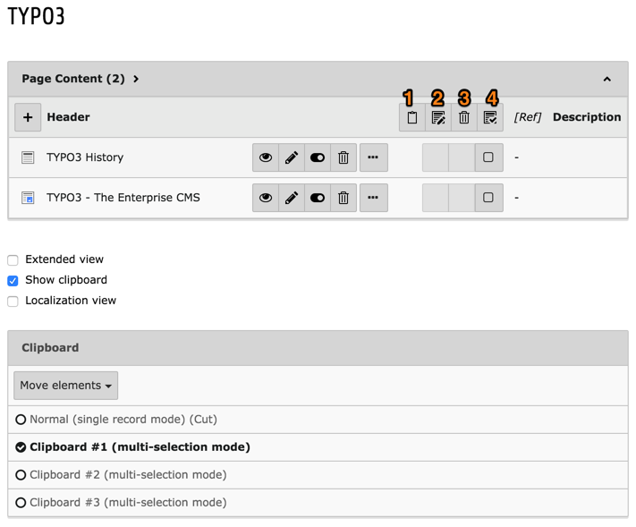
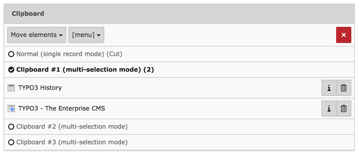
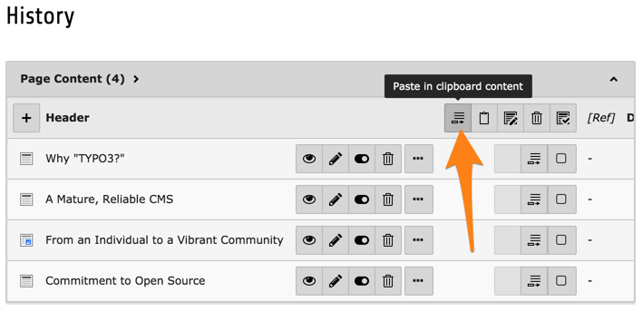
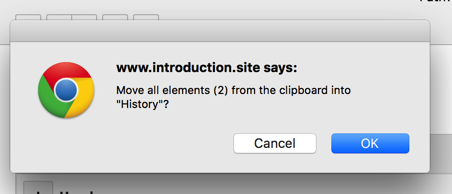
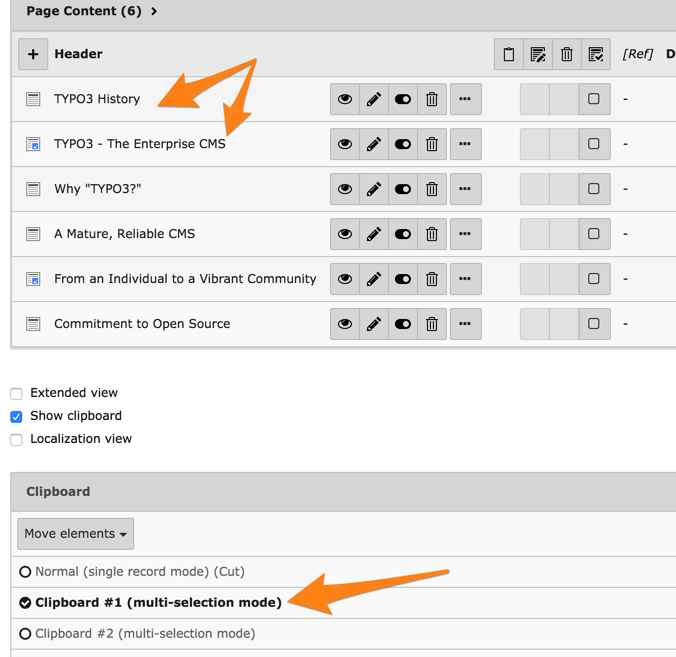

.. include:: ../../Includes.txt

.. _advanced_clipboard_usage:
.. _the-numeric-clipboard-pads-managing-many-elements:

====================================
Utilisation avancée du presse-papier
====================================

Rendez vous à la page "TYPO3" sous la page "À propos" et sélectionnez
l'un des presse-papier numéroté :

Notez comment l'affichage de la liste a été modifiée.
Chaque enregistrement a maintenant une case à cocher et
les icônes d'action ont été déplacés vers l'en-tête de liste.
Avec eux, vous pouvez :

#. transférer les éléments sélectionné vers le presse-papier

#. modifier tous les éléments sélectionnés à la fois

#. supprimer tous les éléments sélectionnés à la fois

#. sélectionner tous les éléments dans la liste

Maintenant, cochez les deux cases et cliquez sur l'icône "Transfert".
Votre presse-papier devrait ressembler à ceci :

Notez comment les éléments sont enregistrés pour "Déplacer".
Le menu déroulant peut être utilisé pour modifier le comportement en "Copier"
(que vous pouvez faire si vous ne voulez pas changer la page en cours).

Déplacer vous vers la page "Historique" et cliquez sur l'icône "Coller dans" :

Un avertissement apparaît pour confirmer l'opération :

Après confirmation, vous pouvez voir que les deux éléments ont été déplacés
vers le haut de la liste et que le volet presse-papier est vide :

