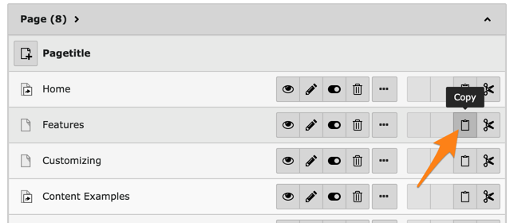
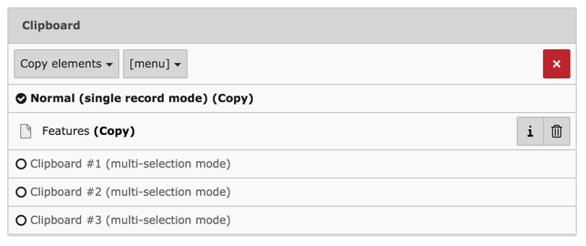

.. include:: /Includes.rst.txt

.. _clipboard:

================
Le presse-papier
================

Chaque fois qu'un enregistrement est copié dans le backend TYPO3 CMS,
il apparaît dans le presse-papier qui se trouve au bas de l'écran du module "Liste".

Cliquez sur l'icône de copie de la page "Features" :

Maintenant, atteignez le bas de page et regardez le presse-papier :

Notez comment le presse-papier enregistre le fait que nous avons choisi l'action "Copier" :
"Copier" est affiché à coté de l'étiquette de l'enregistrement copié.
L'action "Couper" est la même, mais le presse-papier le reflétera avec un texte différent :
("Couper" est affiché à coté de l'étiquette de l'enregistrement coupé).

Comme vous pouvez le voir, le presse-papier indique
qu'il est en « mode d'enregistrement unique ».
Si vous coupez ou copiez un autre enregistrement,
il remplacera le contenu actuel du presse-papier.
Dans le chapitre suivant, nous examinerons les autres presse-papier.
