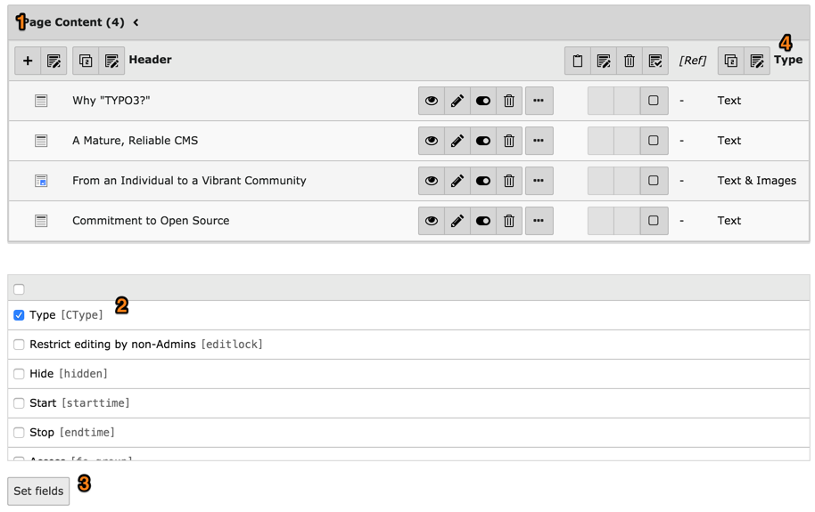
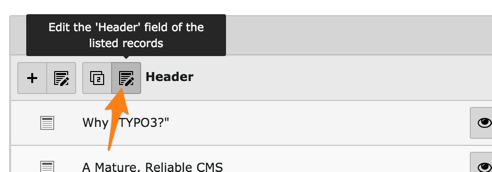
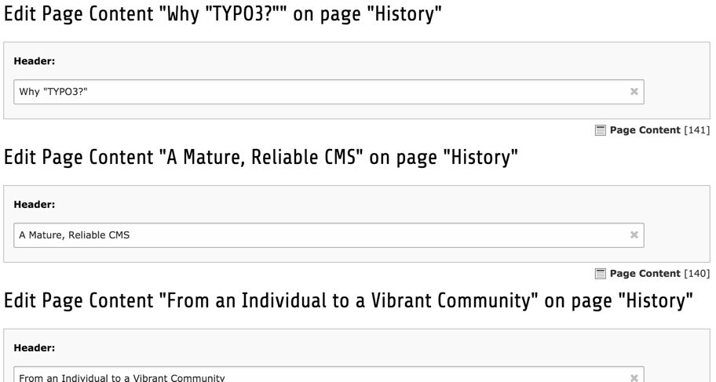
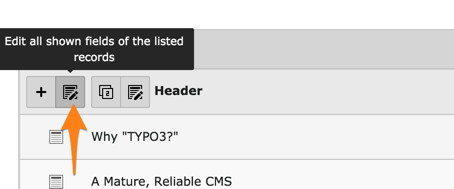
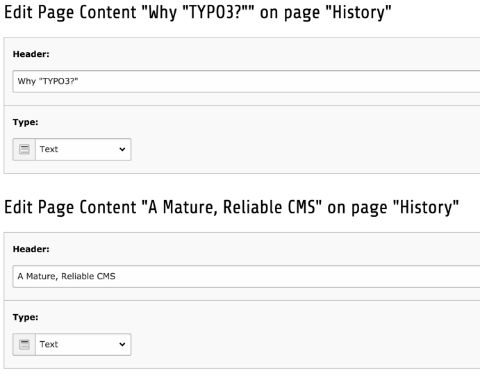
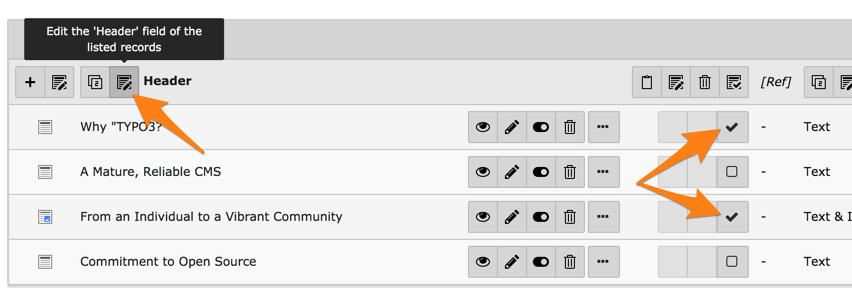
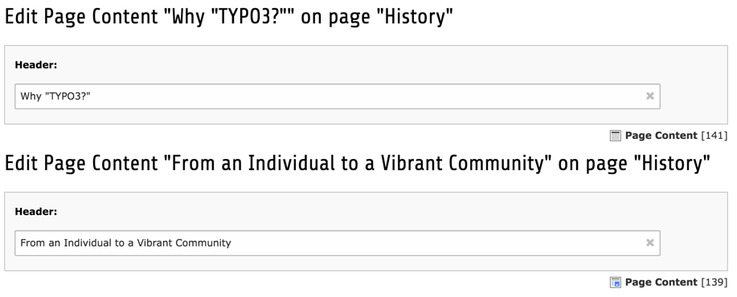

.. include:: /Includes.rst.txt

.. _mass-editing:
.. _selective-editing:

==================
L'édition de masse
==================

Le module *Liste* permet également d'afficher plus d'informations
sur chaque enregistrement et de modifier plusieurs enregistrements à la fois.
Pour ce faire, cliquez d'abord sur l'en-tête de tableau (1):

Cela limite la vue de ce tableau unique et ajoute un sélecteur (2)
vous permettant de sélectionner les champs supplémentaires à afficher.
Sélectionnez le champ "Type" pour le moment et cliquez sur le bouton "Paramétrer un champ".

Cela fait apparaître le champ "Type" dans une nouvelle colonne à droite de la liste d'enregistrement (4).

.. _editing-all-headers:

Modification tous les en-têtes
==============================

Pour modifier les en-têtes de tous les enregistrements en une seule fois,
il suffit de cliquer sur le petit crayon à côté de l'étiquette "Titre de page" :

Vous verrez alors ceci :

Lors de l'enregistrement les changements seront stockés pour tous les enregistrements.

Tous les champs qui sont actuellement visibles peuvent être modifiés en même temps,
en choisissant une icône différente :

Le résultat est presque le même formulaire, mais avec les champs supplémentaires :

Cela peut être encore affiné. Activez l'une des plaquettes de presse-papier si
cela n'est pas déjà fait et cochez les cases pour deux d'enregistrements :

Le résultat est un formulaire juste pour l'édition des champ choisis
pour les deux enregistrements sélectionnés :

