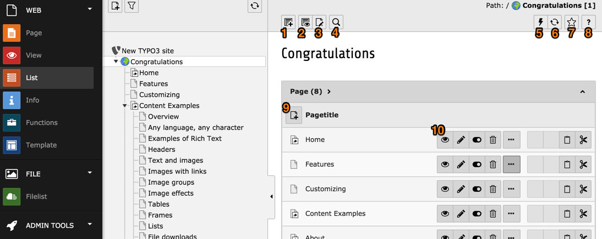
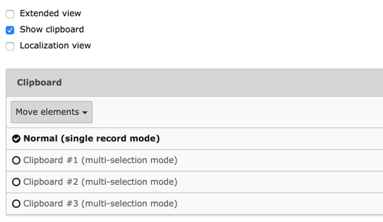

.. include:: /Includes.rst.txt

.. _using-the-list-module-effectively:

=====================================
Utiliser efficacement le module Liste
=====================================

Choisissez le module **WEB > List** et placez-vous sur la page "Congratulations".
Vous devriez voir ce qui suit:

La vue Liste montre généralement la liste des enregistrements
présents sur la page courante, regroupés par type.
Le nom qui apparaît pour chaque enregistrement dépend du champ utilisé comme étiquette.
Pour les pages, le champ affiché est le champ "Titre de la page".

La vue Liste propose plusieurs icônes d'action:

#. créer un nouvel enregistrement (un assistant apparaît pour choisir le type de ce nouvel enregistrement)

#. afficher la page en cours (dans le frontend)

#. modifier la page courante

#. chercher dans la page courante

#. clairement le cache de la page courante

#. actualiser la vue "Liste"

#. mettre en signet cette vue

#. accéder à l'aide contextuelle

#. créer une nouvelle page fiche

#. icônes d'actions pour chaque enregistrement.
   Les icônes qui apparaissent ici dépendent du type d'enregistrement
   Si l'enregistrement est visible dans le frontend (comme le sont les "pages"),
   une icône "visualiser" est affichée.
   Tous les enregistrements auront les trois icônes suivantes, respectivement "Editer",
   "Cacher / Montrer" (à savoir visible dans le frontend ou non) et "Supprimer".

   L'icône avec 3 points de suspension élargit la liste d'icônes pour afficher
   les icônes d'action supplémentaires (généralement pour accéder à l'information,
   la déplacer, etc.)

   En dernier viennent les icônes de couper et coller.

Si vous voulez toujours voir la liste élargie des icônes,
vous pouvez cocher la case "Vue étendue" au bas de la vue
(décendez dans le bas de la page).

Assurez-vous également que la case "Afficher le presse-papiers" est cochée,
car nous allons le découvrir prochainement.

Si vous prévoyez de gérer un site web multilingue,
vous voudrez également cocher la case "vue de localisation".

