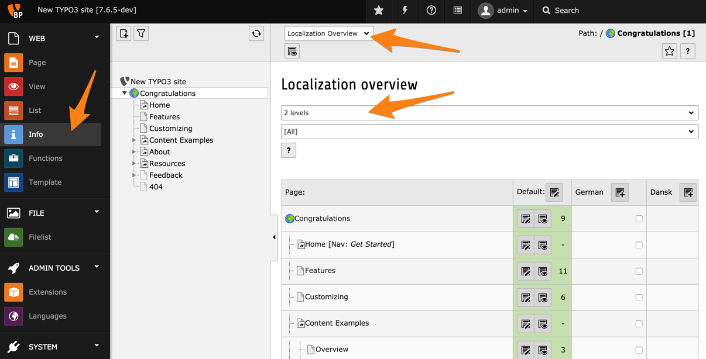

.. include:: ../../Includes.txt

.. _info-functions-modules:

Les modules Information et Fonctions
^^^^^^^^^^^^^^^^^^^^^^^^^^^^^^^^^^^^

Le module **WEB > Info** affiche une variété d'informations
relatives aux pages de votre site web. Il contient plusieurs
fonctions accessibles depuis le menu déroulant dans le docheader.
Par exemple, l'*Aperçu des traductions* vous permet de vérifier
rapidement les pages étant traduites et celles qui ne le sont pas.
Dans la plupart des écrans d'informations vous pouvez modifier
la profondeur d'arborescence des informations devant être affichées.

Le module **WEB > Fonctions** propose également plusieurs fonctionnalités.
La plus intéressante est la possibilité de créer plusieurs pages en une seule fois.