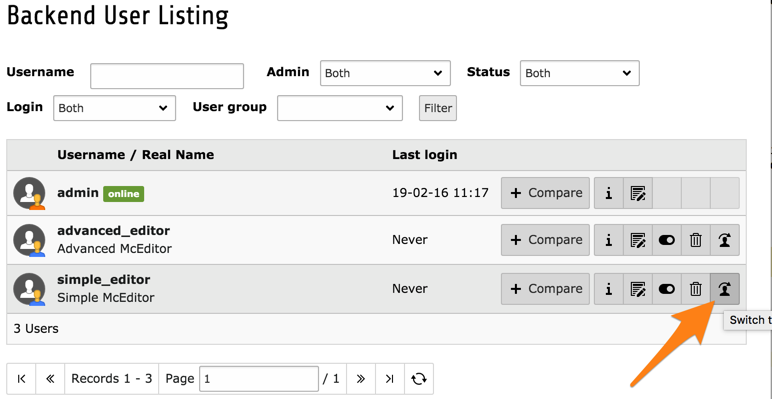
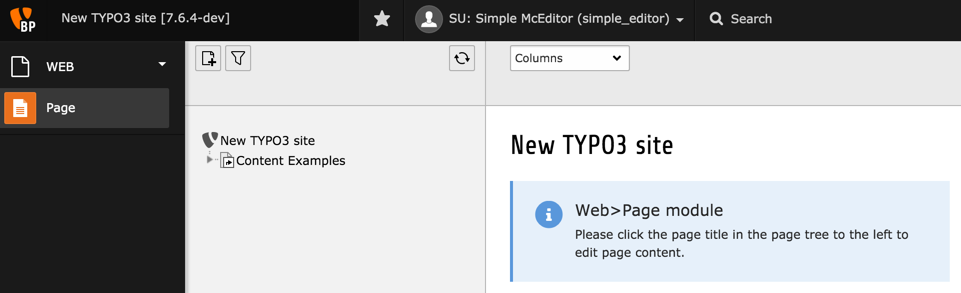
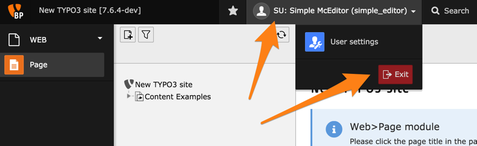

.. include:: /Includes.rst.txt

.. _user-management-backend-users:

====================
Utilisateurs Backend
====================

La gestion des utilisateurs backend est plus aisée
en utilisant module le **SYSTEM > Utilisateurs Backend**.

Le module permet de rechercher et filtrer les utilisateurs.
Ils peuvent également être modifiés, supprimés ou désactivés.

Comme vous pouvez le voir dans la liste, le paquet d'introduction est livré
avec deux utilisateurs en plus de l'utilisateurs admin créés au cours du processus d'installation.
Jetons un coup d'oeil à ce que ces autres utilisateurs peuvent faire.

.. _user-management-simple-editor:

"simple\_editor"
================

La façon la plus simple de vérifier le profil d'un autre utilisateur
(quand on est un administrateur) est d'utiliser la fonction
"changer d'utilisateur" :

Et voici ce que "simple_editor" voit lors de l'accès au backend TYPO3 CMS :

Comme vous pouvez le voir, cet utilisateur ne dispose que d'un accès au module "Page".
De plus son point de vue de l'arborescence des pages est également limitée
à la branche à partir de la page "exemples de contenu".

Pour revenir sur le compte admin, cliquez sur le nom de l'utilisateur
dans la barre supérieure et cliquez sur le bouton "Quittez"
(notez que ce bouton lit normalement "Déconnexion").

.. _user-management-advanced-editor:

"advanced\_editor"
==================

Maintenant, essayez de faire la même chose avec l'utilisateur "advanced_editor".
Vous devriez voir ce qui suit après le changement d'utilisateur:

L'utilisateur "advanced_editor" est autorisé à utiliser plus de modules
que "simple_editor", mais n'a pas accès à l'arborescence des pages.
Ceci est probablement un bug du paquet d'introduction,
mais cela fait un bon exercice pour modifier les droits
des utilisateurs dans les chapitres suivants.

.. note::

   Les enreggistements d'utilisateur peuvent également être consultés
   en utilisant le module **WEB > Liste** et en cliquant sur
   le nœud racine (celui avec le logo TYPO3 CMS).

   .. figure:: ../../Images/BackendBackendUsersList.png
      :alt: Affichage des utilisateurs backend dans le module de liste
