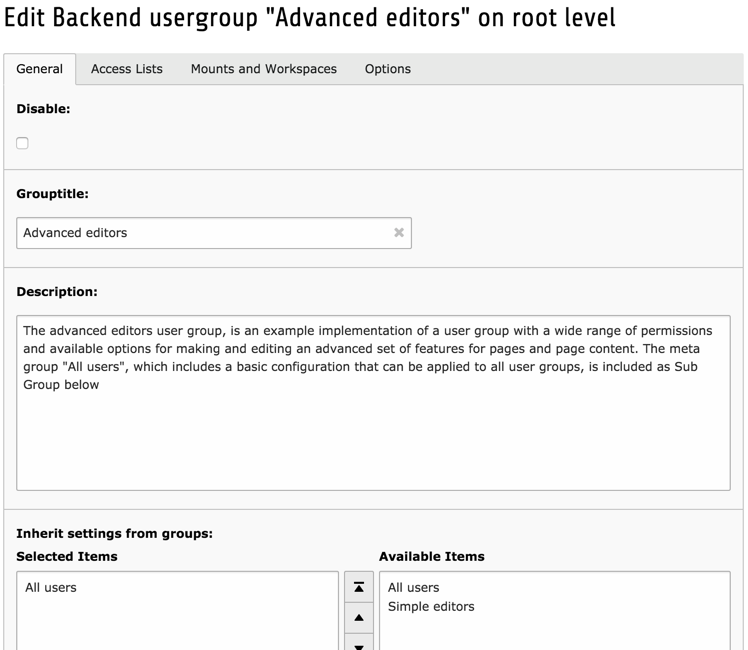
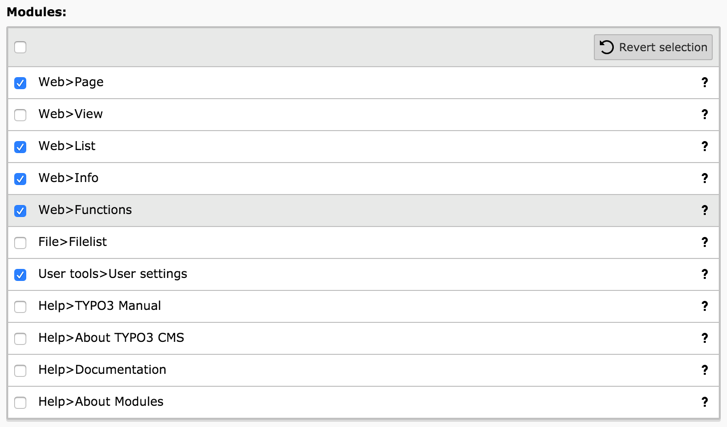
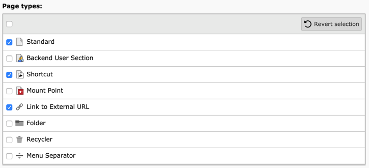
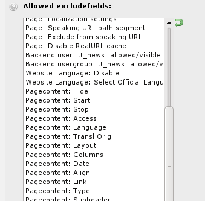
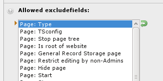
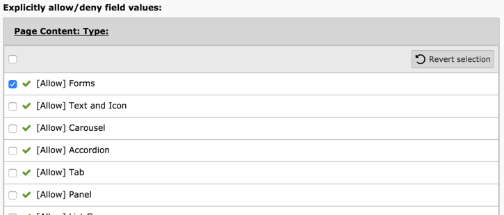
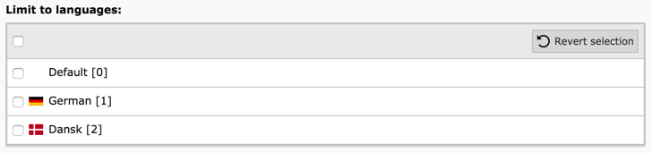
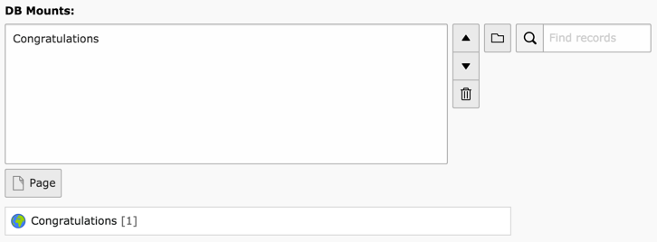
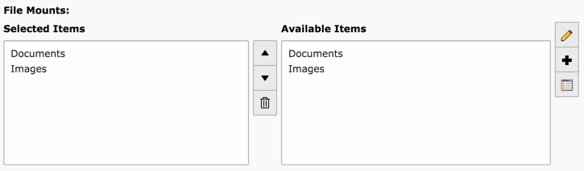

.. include:: /Includes.rst.txt

.. _permissions:
.. _setting-up-user-permissions:

===========================================
Configuration des autorisations utilisateur
===========================================

Nous allons examiner la mise en place des autorisations utilisateur
en modifiant le groupe d'utilisateurs "éditeurs avancés".

.. _general:

Onglet Général
==============

Dans l'onglet "Général", vous pouvez modifier le titre du groupe
et écrire une courte description. Comme mentionné précédemment,
les autorisations des sous-groupes seront hérités par le groupe actuel.

.. note::

   La définition des autorisations ne concerne pas seulement les droits d'accès.
   Il est également question de simplifier l'interface
   en ne laissant les utilisateurs voir que ce qui est vraiment utile pour eux.

.. _access-lists:
.. _include-access-lists:

Liste d'ccès
============

L'onglet « listes d'accès » est l'endroit
où la plupart des autorisations sont définies.
Tous les champs sont détaillés ci-dessous, un par un.

.. _modules:

Modules
-------

Le premier champ est utilisé pour définir les modules
auquels les membres du groupe devraient avoir accès.
Évidemment, cela aura une influence sur ce qui apparaît dans le menu du module.

.. _tables:
.. _tables-modify:

Tables
------

Le deuxième champ permet de sélectionner les tables
que les membres des groupes sont autorisés à voir ( «Tables (liste)").
Et le champ suivant est le même, mais pour les tables
qui peuvent être modifiés ( "Tables (modifier)").

.. figure:: ../../Images/BackendBackendGroupEditTables.png
   :alt:

.. _page-types:

Les types de page
-----------------

Ce champ restreint les types de pages disponibles pour les membres du groupe.
Les explications sur les différents types de pages se trouvent dans le Guide des éditeurs.

.. _allowed-excludefields:

Champs exclusifs autorisés
--------------------------

Lors de la définition des champs de table dans TYPO3 CMS,
il est possible de les marquer comme «exclus».
Ces champs ne seront jamais visibles pour les utilisateurs backend
(à l'exception des administrateurs, bien sûr)
à moins que leur accès ne soient explicitement autorisé.
Ce champ sert à autoriser ces accès.
Il affiche une liste de toutes les tables et leurs champs exclus.

Cliquez sur un nom de table pour développer la liste de ses champs
et de faire une sélection de champs en cochant quelques cases.

.. _explicitly-allow-deny-field-values:

Autorisations / Interdictions explicites des valeurs de champ
-------------------------------------------------------------

Pour certains champs, il est possible de définir des permissions
fines sur les valeurs réelles autorisées pour ces champs.
Ceci est en particulier le cas pour le champ « Contenu de la page : Type »,
qui définit le type d'élément de contenu qui peut alors être
utilisés par les membres du groupe.

Comme la liste des champs exclus, ce champs apparaît d'abord
avec les champs repliés.
Vous devez développer les champs pour commencer à faire des changements.

Limiter aux langues
-------------------

Dans un site Web multilingue, il est également possible
de restreindre les utilisateurs à seulement quelques langues.
Ceci peut être réalisé en utilisant le dernier champ de l'onglet "Listes d'accès".

.. _mounts:

Montages et Espaces de travail
==============================

L'onglet suivant contient des champs très importants
qui définissent sur quelle partie de l'arborescence des pages
et du système de fichiers les membres du groupe peuvent exercer leurs droits.

Ici nous allons seulement couvrir les montages.
Des informations détaillées sur les espaces de travail
peut être trouvées dans le :doc:`manuel lié à l'extension<ext_workspaces:Index>`.

.. _db-mounts:

Montage de base de données
--------------------------

Les montage BDD (montages de base de données) sont utilisés pour limiter
les accès d'un utilisateur à seulement certaines parties de l'arborescence des pages.
Chaque montage correspond à une page dans l'arborescence.
L'utilisateur aura accès uniquement à ces pages et leurs sous-pages.

Voir aussi :ref:`les autorisations de pages<page-permissions>`.

.. _file-mounts:

Montages de fichiers
--------------------

Les montages de fichiers sont similaires aux montages de BDD,
mais pour accéder aux fichiers.
La principale différence est que les dossier de stockage de fichiers
doivent être définis par l'administrateur en premier.
Ceux-ci sont situés dans le noeud racine :

.. figure:: ../../Images/BackendFileMountList.png
   :alt: Liste de tous les montages de fichiers disponibles

Ils peuvent alors être simplement sélectionnés
lors de l'édition d'un groupe d'utilisateurs backend :

.. note::

   La définition des montages de fichiers dépend aussi de ce qu'on appelle
   les dossier de stockage de fichiers. Ce sujet est abordé plus en détail
   dans la référence de :doc:`la couche d'abstraction de fichiers<t3fal:Index>`.

.. _file-permissions:

Permissions sur les manipulations de fichiers
---------------------------------------------

Donner accès aux montages de fichiers n'est pas tout.
Les opérations spécifiques sur les fichiers et les répertoires doivent être autorisées.
Voici ce que le champ suivant fait.
Choisissez soit "Répertoire" ou "Fichiers" et commencer à vérifier les boîtes.

.. figure:: ../../Images/BackendBackendGroupEditFilePermissions.png
   :alt: Donner des autorisations spécifiques sur les manipulations de fichiers
