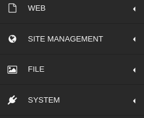
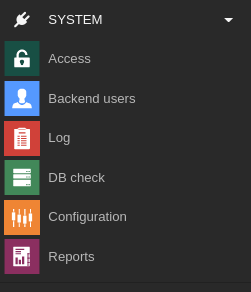
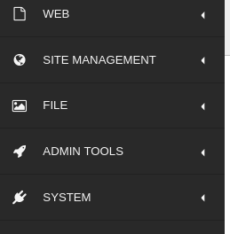
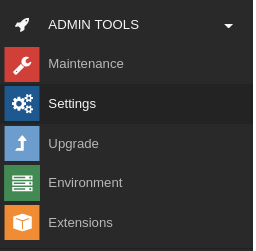

.. include:: /Includes.rst.txt

.. _privileges:

==================
Привилегии внутреннего интерфейса
==================

В следующих главах рассматриваются модули, которые будут доступны только пользователям внутреннего интерфейса с определенными привилегиями доступа.

В дополнение к настройке прав доступа для внутренних пользователей или групп, описанной в :ref:`permissions`, существуют права "суперпользователя", которые могут быть активированы для каждого пользователя.

Если пользователь внутреннего интерфейса был создан для редактирования во внутреннем интерфейсе, то он, как правило, не должен получать доступ к модулям администратора или системы.

Пользователю внутреннего интерфейса следует предоставлять только тот доступ, который ему необходим. Это облегчает работу за счет автоматической деактивации модулей и элементов графического интерфейса, к которым пользователь не имеет доступа. Кроме того, пользователь не сможет нанести вред системе, случайно выполнив действия, к которым он не должен был иметь доступа.

До версии TYPO3 9 существовали только права admin и non admin. Теперь у нас появилась дополнительная привилегия доступа " system maintainer".

.. _admin-user:

Администратор / Admin
=====

* Привилегия пользователя admin может быть добавлена путем установки флажка "admin" при создании или изменении пользователя внутреннего интерфейса.
* администраторы имеют доступ к модулю **SYSTEM** (включая модули Access, Backend User, Log и т. д.)

.. _user-management-system-maintainers:
.. _system-maintainer:

Системные администраторы / System Maintainers
==================

The first backend admin created during installation will automatically be a system maintainer as well. To give other users system privileges, you can add them in the :guilabel:`ADMIN TOOLS > Settings > Manage System Maintainers` configuration. Alternatively the website can be set into "Development" mode in the Install Tool. This will give all admin users system maintainer access.
Первый администратор внутреннего интерфейса, созданный при установке, автоматически становится и сопровождающим системы (system maintainer). Чтобы предоставить другим пользователям системные привилегии, можно добавить их в конфигурации :guilabel:`ADMIN TOOLS > Settings > Manage System Maintainers`. В качестве альтернативы можно перевести сайт в режим "Разработка" в инструменте установки. В этом случае все пользователи-администраторы получат права системного сопровождающего (system maintainer).

System Maintainers - это единственные пользователи, которые могут видеть и иметь доступ к :guilabel:`Admin Tools` и :guilabel:`Extension Manager`. Эти пользователи сохраняются в :file:`config/system/settings.php` как :php:`$GLOBALS['TYPO3_CONF_VARS']['SYS']['systemMaintainers']`.

