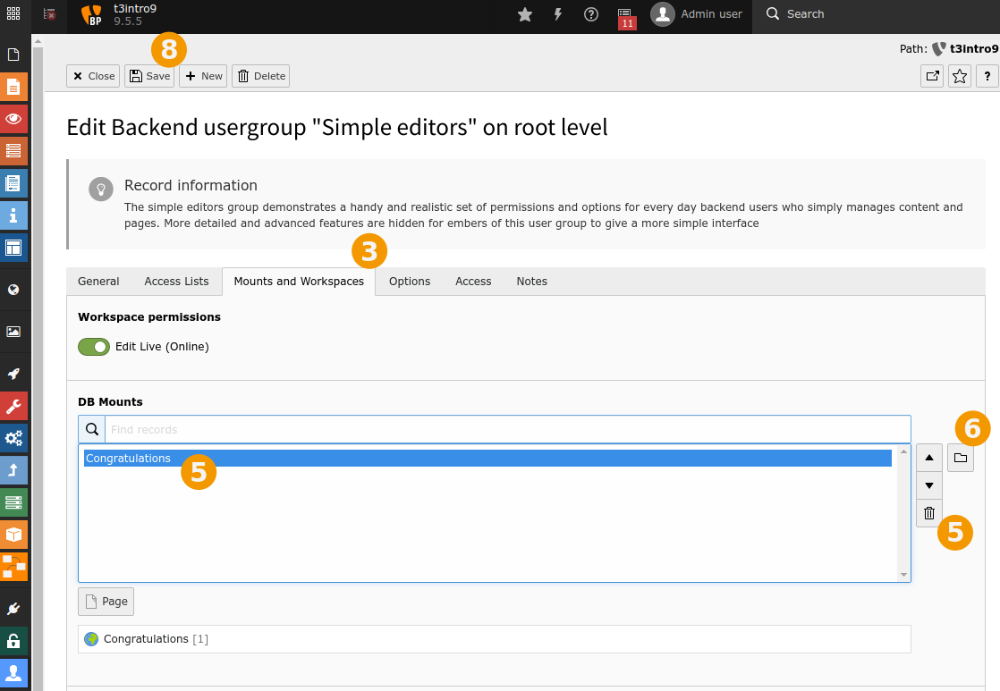

:orphan:

.. include:: /Includes.rst.txt

.. _user-management-create-default-editors:

====================
Создание пользователей по умолчанию
====================

Создание simple_editor
====================

Создание новых пользователей и групп подробно рассматривается в разделе :ref:`creating-a-new-user-for-the-introduction-site`.

Здесь будут созданы 2 новых пользователя, использующих уже существующие группы ( созданные с помощью " Introduction Package ").

.. rst-class:: bignums

1. Войдите в модуль "Внутренние пользователи"

2. Щелкните по `+`: "Создать новую запись" / "Create new record"

   .. figure:: ../../Images/ManualScreenshots/UserManagement/UserManagementCreateNewUser.png
      :alt: Создание нового пользователя
      :class: with-shadow

      Создайте нового внутреннего пользователя

3. Заполните поля.

   * **Имя пользователя** / **Username:** simple_editor
   * **Пароль** / **Password:** *choose some password*
   * **Группа** / **Group:** Select "Simple editors" in the "Available Items"
   * **Имя** / **Name:** Simple Editor

   .. figure:: ../../Images/ManualScreenshots/UserManagement/UserManagementCreateNewUserSimpleEditor.png
      :alt: Заполнение полей данными для нового внутреннего пользователя
      :class: with-shadow

4. Нажмите Сохранить (вверху)

5. Активация внутреннего пользователя

   .. figure:: ../../Images/ManualScreenshots/UserManagement/BackendEditorUnhide.png
      :alt: Активация редактора
      :class: with-shadow

Создан пользователь с уже существующей группой "Simple editors".

Создание "advanced_editor"
========================

Создаем еще одного пользователя "advanced_editor". Используем группу "Advanced Editors".

Изменить монтирование БД / DB Mount для группы "Simple Editors"
==========================================

Группа ""Simple Editors"" должна иметь страницу "Content Examples", установленную как "DB Mounts" в разделе "Mounts and Workspaces".

.. rst-class:: bignums

1. В верхней части выберите "Группы внутренних пользователей" / "Backend user groups".

2. Щелкните на группе " Simple editors" (или на карандаше для редактирования).

3. Выберите вкладку "Точки доступа и рабочие области" / "Mounts and Workspaces"

4. Проверьте

   Если вы видите страницу "Congratulations" в DB Mounts, то следует продолжить, если вы видите "Content Examples", то вы закончили и можете прервать работу, выбрав вверху "Закрыть".

5. Щелкните на " Congratulation " и мусорном ведре, чтобы удалить ее.

6. Щелкните по значку с папкой "Обзор записей"

7. Выберете страницу "Content Examples"

8. Сохраните

   Изменить точку монтирования БД

Что мы сейчас сделали?

Мы изменили монтирование БД со страницы "Congratulations" (изначально установленной) на "Content Examples". Редактор должен видеть и редактировать только страницы из раздела "Content Examples". Результат вы увидите на следующем шаге.

Далее
====

Перейдите к :ref:`simulate-user`
