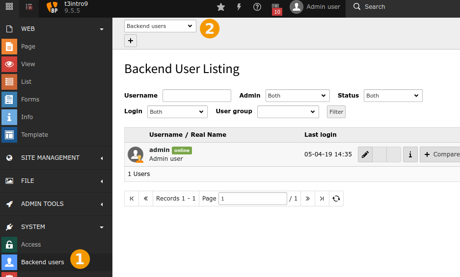
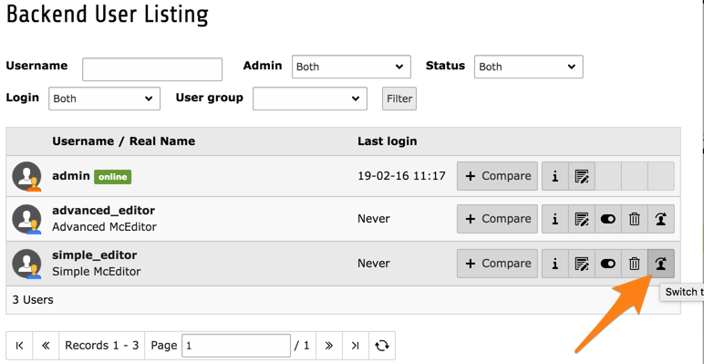
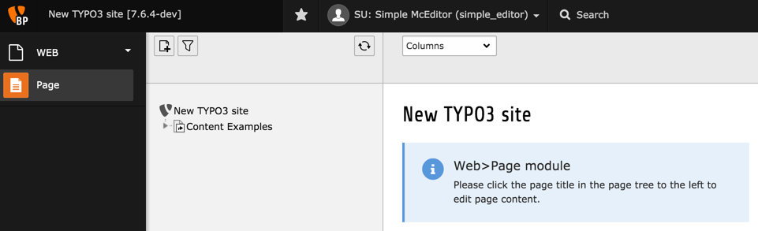
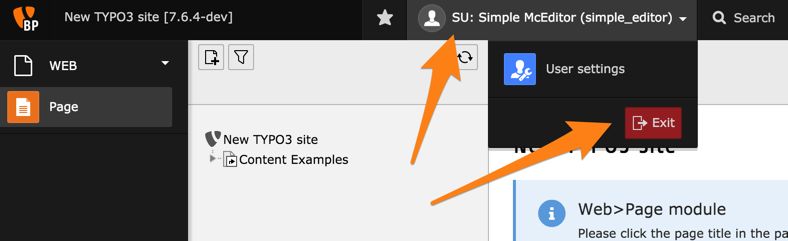
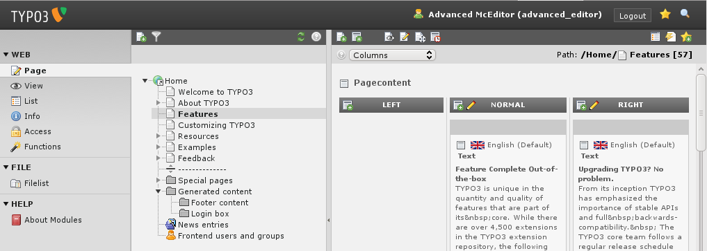

.. include:: /Includes.rst.txt

.. _user-management-backend-users:

=============
Внутренние пользователи
=============

Управление пользователями внутреннего интерфейса осуществляется с помощью модуля **СИСТЕМА > Внутренние пользователи** / **SYSTEM > Backend users**.

Данный модуль позволяет осуществлять поиск и фильтрацию пользователей. Кроме того, их можно редактировать, удалять и отключать.

.. tip::

   Подробнее о специальных ролях пользователей внутреннего интерфейса "администратор" / "admin" и "сопровождающий системы" / "system maintainers" см. в разделе :ref:`privileges`.

Редакторы по умолчанию в пакете Introduction Package
===========================================

В Introduction Package для вас будут созданы два редактора и группы по умолчанию: "simple_editor" и "advanced_editor".

.. hint::

   В следующих шагах предполагается, что редакторы "simple_editor" и "advanced_editor" существуют. В некоторых версиях " Introduction Package" `они не создаются <https://github.com/FriendsOfTYPO3/introduction/issues/21>`__.

   Если эти пользователи не существуют в вашей установке, выполните шаги, описанные в :ref:`user-management-create-default-editors`, и продолжайте.

.. _simulate-user:

Имитация пользователя
=============

.. _user-management-simple-editor:

"simple\_editor"
----------------

Самый простой способ проверить другого пользователя (если один из них является администратором) - это воспользоваться функцией "имитация пользователя" / "simulate user":

А вот что видит "simple\_editor" при обращении к внутреннему интерфейсу TYPO3 CMS:

Как видно, этот пользователь имеет доступ только к модулю "Страница" / "Page". Кроме того, его представление дерева страниц также ограничено ветвью, начинающейся со страницы "Примеры содержимого" / "Content examples".

Чтобы вернуться к учетной записи администратора, щелкните на имени пользователя в верхней панели и нажмите кнопку "Выход из режима имитации" (обратите внимание, что обычно эта кнопка имеет значение "Выход").

.. _user-management-advanced-editor:

"advanced\_editor"
------------------

Теперь попробуйте проделать то же самое с "advanced\_editor". После переключения пользователя вы должны увидеть следующее:

Пользователь "advanced\_editor" имеет право использовать больше модулей, чем "simple\_editor", но не имеет доступа к дереву страниц. Возможно, это ошибка пакета Introduction, но это хорошее упражнение для того, чтобы изменить права пользователей в следующих главах.

.. note::

   Доступ к записям пользователей можно также получить, используя модуль **ВЕБ > Список** / **WEB > List** и щелкнув на корневом узле (тот, что с логотипом TYPO3 CMS).

   .. figure:: ../../Images/ManualScreenshots/UserManagement/BackendBackendUsersList.png
      :alt: Внутренние пользователи в модуле Список
      :class: with-shadow

